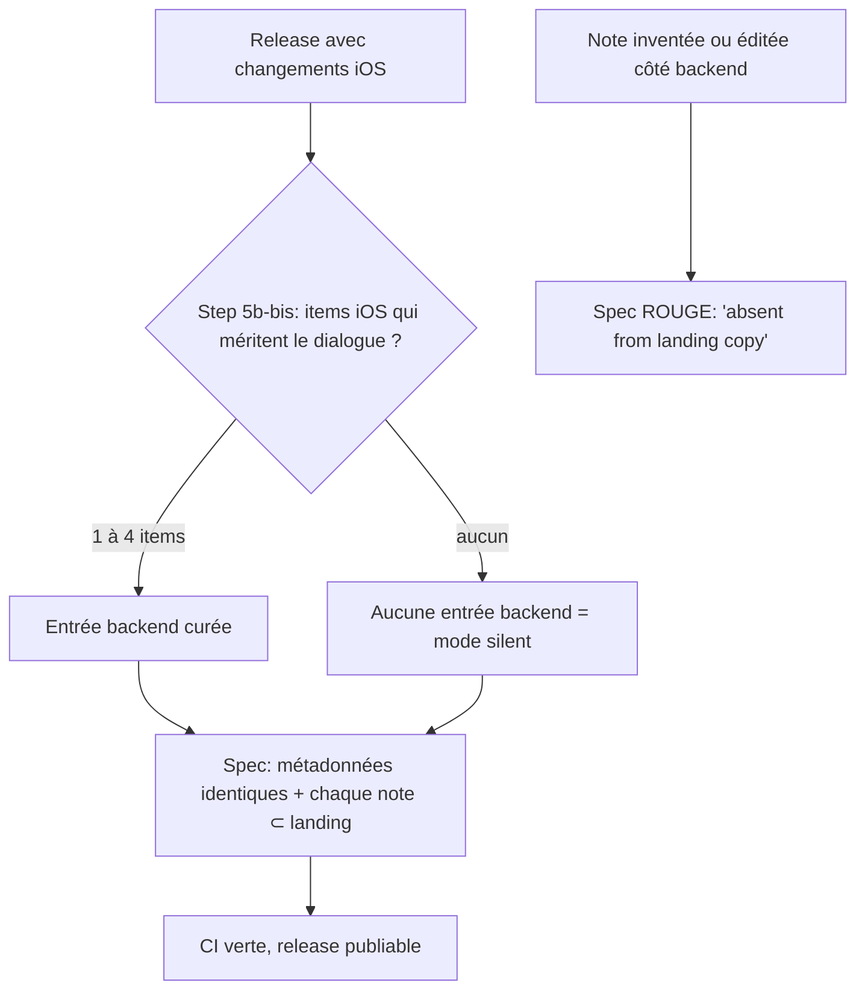

# Instruction: Spec de parité → contrat « sous-ensemble curé »

## Architecture projection

> Tree of the final files. ✅ create · ✏️ modify · ❌ delete

```txt
backend-nest/src/modules/whats-new/domain/
└── releases-data.parity.spec.ts    ✏️ miroir verbatim → sous-ensemble curé + mode `silent` légal (L49-85 uniquement)
```

## User Journey



## Tasks to do

### `1)` Remplacer l'assertion de contenu (L49-85)

> `isDeepStrictEqual` sur une projection verbatim interdit toute curation. Garder L1-48 et L87-101 intacts.

1. Supprimer `toProjection` (L49-61) et l'assertion `isDeepStrictEqual` (L81-83).
2. Ajouter `itemKey = (item) => \`${item.title}\0${item.description}\`` — clé de comparaison d'une note.
3. Ajouter `assertMetadataParity(projection, landing)` : `iosVersion`, `date`, `platforms` (comparées triées) et `changes.technical.length === 0`. Échec → `fail(version, 'projection metadata differs')`.
4. Ajouter `assertCuratedSubset(projection, landing)` : projection non vide (sinon `fail(version, 'empty projection: omit the entry instead')`), puis chaque note de `features ∪ fixes` doit exister dans `landing.features ∪ landing.fixes`. Échec → `fail(version, 'note "X" is absent from landing copy')`.
5. Ne PAS porter le cap 1–4 dans la spec : il reste dans `validate-ios-release.ts:169` (voir Decisions du plan).

### `2)` Rendre le mode `silent` représentable

> `backendMatches.length !== 1` (L74) exige une entrée backend pour toute release iOS user-facing, ce qui interdit `silent`.

1. `!== 1` → `> 1`, message « expected at most one backend entry, found N ».
2. `const projection = backendMatches[0]; if (!projection) continue;` avec un commentaire nommant le mode et sa source : `// Silent mode: marketing bump with no iOS-worthy note (references/ios-release.md).`
3. Renommer le test → `projects a curated subset of every user-facing iOS landing release`.
4. Laisser le 2e test (« no backend entry orphaned », L87-100) strictement inchangé : il garde le sens backend → landing.

### `3)` Prouver le déblocage sur les 3 scénarios qui échouaient

> Un patch de référence vérifié existe : `<scratchpad>/parity-fix.diff` (+51 −17).

1. `cd backend-nest && bun test src/modules/whats-new/domain/releases-data.parity.spec.ts` sur la donnée actuelle → vert.
2. Scénario curation : copie de travail où `0.36.0` est réduit à 2 notes → doit passer (la spec actuelle échoue).
3. Scénario `silent` : copie de travail sans entrée backend pour `0.35.0` → doit passer (la spec actuelle échoue).
4. Scénario anti-dérive : note inventée ajoutée dans `0.34.0` → doit ÉCHOUER en nommant la note.
5. `cd backend-nest && bun run quality`.

## Test acceptance criteria

| Task | Acceptance criteria                                                                                                                                      |
| ---- | ---------------------------------------------------------------------------------------------------------------------------------------------------------- |
| 1    | Une entrée backend qui ne garde que 2 des 6 notes de son entrée landing passe ; une note dont le titre ou la description a été retouchée côté backend échoue en nommant la note |
| 2    | Une release landing avec `iosVersion` et des notes user-facing mais SANS entrée backend passe ; deux entrées backend pour la même version échouent          |
| 3    | Les 4 scénarios donnent le verdict attendu et `bun run quality` du backend est vert ; aucun autre fichier que la spec n'est modifié                      |
