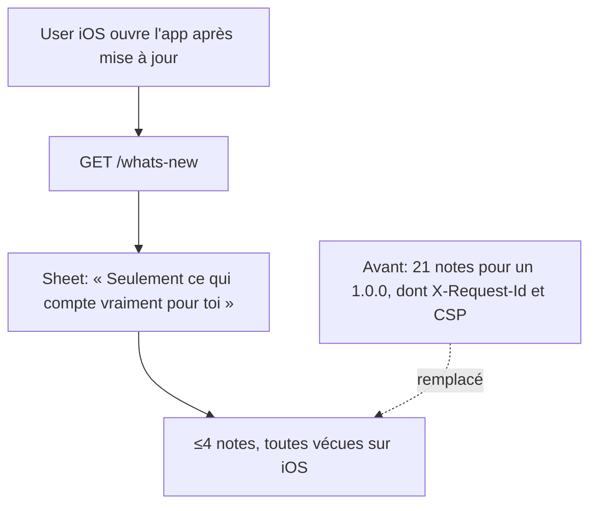

# Instruction: Curer le feed iOS embarqué (contenu)

> Dépend de la phase 1 : tant que la spec exige le miroir verbatim, toute suppression la fait échouer.

## Architecture projection

> Tree of the final files. ✅ create · ✏️ modify · ❌ delete

```txt
backend-nest/src/modules/whats-new/domain/
└── releases-data.ts    ✏️ suppression de notes web-only / techniques sur 0.34.0, 0.35.0, 0.36.0
```

## User Journey



## Tasks to do

### `1)` Fixer la règle de coupe avant de couper

> Curation par SUPPRESSION seule : le check de sous-ensemble exige que chaque note restante existe verbatim dans `landing/data/releases.json`. Aucune réécriture de `title`/`description`.

1. Relire les critères Include/Exclude de `references/ios-release.md` (section « Curate iOS What's New »).
2. Exclure : web-only, landing-only, infra/télémétrie, sécurité sans effet visible, micro-cosmétique.
3. Garder au plus 4 notes par entrée, priorité : nouvelle capacité iOS > fix d'un flux fréquent > amélioration UX visible.
4. Ne PAS toucher `landing/data/releases.json` : c'est le changelog public, déjà publié, et il doit rester le sur-ensemble.

### `2)` Curer les 3 entrées hors-cap

> Compteurs actuels : 0.36.0 = 6, 0.35.0 = 7, 0.34.0 = 18. `0.33.0` (3 notes) est déjà conforme.

1. `0.36.0` (`:66-107`) : candidats à retirer en priorité — `Textes localisés CH/FR` (mentionne explicitement le hero de la landing), puis arbitrer entre les 3 fixes iOS restants pour tenir ≤4.
2. `0.35.0` (`:109-155`) : retirer `Identifiant de corrélation` (`:131`, X-Request-Id webapp↔backend), `Effacement analytique (RGPD)` (`:136`), `Durcissement sécurité (web + landing)` (`:148`, titre auto-déclaré non-iOS). Reste 4.
3. `0.34.0` (`:157+`, 18 notes) : la coupe la plus large ; retirer notamment `Reprise iOS Safari` (surface webapp, pas l'app). Viser 4.
4. Faire valider la sélection finale par le releaser avant écriture : c'est une décision éditoriale, pas technique.

### `3)` Vérifier l'effet réel côté client

> `0.33.0` et `0.34.0` partagent `iosVersion: '1.0.0'` : une install 1.0.0 reçoit les deux entrées cumulées.

1. Compter les notes servies pour `1.0.0` après curation et confirmer que le total reste lisible dans la sheet.
2. `cd backend-nest && bun test src/modules/whats-new` → vert (parité + orphelins).
3. `cd backend-nest && bun run quality`.

## Test acceptance criteria

| Task | Acceptance criteria                                                                                                                          |
| ---- | ---------------------------------------------------------------------------------------------------------------------------------------------- |
| 1    | Chaque note conservée existe encore mot pour mot dans l'entrée correspondante de `landing/data/releases.json` ; `releases.json` est inchangé |
| 2    | Aucune entrée de `releases-data.ts` ne dépasse 4 notes ; plus aucune note ne décrit une surface web, landing, infra ou télémétrie            |
| 3    | Le feed servi pour `iosVersion` 1.0.0 est justifiable devant le titre de la sheet ; `bun test src/modules/whats-new` est vert                |
