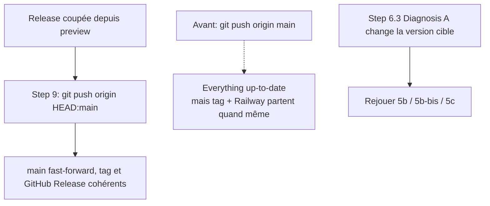

# Instruction: Durcir le skill `update-changelog`

> Indépendant des phases 1 et 2 (fichiers disjoints), ordre libre. Édition de documentation uniquement, aucun code applicatif.

## Architecture projection

> Tree of the final files. ✅ create · ✏️ modify · ❌ delete

```txt
.claude/skills/update-changelog/
├── SKILL.md                      ✏️ Step 9 push branche-agnostique + garde de rejeu en Diagnosis A
└── references/ios-release.md     ✏️ 3e branche du pré-check Railway pour le mode `skip`
```

## User Journey



## Tasks to do

### `1)` Step 9 : pousser la branche courante, pas le ref `main` local

> `SKILL.md:410` fait `git push origin main` alors que la branche par défaut du repo est `preview`. Résultat depuis un checkout normal : « Everything up-to-date », mais le tag, la GitHub Release et le sync Railway partent quand même.

1. `SKILL.md:410` : `git push origin main` → `git push origin HEAD:main`.
2. Ajouter une ligne en préambule du Step 9 : `preview` = intégration, `main` = release ; le tag est coupé sur la branche courante et `main` est fast-forwardé.
3. NE PAS ajouter de garde dure sur le nom de branche : elle aurait bloqué v0.37.0 et v0.37.1, coupées depuis `preview`.
4. Vérifier au passage l'ordre des étapes 3-5 : le sync Railway (`LATEST_WEB_VERSION` / `LATEST_IOS_VERSION`) précède le push. Documenter le risque ou déplacer le sync après le push réussi.

### `2)` Pré-check Railway : couvrir le mode `skip`

> `references/ios-release.md:78-81` énumère 2 branches présentées comme exhaustives ; aucune ne couvre `skip`, et les deux existantes exigent un `iosVersion` dans `releases.json` que `SKILL.md:189` interdit d'écrire sous `SKIP_WHATS_NEW=true`.

1. Ajouter une 3e puce : si `SKIP_WHATS_NEW=true`, vérifier qu'aucune entrée n'existe pour cette version dans `releases.json` ni dans `releases-data.ts`.
2. Préciser que le sync `LATEST_IOS_VERSION` s'applique quand même dès que `MARKETING_VERSION` a bougé, quel que soit le mode.

### `3)` Diagnosis A : garde de rejeu

> `SKILL.md:323` fait bouger la version cible APRÈS que les Steps 5b / 5b-bis / 5c l'ont déjà écrite dans 3 fichiers, dont un `githubUrl` pointant un tag qui ne sera jamais créé.

1. Ajouter une ligne en fin de Diagnosis A : si la correction change la version cible, rejouer 5b / 5b-bis / 5c avec la version corrigée avant de continuer.

## Test acceptance criteria

| Task | Acceptance criteria                                                                                                                                     |
| ---- | --------------------------------------------------------------------------------------------------------------------------------------------------------- |
| 1    | Une relecture du Step 9 depuis un checkout `preview` mène à un push qui met `main` à jour ; aucune commande ne suppose que la branche courante est `main` |
| 2    | Les 4 modes (`projection`, `silent`, `build`, `skip`) ont chacun une branche explicite dans le pré-check Railway                                        |
| 3    | Le Step 6.3 ne peut plus laisser une version cible périmée dans `releases.json`, `releases-data.ts` ou `whats-new-releases.ts`                          |
