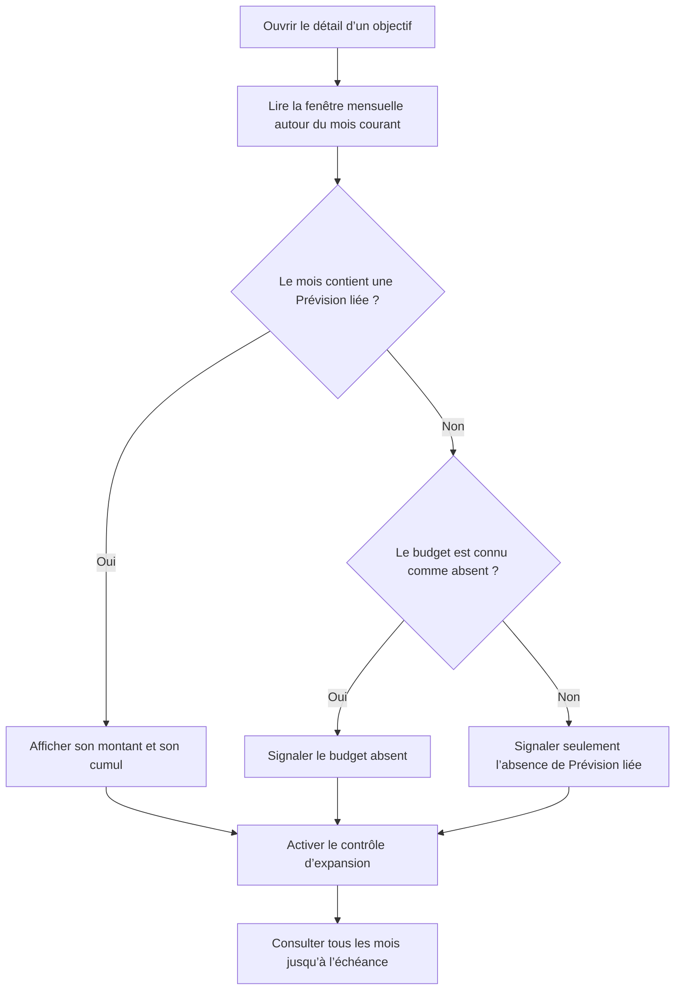

# Instruction: Verrouiller puis corriger la présentation mensuelle iOS

## Architecture projection

> Tree of the final files. ✅ create · ✏️ modify · ❌ delete

```txt
ios/
├── Pulpe/Features/SavingsGoals/Components/
│   ├── ✏️ GoalPlanMonthRow.swift
│   └── ✏️ GoalPlanTimelineSection.swift
└── PulpeTests/Features/SavingsGoals/
    └── ✅ GoalPlanTimelinePresentationTests.swift
```

## User Journey



## Wireframe

```txt
┌──────────────────────────────────────┐
│ (1) En-tête : section · action       │
│ ┌──────────────────────────────────┐ │
│ │ (2) Mois avec montant et cumul   │ │
│ ├──────────────────────────────────┤ │
│ │ (3) Mois sans élément lié        │ │
│ ├──────────────────────────────────┤ │
│ │ (3) Mois sans élément lié        │ │
│ └──────────────────────────────────┘ │
│ (4) Contrôle de liste complète   [∨] │
│ (5) Information récapitulative      │
└──────────────────────────────────────┘
```

1. En-tête : identifie le plan mensuel et place son unique action au même niveau.
2. Mois renseigné : présente la Prévision liée et le cumul de l’objectif.
3. Mois vide : réserve un emplacement à une information d’état exacte.
4. Contrôle : occupe une ligne complète afin d’être reconnu comme interactif.
5. Récapitulatif : explique les mois sans Prévision liée sans confondre leur budget.

## Tasks to do

### `1)` Verrouiller la régression de présentation

> Reproduire le cas de la capture avant de modifier les composants.

1. Ajouter un test pur de présentation avec juillet et août porteurs d’une Prévision liée, septembre et octobre en `gap` avec `isProvisionable == false`, puis au moins un vrai budget absent avec `isProvisionable == true`.
2. Prouver que le comportement actuel classe à tort septembre et octobre comme « Pas de budget » et les inclut dans le décompte des budgets absents.
3. Couvrir le happy path : la fenêtre repliée reste bornée autour du mois courant, tandis que l’état développé retourne tous les mois jusqu’à l’échéance.

### `2)` Séparer les deux états sans modifier le contrat API

> Exploiter le signal déjà fourni par le serveur et éviter un changement backend inutile.

1. Dans la couche de présentation des composants existants, réserver « Pas de budget » aux mois `gap` dont `isProvisionable` vaut `true`.
2. Présenter les autres mois `gap` avec une formulation factuelle d’absence de Prévision liée à l’objectif ; cette formulation reste vraie que le budget existe ou que son absence ne soit pas provisionnable.
3. Remplacer la grosse capsule d’état des mois vides par une ligne secondaire compacte avec SF Symbol ; réserver les chips aux vrais statuts et actions.
4. Remplacer le récapitulatif « mois sans budget » par le nombre de mois sans Prévision liée, sans promettre qu’une simple création de budget ajoutera automatiquement une Prévision.
5. Aligner le libellé d’accessibilité de chaque ligne sur le nouvel état visible.
6. Garder inchangés les montants, cumuls, états pointés, règles de verrouillage et calculs du simulateur.

### `3)` Rendre l’accès au plan complet explicite

> Conserver la fenêtre courte par défaut, mais montrer clairement qu’elle est repliée.

1. Réutiliser le pattern iOS existant de ligne pleine largeur avec libellé et chevron pour le contrôle d’expansion.
2. Transformer l’ouverture à sens unique en bascule « voir tout / voir moins », avec chevron cohérent, cible tactile minimale de 44 pt et hint VoiceOver correspondant à l’état.
3. Utiliser la typographie de titre de section existante et aligner « Ajuster » dans l’en-tête, au lieu d’empiler un gros titre puis un chip d’action.
4. Conserver la fenêtre actuelle du mois courant et des trois mois futurs ; elle limite la densité mais ne doit plus ressembler à une fin de données.
5. Faire passer le test de régression, puis exécuter le test iOS ciblé et un build `PulpeLocal` sur simulateur.

## Test acceptance criteria

| Task | Acceptance criteria |
| --- | --- |
| 1 | Le scénario reproduit échoue avant correction parce que septembre et octobre, budgets matérialisés sans Prévision liée, sont annoncés comme budgets absents. |
| 1 | Le test distingue un mois sans Prévision liée d’un mois `isProvisionable`, et couvre la liste repliée puis développée. |
| 2 | Septembre et octobre n’affichent plus « Pas de budget » ; ils indiquent seulement qu’aucune Prévision n’est liée à cet objectif. |
| 2 | Un mois `gap` avec `isProvisionable == true` conserve l’état « Pas de budget ». |
| 2 | Le récapitulatif compte les mois sans Prévision liée et ne les décrit plus comme autant de budgets absents. |
| 2 | Les libellés VoiceOver, montants, cumuls et états pointés correspondent au contenu visible. |
| 2 | Un mois vide utilise une information secondaire compacte, sans capsule surdimensionnée. |
| 3 | Par défaut, la timeline reste courte et affiche un contrôle pleine largeur avec chevron ; son activation affiche tous les mois, dont novembre et décembre lorsqu’ils sont dans l’horizon. |
| 3 | Le contrôle permet aussi de replier la liste, dispose d’une cible d’au moins 44 pt et annonce son action à VoiceOver. |
| 3 | Le titre et l’action d’ajustement partagent une seule rangée et utilisent les primitives typographiques et interactives existantes. |
| 3 | `GoalPlanTimelinePresentationTests`, puis le build `PulpeLocal`, passent sur le simulateur iPhone configuré par le projet. |
