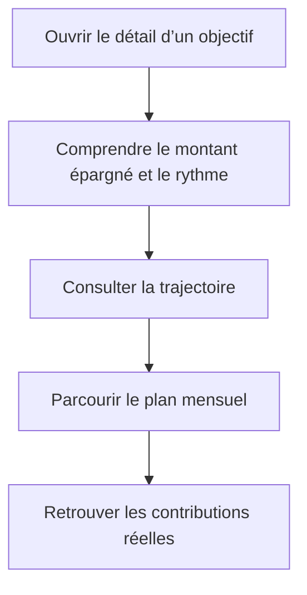

# Instruction: Distiller la hiérarchie du détail d’objectif

## Architecture projection

> Tree of the final files. ✅ create · ✏️ modify · ❌ delete

```txt
ios/
├── Pulpe/Features/SavingsGoals/
│   ├── ✏️ SavingsGoalDetailView.swift
│   ├── ✏️ GoalContributionsSection.swift
│   └── Components/
│       └── ✏️ GoalProjectionChart.swift
└── PulpeTests/Features/SavingsGoals/
    └── ✅ GoalProjectionSeriesTests.swift
```

## User Journey



## Wireframe

```txt
┌──────────────────────────────────────┐
│ (1) Navigation : titre · modification│
├──────────────────────────────────────┤
│ (2) Métadonnées : état · échéance    │
│ ┌──────────────────────────────────┐ │
│ │ (3) Résumé : montant · cible     │ │
│ │     progression · rythme         │ │
│ │     indicateurs essentiels       │ │
│ └──────────────────────────────────┘ │
│ (4) État contextuel éventuel         │
│                                      │
│ (5) Section trajectoire              │
│ ┌──────────────────────────────────┐ │
│ │ graphique · deux indicateurs     │ │
│ └──────────────────────────────────┘ │
│                                      │
│ (6) Section plan mensuel             │
│                                      │
│ (7) Section contributions réelles    │
│ ┌──────────────────────────────────┐ │
│ │ contribution · lignes associées │ │
│ └──────────────────────────────────┘ │
└──────────────────────────────────────┘
```

1. Navigation : garde le détail dans la hiérarchie native et l’édition dans la toolbar.
2. Métadonnées : rassemble les informations d’identité sans créer un second hero.
3. Résumé : répond d’abord à « où j’en suis » avec une seule occurrence de chaque donnée.
4. État contextuel : conserve les conseils conditionnels uniquement lorsqu’ils s’appliquent.
5. Trajectoire : garde le graphique comme regroupement analytique secondaire.
6. Plan mensuel : reste la prochaine étape logique après la vue d’ensemble.
7. Contributions : conserve le détail réel en fin de page, sans conteneur imbriqué.

## Tasks to do

### `1)` Rétablir une hiérarchie iOS de page détail

> Réduire l’intensité typographique sans inventer une nouvelle direction visuelle.

1. Passer le titre de navigation en mode `inline`, comme les autres pages de détail iOS du projet ; conserver le mode large sur la liste d’objectifs.
2. Remplacer la taille `headline` de hero par la taille `title` existante pour « Ta trajectoire » et « Ton suivi » ; la phase 1 applique le même niveau au plan mensuel.
3. Conserver Manrope pour les montants et SF Pro pour la navigation, les titres de section et les libellés.
4. Réutiliser exclusivement les tokens, couleurs, styles de boutons et SF Symbols existants ; ne créer ni token ni composant partagé pour ce polish ponctuel.

### `2)` Dédupliquer le résumé de progression

> Faire répondre le premier bloc à « combien, sur quelle cible, et à quel rythme ? ».

1. Intégrer le verdict de rythme dans la carte de progression au lieu de le laisser flotter comme un chip entre deux blocs.
2. Supprimer la ligne « Épargné » qui répète exactement le montant principal de la carte.
3. Conserver la cible, la barre, le montant de départ lorsqu’il existe, le prévu cumulé et l’effort mensuel requis.
4. Retirer du résumé la projection numérique à l’échéance, déjà expliquée par la trajectoire et son atteinte estimée juste après.
5. Garder inchangés les calculs serveur, le masquage des montants et les libellés d’accessibilité de la barre.

### `3)` Clarifier la trajectoire sans enrichissement décoratif

> Corriger la collision visible des dates et laisser le graphique porter l’analyse.

1. Adapter la sélection pure des repères horizontaux : lorsque l’ancrage et le mois courant sont trop proches pour afficher deux libellés lisibles, privilégier le mois courant et l’extrémité du plan.
2. Ajouter un test de régression pour un objectif démarré deux périodes avant le mois courant et un happy path où les trois repères restent suffisamment espacés.
3. Conserver les quatre séries, la cible, les deux indicateurs sous le graphique, les couleurs sémantiques et le comportement Reduce Motion existants.

### `4)` Aplatir le suivi réel

> Supprimer la carte imbriquée sans retirer les transactions utiles.

1. Garder une carte par contribution, son état pointé, son mois et son montant.
2. Remplacer le fond arrondi interne « Transactions réelles » par une liste simplement indentée, structurée par le libellé et des dividers.
3. Conserver les états de chargement, d’erreur et de retry existants ainsi que les libellés VoiceOver des lignes.
4. Vérifier le rendu en taille de texte standard et accessibilité, en clair et sombre, avec montants visibles puis masqués.
5. Exécuter les tests ciblés, puis un build `PulpeLocal`; maintenir l’ensemble du polish sous environ 300 lignes nettes.

## Test acceptance criteria

| Task | Acceptance criteria |
| --- | --- |
| 1 | Le détail utilise un titre inline ; les trois sections ont le même niveau de titre secondaire et aucune taille de hero ne concurrence le nom de l’objectif. |
| 1 | Aucun nouveau token, composant partagé, matériau ou couleur décorative n’est ajouté. |
| 2 | Le montant épargné n’apparaît qu’une fois dans le résumé ; cible, progression, rythme, prévu cumulé et effort requis restent lisibles. |
| 2 | Le montant de départ reste visible lorsqu’il est non nul, et tous les montants respectent le mode de confidentialité. |
| 3 | Sur l’horizon reproduit par la capture, les libellés de l’ancrage et du mois courant ne se chevauchent plus ; un horizon suffisamment espacé conserve trois repères. |
| 3 | Séries, cible, écart cumulé et atteinte estimée restent identiques avant et après le polish. |
| 4 | Chaque contribution reste une carte unique ; ses transactions sont lisibles sans second fond arrondi imbriqué. |
| 4 | Le détail reste complet en Dynamic Type, clair/sombre et avec montants masqués ; toutes les actions conservent une cible de 44 pt minimum. |
| 4 | `GoalPlanTimelinePresentationTests`, `GoalProjectionSeriesTests`, puis le build `PulpeLocal`, passent sur le simulateur configuré par le projet. |
