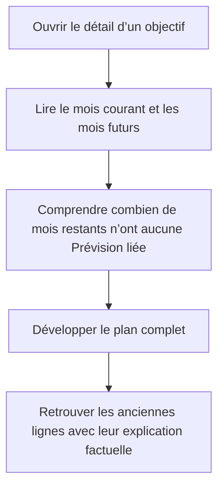

# Instruction: Compter et nommer uniquement les mois restants

## Architecture projection

> Tree of the final files. ✅ create · ✏️ modify · ❌ delete

```txt
ios/
├── Pulpe/Features/SavingsGoals/Components/
│   └── ✏️ GoalPlanTimelineSection.swift
└── PulpeTests/Features/SavingsGoals/
    └── ✏️ GoalPlanTimelinePresentationTests.swift
```

## User Journey



## Wireframe

```txt
┌──────────────────────────────────────┐
│ (1) Titre de section · action        │
│ ┌──────────────────────────────────┐ │
│ │ (2) Lignes mensuelles du plan    │ │
│ │     historique · courant · futur │ │
│ └──────────────────────────────────┘ │
│ (3) Contrôle du plan complet         │
│ (4) Résumé prospectif des mois vides │
└──────────────────────────────────────┘
```

1. En-tête : conserve l’identité et l’action actuelles.
2. Timeline : garde les lignes historiques explicatives et le contenu existant.
3. Contrôle : reste entre la timeline et son information complémentaire.
4. Résumé : porte uniquement la situation depuis le mois courant.

## Tasks to do

### `1)` Verrouiller la portée temporelle du compteur

> Prouver que l’historique reste consultable sans gonfler le résumé prospectif.

1. Étendre le test pur de présentation avec au moins un mois passé sans ligne liée, le mois courant et des mois futurs sans ligne liée.
2. Vérifier que le plan développé restitue toujours le mois historique et que `GoalPlanMonthAvailability` continue de l’expliquer comme sans Prévision liée.
3. Faire échouer l’ancien compteur en attendant uniquement le nombre de mois vides depuis le mois courant.

### `2)` Recentrer le résumé sur la suite du plan

> Faire correspondre le nombre visible aux périodes encore pertinentes pour la planification.

1. Renommer le compteur de présentation pour exprimer sa portée restante plutôt qu’un total sur tout l’horizon.
2. Parcourir la timeline ordonnée à partir de `currentIndex` et compter les mois dont `lines` est vide, sans filtrer sur `state == .gap`.
3. Remplacer le texte actuel par « X mois restants sans prévision liée à cet objectif. » et le masquer lorsque ce nombre vaut zéro.
4. Conserver sans changement les libellés des lignes historiques, la distinction « Pas de budget », le fenêtrage, l’expansion et les calculs serveur.

### `3)` Vérifier le comportement iOS

> Valider la règle pure et l’intégration SwiftUI sans élargir le périmètre.

1. Exécuter `GoalPlanTimelinePresentationTests` sur le simulateur iPhone configuré.
2. Compiler le scheme `PulpeLocal` sur le même simulateur.

## Test acceptance criteria

| Task | Acceptance criteria |
| --- | --- |
| 1 | Un mois passé sans ligne liée reste présent dans `visibleMonths` lorsque le plan est développé et conserve l’état « Aucune prévision liée ». |
| 1 | Le test échoue avec le compteur actuel parce que celui-ci inclut encore le mois historique. |
| 2 | Le mois courant et les mois futurs sans ligne liée sont comptés ; les mois antérieurs au mois courant ne le sont pas. |
| 2 | Le résumé affiche « X mois restants sans prévision liée à cet objectif. » pour un total positif et disparaît lorsque le total vaut zéro. |
| 2 | Les lignes historiques du plan développé, « Pas de budget », « Voir tout / Voir moins » et les cumuls restent inchangés. |
| 2 | Aucun contrat backend/shared, token de design ou composant partagé n’est ajouté ou modifié. |
| 3 | `GoalPlanTimelinePresentationTests` et le build `PulpeLocal` réussissent sur le simulateur configuré. |
