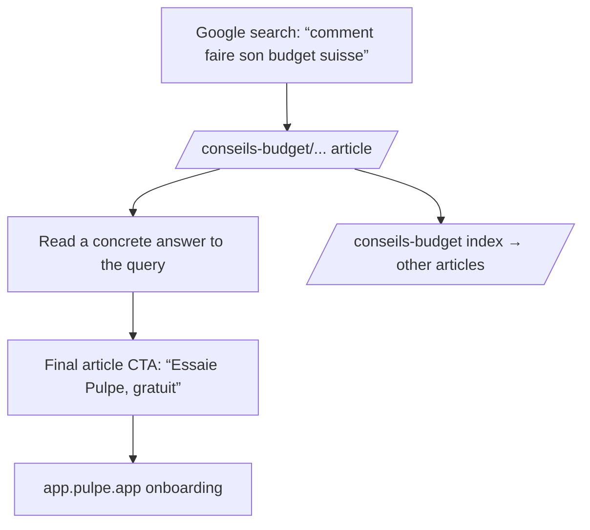

# Instruction: SEO article foundation on the landing (`/conseils-budget`)

## Architecture projection

> Tree of the final files. ✅ create · ✏️ modify · ❌ delete

```txt
landing/
├── app/
│   ├── sitemap.ts                        ✅ dynamic sitemap (static pages + articles)
│   ├── conseils-budget/
│   │   ├── page.tsx                      ✅ article index (card list)
│   │   └── comment-faire-son-budget-en-suisse/
│   │       └── page.tsx                  ✅ seed article proving the foundation
│   └── layout.tsx                        ✏️ change nothing if possible; otherwise expose “Conseils budget” on shared surfaces
├── components/
│   ├── guides/
│   │   ├── ArticleLayout.tsx             ✅ shared layout: header, contents, prose, final CTA, JSON-LD
│   │   └── guides.ts                     ✅ typed article registry (slug, title, description, date), shared by index + sitemap
│   └── sections/Footer.tsx               ✏️ “Conseils budget” footer link
└── public/sitemap.xml                    ❌ replaced by app/sitemap.ts
```

## User Journey



## Wireframe

```txt
┌────────────────────────────────────────┐
│ (1) Existing landing header            │
├────────────────────────────────────────┤
│ (2) Article H1 + date + reading time   │
├────────────────────────────────────────┤
│ (3) Prose: H2/H3, lists, tables        │
│     reading width around 65ch          │
│                                        │
├────────────────────────────────────────┤
│ (4) CTA card: “Essaie Pulpe” [Button]  │
├────────────────────────────────────────┤
│ (5) Existing footer + advice link      │
└────────────────────────────────────────┘
```

1. Header: reuse the existing `Header` with no variant.
2. Title: one H1 matching the target query, with discreet metadata.
3. Prose: existing Poppins typography; visual hierarchy over verbose copy.
4. CTA: one primary CTA per article, targeting the app.
5. Footer: reuse it and add the `/conseils-budget` link.

## Verified context (codebase agent, July 2026)

- Next.js 16.2.11, App Router, **`output: 'export'`** (fully static, `distDir: 'dist'`): `app/sitemap.ts` works during builds and nested routes are supported.
- Deployment: Vercel through `landing/vercel.json` (CSP, PostHog rewrites, Vercel redirects): **no change required** for new routes.
- `robots.txt` already declares `Sitemap: https://pulpe.app/sitemap.xml`: no robots change.
- `pnpm build` currently passes (five static pages): green baseline.
- Existing content pattern to follow: `app/changelog/page.tsx` (TSX + local data + Container/Header/Footer).
- **No prose styles exist** (`prose` is absent from globals.css and @tailwindcss/typography is not installed): article typography must be added.
- French only (`<html lang="fr">`, fr_CH), with the `%s | Pulpe` title template and per-page canonicals already in place.

## Tasks to do

### `1)` Article registry

> One source of truth for the index, sitemap, and metadata.

1. Create `components/guides/guides.ts`: a typed `{ slug, title, description, publishedAt }` array.

### `2)` Shared article layout and prose typography

> One component keeps every article aligned with the landing's visual direction.

1. Read `landing/DESIGN.md`, `app/changelog/page.tsx`, and two section components before writing (workflow rule).
2. Create `ArticleLayout.tsx`: prose container, H1, metadata, final CTA, and inline `Article` JSON-LD.
3. Add prose styles in globals.css; do not add @tailwindcss/typography for fewer than ten articles.

### `3)` `/conseils-budget` index and seed article

> The route launches with one real piece of content.

1. `app/conseils-budget/page.tsx`: list registry entries, with metadata and a canonical.
2. Seed article “Comment faire son budget en Suisse” (about 1,200 words, informal French, Pulpe vocabulary).

### `4)` Dynamic sitemap and internal linking

> Google discovers articles without a manual edit.

1. Create `app/sitemap.ts` (static pages + registry loop) and remove `public/sitemap.xml` through `trash` **in the same PR** to avoid a route collision.
2. Add the “Conseils budget” footer link.

## Test acceptance criteria

| Task | Acceptance criteria                                                                                                                                                          |
| ---- | ---------------------------------------------------------------------------------------------------------------------------------------------------------------------------- |
| 1    | Adding a registry entry makes it appear in both the index and sitemap without another edit                                                                                   |
| 2    | The article renders valid `Article` JSON-LD and one H1; the landing direction remains intact (Poppins, light background); H2/H3 hierarchy is readable without ad hoc classes |
| 3    | `/conseils-budget` and the seed article pass the landing production build with their own title, description, and canonical                                                   |
| 4    | Generated `dist/sitemap.xml` lists `/`, `/changelog`, `/support`, `/conseils-budget`, and the seed article; `public/sitemap.xml` is absent                                   |
