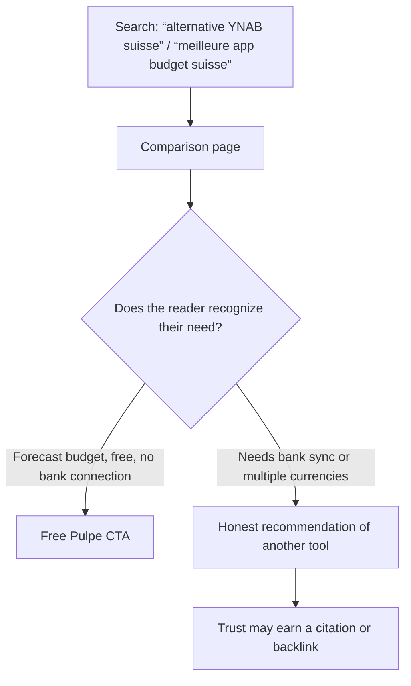

# Instruction: Competitor comparison pages (SEO gap)

## Architecture projection

> Tree of the final files. ✅ create · ✏️ modify · ❌ delete

```txt
landing/
├── app/conseils-budget/
│   ├── alternative-ynab-suisse/page.tsx      ✅ flagship: confirmed ranking gap; must beat BudgetHub's French page (about 400 words)
│   ├── meilleure-app-budget-suisse/page.tsx  ✅ our own French listicle (BudgetHub publishes only in German; magicheidi targets freelancers)
│   ├── pulpe-vs-budgetch/page.tsx             ✅ the free competitor a French-speaking Swiss reader actually encounters
│   └── pulpe-vs-budgethub/page.tsx            ✅ strategic competitor with the same no-bank-sync/CHF positioning
└── components/guides/guides.ts               ✏️ four registry entries
```

## Verified context (adversarial research, July 2026)

**Confirmed target queries** (US index; recheck the Swiss locale in task 1):

- “alternative YNAB suisse”, “alternative à YNAB gratuite”, and “remplacer YNAB” return only English listicles. The sole French page (BudgetHub, about 400 words, self-comparison without a table) does not rank. **The gap is real and the window is closing**, because BudgetHub is actively publishing in French.
- “YNAB avis” is **abandoned**: Mustachian Post (Swiss, pro-YNAB, updated July 9, 2026) and French sites hold it.
- “meilleure app budget suisse”: BudgetHub owns it in German (“Budget-App Test & Vergleich Schweiz 2026”); magicheidi ranks in French with a self-ranked freelance angle. An honest general-audience French listicle is feasible.

**Competitor facts sourced from publishers (quote exactly and safely):**

| Competitor   | Verified facts                                                                                                                                                                                                                                                                                                                        |
| ------------ | ------------------------------------------------------------------------------------------------------------------------------------------------------------------------------------------------------------------------------------------------------------------------------------------------------------------------------------- |
| YNAB         | $14.99/month or $109/year, **USD only** (“Exchange rates are not reflected in the price”), no free tier, 34-day trial. English UI: cite the Swiss App Store language field, not ynab.com. Currency wording: “can't use multiple currencies together in a single spending plan”; one budget per currency. Do not write “no conversion” |
| BudgetHub    | PWA rather than a native app, no bank sync (CSV), limited free tier (two accounts, five AI scans/month), CHF 6.90/11.90 per month. Write exactly “Datenhaltung in der Schweiz, Compute in der EU”, not “hosted in Zurich”                                                                                                             |
| BudgetCH     | Free, nonprofit (Budget-conseil Suisse), native French, updated July 2025. **Do not compete on price** because both are free; differentiate on UX and forward planning while acknowledging the nonprofit backing                                                                                                                      |
| MoneyControl | Free up to 20 transactions/month; one-time CHF 8–10 unlock in the Swiss App Store. Use CHF prices rather than circulating EUR figures                                                                                                                                                                                                 |
| Goodbudget   | Free tier: 20 envelopes, one account, two devices, one year of history; otherwise $10/month. Write “no Swiss bank sync”; the paid tier syncs US banks                                                                                                                                                                                 |

**Defensible Pulpe differentiators**: completely free with no caps, native French, months-ahead “Disponible” planning, a native iOS app rather than BudgetHub's PWA, and privacy through no bank connection.

## User Journey



## Tasks to do

### `1)` Recheck the Swiss-local SERPs

> The research used a US index; google.ch fr-CH positions may differ.

1. Rerun the four target queries with Swiss qualification (site:ch, google.ch if accessible, Switzerland mention) and adjust briefs if a strong French-language competitor appears.

### `2)` Write the four pages

> Each page must structurally beat the existing result with a comparison table, at least five real alternatives, and a free/CHF angle at the top.

1. `alternative-ynab-suisse`: price angle (USD + FX versus free), English UI, one budget per currency; table with at least five real alternatives (Pulpe, BudgetCH, BudgetHub, Goodbudget, MoneyControl), which BudgetHub's page lacks.
2. `meilleure-app-budget-suisse`: five or six apps, Swiss criteria (CHF, FADP, French, actual price), with honest Pulpe positioning.
3. `pulpe-vs-budgetch`: modern UX and 12-month projection versus a solid nonprofit app; respectful tone.
4. `pulpe-vs-budgethub`: native iOS and uncapped free use versus a freemium PWA; mention BudgetHub strengths (CSV import, BudgetAI).
5. Every page uses `ArticleLayout`, has a registry entry, uses informal French, and names at least one real Pulpe weakness (no bank sync, no multiple currencies, young product).

## Test acceptance criteria

| Task | Acceptance criteria                                                                                                            |
| ---- | ------------------------------------------------------------------------------------------------------------------------------ |
| 1    | Every brief cites the rechecked Swiss-local SERP, and any change from the initial research is recorded                         |
| 2    | Every published competitor fact comes from the verified table above or a fresh publisher source; no unsupported claim appears  |
| 2    | Every page lists at least one real Pulpe weakness; the production build passes; all four pages appear in the generated sitemap |
