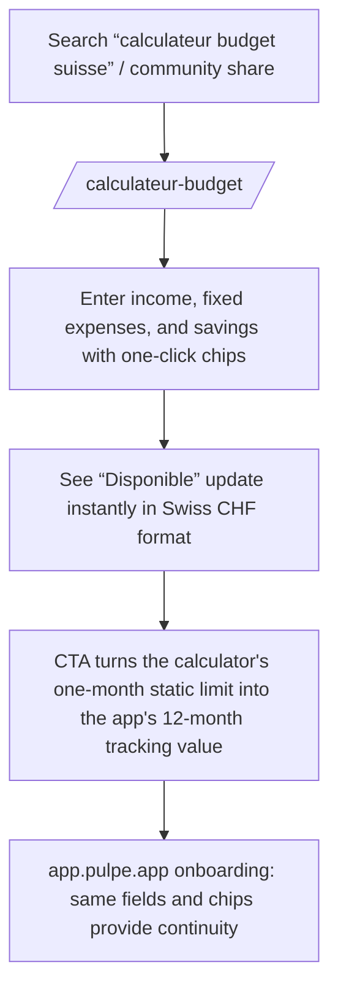

# Instruction: Lead magnet — Swiss budget calculator

## Architecture projection

> Tree of the final files. ✅ create · ✏️ modify · ❌ delete

```txt
landing/
├── app/calculateur-budget/page.tsx        ✅ SEO page for “calculateur budget suisse” (metadata + prose)
├── components/calculator/
│   └── BudgetCalculator.tsx               ✅ client component: exact onboarding-calculation mirror, no network
└── app/sitemap.ts                         ✏️ /calculateur-budget entry
```

## Verified context (research + codebase agent, July 2026)

**The “calculateur budget suisse” SERP is moderately winnable**:

- #1 is moneyhaxx.ch (Budget-conseil Suisse, **youth brand**, cantonal-bank backing, FR/DE/IT, working calculator + AI chatbot). It is beatable on French-speaking Switzerland specifics and continuity into a real app, **not** on the youth angle they already own or short-term authority.
- Other positions include Swiss Life (generic), Valiant (real budget calculator, mid-sized bank), salairesuisse.ch (an expat microsite that ranks, proving a small domain can rank), HelloSafe (existing free calculator), and two credit brokers with mismatched intent. Caritas withdrew its app in 2021 and its page is dead.
- **Ignore generic French searches** (“calculateur budget mensuel”, “calcul budget gratuit”): French sites such as reste-a-vivre.fr, N26, and Finary dominate them, but the audience is wrong.
- Required differentiation: prefilled Romandy data (LAMal, taxes, Serafe, third pillar), personas (student, apprentice, first salary), and continuity into the app—not “one more calculator”.

**Actual onboarding logic** (verified in `complete-profile-store.ts`):

- `income = monthly income + custom income`; `committed = six fixed expenses + custom expenses + custom savings`; `available = income − committed`. **Savings count as committed.** A deficit (`available < 0`) is non-blocking, uses an error tint, and shows the reassuring hint “Pas d'inquiétude — tu pourras ajuster tout ça après.”
- **Actual UI labels** (`fr.json`): “Revenus mensuels”, “Charges mensuelles”, and the summary row “Revenu / Dépenses / Disponible”. Do not use “Disponible à dépenser” in the widget; that phrase is reserved for surrounding marketing copy. Expense fields: “Loyer / Crédit”, “Assurance maladie”, “Abonnement téléphonique”, “Abonnement internet”, “Transport”, “Leasing”.
- **Exact suggestion chips**: Courses / alimentation 600 · Restaurants & sorties 150 · Loisirs & sport 100 · Épargne 500 · 3ème pilier 587 (CHF; “Épargne retraite” in EUR).
- **Formatting**: do not depend on `pulpe-shared` (plan decision). Inline `Intl.NumberFormat('de-CH', { minimumFractionDigits: 0, maximumFractionDigits: 2 })` with a “CHF” suffix and Swiss apostrophe (`1’234 CHF`); CHF by default.

## User Journey



## Wireframe

```txt
┌────────────────────────────────────────┐
│ (1) Existing landing header            │
├────────────────────────────────────────┤
│ (2) H1: Calcule ton budget suisse      │
├───────────────────┬────────────────────┤
│ (3) Form          │ (4) Live result    │
│  Revenus [____]   │   Disponible       │
│  Loyer   [____]   │     2’100 CHF      │
│  Assur.  [____]   │  Revenu · Dépenses │
│  Transp. [____]   │  · Disponible      │
│  Épargne [____]   │  (deficit is OK)   │
│  chips: +600 +150 │                    │
├───────────────────┴────────────────────┤
│ (5) CTA: “Projette-le sur 12 mois”     │
├────────────────────────────────────────┤
│ (6) SEO prose: Romandy items (LAMal,   │
│     Serafe, third pillar), personas    │
└────────────────────────────────────────┘
```

1. Reuse the header.
2. The H1 is the Swiss-qualified target query.
3. Fields use the same labels as onboarding; one-click chips use the exact 600/150/100/500/587 values.
4. Recalculate on every keystroke; use the same Revenu/Dépenses/Disponible row as the app; deficits remain non-blocking with the reassuring hint.
5. One primary CTA: the calculator's limit becomes the reason to use the app.
6. Indexable prose covers typical Romandy expenses and persona links, differentiating it from moneyhaxx and HelloSafe.

## Tasks to do

### `1)` Calculator component

> Exact mirror of onboarding calculation, fully client-side.

1. `BudgetCalculator.tsx`: local React state, the verified formula above (savings included in committed, deficit non-blocking), exact chips, and an inline `de-CH` formatter.

### `2)` Page and SEO

> The page contains both the tool and the text that can rank.

1. `app/calculateur-budget/page.tsx`: metadata, H1, calculator, and about 600 words of prose (Romandy items: LAMal about CHF 326 for ages 19–25, Serafe, taxes, third pillar; persona links to phase 4 articles).
2. Add the sitemap entry and link from the `/conseils-budget` index and footer.

## Test acceptance criteria

| Task | Acceptance criteria                                                                                                                                          |
| ---- | ------------------------------------------------------------------------------------------------------------------------------------------------------------ |
| 1    | Income 5000 / rent 2000 / insurance 400 / savings 500 instantly produces “2’100 CHF” (Swiss apostrophe, no decimal for whole input)                          |
| 1    | Labels and chips match web onboarding (Revenu/Dépenses/Disponible, 600/150/100/500/587); deficit uses a tint + hint and never blocks                         |
| 2    | The page passes the production build, appears in the sitemap, and makes no network call from the calculator; prose mentions at least three Romandy specifics |
