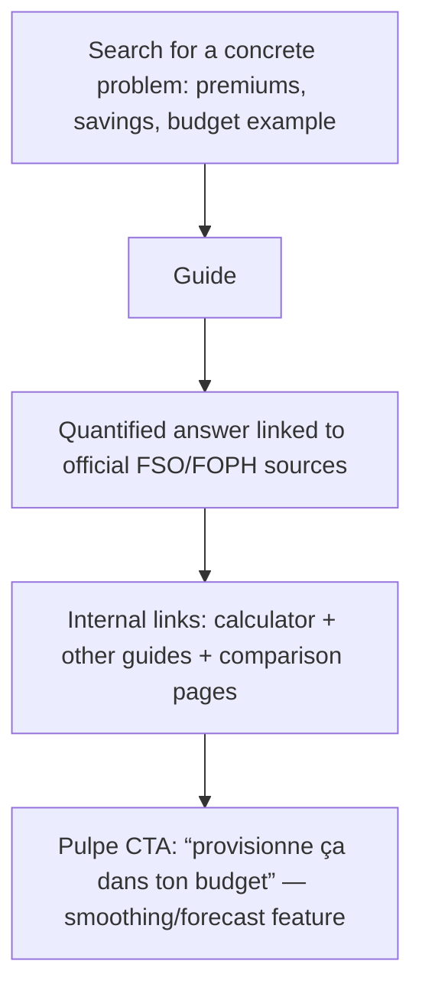

# Instruction: Evergreen guides for French-speaking Switzerland (3 articles)

## Architecture projection

> Tree of the final files. ✅ create · ✏️ modify · ❌ delete

```txt
landing/
├── app/conseils-budget/
│   ├── budget-mensuel-suisse-exemple/page.tsx       ✅ SERP has institutional PDFs; gap is prospective planning for young workers
│   ├── budgeter-primes-maladie/page.tsx             ✅ ⏰ PUBLISH BEFORE EARLY SEPTEMBER 2026 (FOPH announcement at month end)
│   └── epargner-avec-salaire-suisse/page.tsx        ✅ format to beat: calculsuisse.ch (hybrid guide + calculator)
└── components/guides/guides.ts                      ✏️ three registry entries
```

## Verified context (adversarial research, July 2026)

**Figures confirmed by primary sources (cite with links for E-E-A-T):**

| Data                                         | Verified value                                                                                                                                          | Primary source              |
| -------------------------------------------- | ------------------------------------------------------------------------------------------------------------------------------------------------------- | --------------------------- |
| 2026 premiums (FOPH announcement 23.09.2025) | +4.4% average, CHF 393.30/month; ages 19–25: CHF 326.30 (+4.2%)                                                                                         | FOPH/BAG release            |
| Historical increases                         | +6.6% (2023), +8.7% (2024), +6% (2025), +4.4% (2026)                                                                                                    | FOPH via RTS                |
| 2027 forecast (already public)               | +3.7% (Comparis, May 2026); about 5% signaled by FOPH                                                                                                   | Comparis + RTS              |
| Median full-time gross salary                | CHF 7,024/month (ESS 2024; Zurich 7,502 / Ticino 5,708)                                                                                                 | FSO/BFS                     |
| Average net rent                             | About CHF 1,412 (2022) → about CHF 1,451 (2023)                                                                                                         | FSO                         |
| Household savings rate                       | About 17.5–20% of income; bottom quintile below 5%                                                                                                      | FSO HBS (relay)             |
| Premium subsidies in Romandy                 | **32.2% of Romandy residents received a subsidy in 2024**; cite this take-up rate, not the broker copy “one in three would be eligible without knowing” | Relayed cantonal statistics |

Unverified (do not publish without rechecking): Jura rent around CHF 981; savings ceiling CHF 1,460/month.

**Confirmed gap angles** (corrected after skeptical review):

- “exemple budget mensuel suisse”: Budget-conseil Suisse has an app and covers young people, apprentices, and students. The gap is **not** “interactive for youth”; it is **prospective provisioning** (“how much will be left in X months”), Pulpe's model. Mention moneyland.ch in the landscape (French available, high authority, English-first content).
- “primes maladie”: the SERP is entirely “switch insurer” comparison sites and news. **Nobody** covers provisioning the increase in a monthly budget months ahead; that is Pulpe's exact angle. Schedule a one-hour refresh on the day 2027 figures are announced.
- “combien épargner salaire suisse”: #1 is calculsuisse.ch (hybrid guide + calculator, the format to beat). Differentiate for young workers receiving a first salary, third pillar, and premiums as a fixed expense.

## User Journey



## Tasks to do

### `1)` Write the three guides

> About 1,200 words each, visual hierarchy over verbosity, informal French, and every figure linked to its primary source.

1. Write `budgeter-primes-maladie` **first (early-September deadline)**: “provision the increase” structure (the differentiator), CHF 326.30 youth premium, 32.2% subsidy take-up, and a bridge to Pulpe smoothing. Reserve a “2027 figures” section for announcement day.
2. `budget-mensuel-suisse-exemple`: two or three quantified profiles (young worker in Lausanne, couple, student) based on verified values (median salary, rent, premiums); 12-month prospective angle and calculator link.
3. `epargner-avec-salaire-suisse`: benchmarks by bracket around the CHF 7,024 median, pay-yourself-first method, third pillar, and a bridge to savings goals.
4. Internal linking: every guide links the phase 3 calculator and one or two other guides.

## Test acceptance criteria

| Task | Acceptance criteria                                                                                                                                   |
| ---- | ----------------------------------------------------------------------------------------------------------------------------------------------------- |
| 1    | Every published amount appears in the verified table above or has a fresh linked primary source; neither unverified figure appears without rechecking |
| 1    | The premiums guide is mergeable before September 1, 2026, and focuses on provisioning rather than switching insurer                                   |
| 1    | Production build passes, all three guides are in the registry/sitemap, and each guide has at least two internal links                                 |
