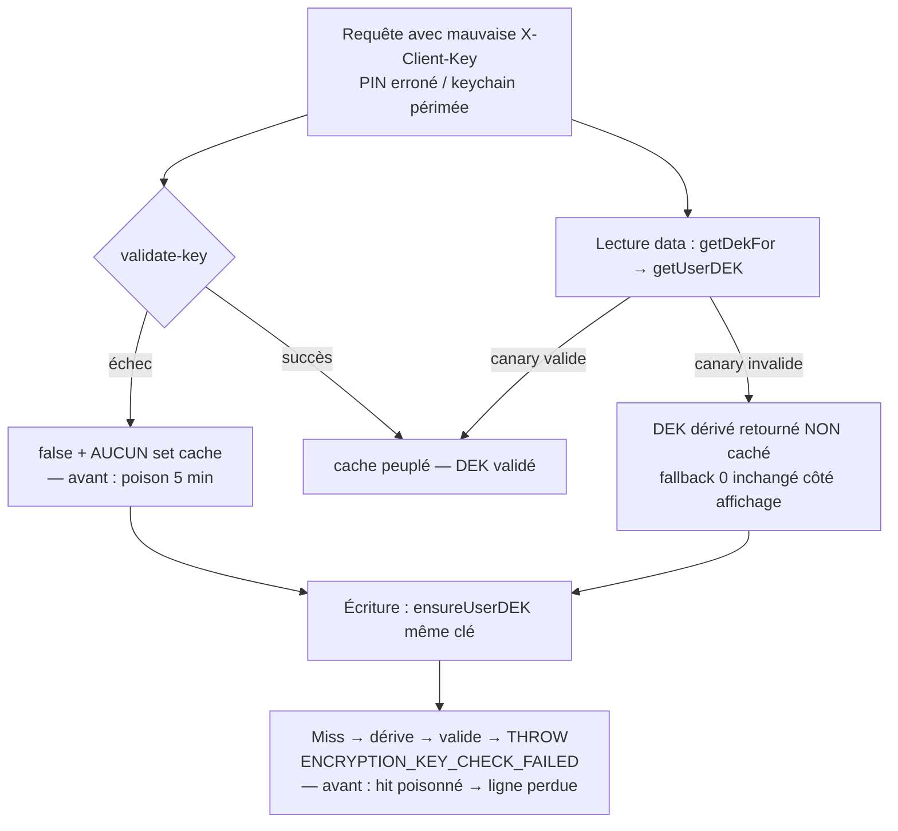

# Instruction: Validation du DEK avant mise en cache

> **Bug (P0, réel) :** `verifyAndEnsureKeyCheck` écrit le DEK dérivé dans le cache 5 min à
> `aes-gcm.crypto-service.ts:329` et ne vérifie le canary `key_check` qu'à `:334`. Sur mauvaise
> clé il retourne `false` mais le **mauvais DEK reste caché**. Un `ensureUserDEK` ultérieur avec
> la même mauvaise `X-Client-Key` (`:193-196`) fait un hit, saute sa propre validation et chiffre
> de nouvelles lignes sous le mauvais DEK → indéchiffrables à jamais. Déclencheur sans attaquant :
> clé iOS périmée après changement de PIN sur un autre appareil.
>
> **Second vecteur (ajout vs plan worktree) :** `getUserDEK` (`:215-240`) dérive et **cache sans
> valider** sur miss. Une lecture (`getDekFor`) avec clé périmée empoisonne le cache pour une
> écriture concurrente. L'invariant « seul un DEK validé entre dans le cache » doit couvrir ce
> chemin aussi — sans changer l'UX de lecture (fallback 0), donc : valider, et sur échec **ne pas
> cacher** (retourner le DEK dérivé non caché), sans throw.
>
> **Sous-finding (réel) :** `createRecoveryKey` (`:347`) et `#generateAndStoreRecoveryKey` (`:385`)
> passent par `getUserDEK`, qui ne vérifie jamais le canary → une recovery key peut wrapper un DEK
> mort (filet de secours silencieusement inutilisable).

## Architecture projection

> Tree of the final files. ✅ create · ✏️ modify · ❌ delete

```txt
backend-nest/src/modules/encryption/infrastructure/crypto/
├── aes-gcm.crypto-service.ts        ✏️ validate-before-cache (verifyAndEnsureKeyCheck) + getUserDEK sans cache sur échec + recovery via ensureUserDEK
└── aes-gcm.crypto-service.spec.ts   ✏️ 3 tests repro (rouges → verts)
```

## User Journey



## Tasks to do

### `1)` Ne cacher qu'un DEK validé dans `verifyAndEnsureKeyCheck`

> Réordonner pour que le mauvais DEK n'entre jamais dans le cache.

1. Quand `row.key_check` est présent : exécuter `validateKeyCheck(row.key_check, dek)` **d'abord**.
2. Échec → retourner `false` **sans** appeler `#dekCache.set` (supprimer le set de `:329` sur ce chemin) et sans autre effet de bord.
3. Succès → `#dekCache.set(...)` puis retourner `true`.
4. Garder le chemin première utilisation (`!row.key_check` : dérive → `generateKeyCheck` → `updateKeyCheckIfNull` → cache → `true`) — ce DEK est valide par définition puisqu'il amorce le canary.

### `2)` `getUserDEK` : valider sur miss, ne jamais cacher un DEK invalide

> Fermer le second vecteur sans toucher à l'UX de lecture.

1. Sur miss : récupérer la ligne complète (`findByUserId`, comme `verifyAndEnsureKeyCheck`) pour avoir `salt` ET `key_check`.
2. Si `key_check` présent et `validateKeyCheck` échoue → **ne pas** appeler `#dekCache.set` ; retourner le DEK dérivé non caché (les lectures retombent sur le fallback `tryDecryptAmount` existant — comportement affichage inchangé).
3. Si validation OK (ou pas de `key_check` amorcé) → cacher puis retourner.
4. Ne PAS throw ici : le comportement de lecture en cas de mauvaise clé reste la décision produit différée (voir plan Decisions).

### `3)` Recovery keys : wrapper uniquement un DEK prouvé

1. `createRecoveryKey` (`:347`) : remplacer `getUserDEK` par `ensureUserDEK` (valide le canary sur miss, throw `ENCRYPTION_KEY_CHECK_FAILED` sur mauvaise clé).
2. Même remplacement dans `#generateAndStoreRecoveryKey` (`:385`).

### `4)` Tests (repro d'abord, règle bug du repo)

1. `verifyAndEnsureKeyCheck` avec `key_check` stocké + mauvaise clé → retourne `false` ET un `ensureUserDEK` subséquent avec la même clé **throw** (prouve l'absence de poison).
2. `getUserDEK` (via `getDekFor`) avec mauvaise clé → retourne sans throw (UX lecture), puis `ensureUserDEK` même clé → **throw** (prouve que la lecture n'a pas empoisonné le cache).
3. `createRecoveryKey` avec mauvaise clé (canary présent) → **throw** avant tout `wrapDEK`/`updateWrappedDEK`.
4. Constater le rouge sur code non fixé, vert après ; happy path `verifyAndEnsureKeyCheck` réussi peuple toujours le cache (une dérivation).

## Test acceptance criteria

| Task | Acceptance criteria                                                                                                                                        |
| ---- | ---------------------------------------------------------------------------------------------------------------------------------------------------------- |
| 1    | Après un `verifyAndEnsureKeyCheck` échoué, le cache ne contient aucune entrée pour ce `userId:clientKey` ; l'écriture suivante re-dérive et rejette la clé.  |
| 2    | Une lecture avec mauvaise clé ne throw pas (affichage fallback inchangé) mais laisse le cache vierge : l'écriture concurrente rejette la clé au lieu de chiffrer sous un mauvais DEK. |
| 3    | `setup-recovery`/`regenerate-recovery` avec mauvaise clé → erreur explicite, aucun `wrapped_dek` persisté.                                                    |
| 4    | Les 3 specs échouent sur le code actuel et passent après fix ; `bun test aes-gcm.crypto-service.spec.ts` vert.                                                |
