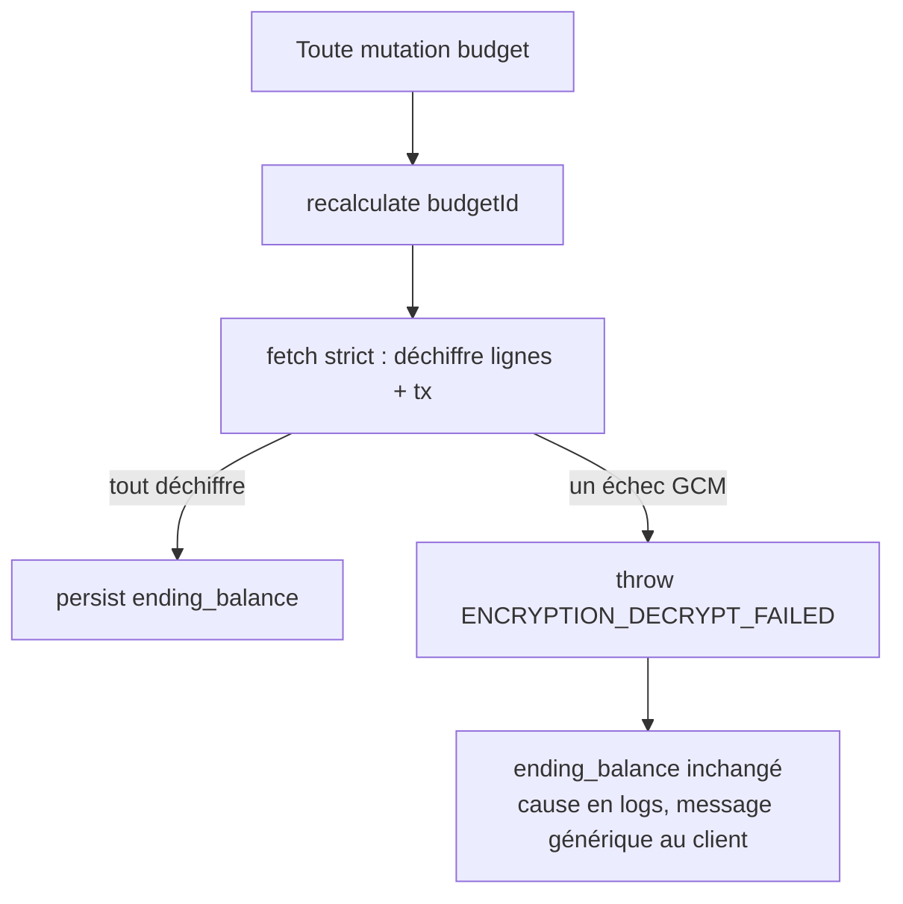

# Instruction: Recalcul de balance fail-closed

> **Bug (P0, réel — côté persistance) :** `RecalculateBudgetBalancesUseCase.calculateEndingBalance`
> lit lignes + transactions via `SupabaseBudgetRepository.fetchBudgetData`, qui déchiffre avec
> `tryDecryptAmount(..., 0)` — tout échec GCM (ciphertext sous mauvais DEK, ou échec d'auth-tag =
> altération) devient silencieusement `0`. `recalculate` chiffre ensuite ce total faux et **écrase**
> `monthly_budget.ending_balance` (`recalculate-budget-balances.use-case.ts:22-24` →
> `persistEndingBalance`), et `recalculate` tourne après presque chaque mutation. Une seule ligne
> indéchiffrable committe un solde faux mais crédible, et jette la détection de falsification AEAD.
> Cette phase rend le **chemin d'écriture fail-closed** ; le comportement de lecture est différé
> (voir plan Decisions).

## Architecture projection

> Tree of the final files. ✅ create · ✏️ modify · ❌ delete

```txt
backend-nest/src/
├── modules/budget/
│   ├── application/
│   │   ├── recalculate-budget-balances.use-case.ts        ✏️ utilise le fetch strict
│   │   └── recalculate-budget-balances.use-case.spec.ts   ✏️ repro rouge → vert
│   ├── infrastructure/persistence/
│   │   ├── supabase-budget.repository.ts                  ✏️ fetch strict dédié au recalcul
│   │   └── supabase-budget.repository.spec.ts             ✏️ couvre le throw strict
│   └── domain/ports/budget-repository.port.ts             ✏️ expose le fetch strict
├── common/constants/error-definitions.ts                  ✏️ ENCRYPTION_DECRYPT_FAILED (500)
shared/src/error-codes.ts                                  ✏️ entrée API_ERROR_CODES correspondante
```

## User Journey



## Tasks to do

### `1)` Ajouter une lecture à déchiffrement strict, réservée au recalcul

> Le recalcul exige des montants exacts : un échec doit stopper l'écriture, pas la mettre à zéro.

1. Dans `SupabaseBudgetRepository`, ajouter un fetch dédié (ex. `fetchBudgetDataForRecalc(budgetId)`) qui ne retourne que ce que la formule consomme — lignes `{ id, kind, amount }`, transactions `{ kind, amount, budgetLineId }`.
2. Déchiffrer avec la primitive **stricte** : `amount ? this.encryption.decryptAmount(amount, dek) : 0`. Un `amount` légitimement `null` → `0` ; un ciphertext non-null qui échoue GCM → `decryptAmount` throw (distingue « pas de valeur » de « indéchiffrable »).
3. Wrapper l'erreur dans `BusinessException(ERROR_DEFINITIONS.ENCRYPTION_DECRYPT_FAILED, { budgetId }, { operation: 'recalc.decrypt', entityId: budgetId }, { cause })` en suivant la signature existante de `BusinessException`. Ne jamais logger le montant.
4. Réutiliser les requêtes de `fetchBudgetData` ; seule l'étape de déchiffrement diffère. Ne **pas** modifier `fetchBudgetData` (lecture + export gardent le fail-open tant que la décision UX n'est pas prise).
5. Exposer la méthode sur `budget-repository.port.ts` et aligner les mocks/fakes des tests.

### `2)` Brancher le recalcul sur le chemin strict

1. `RecalculateBudgetBalancesUseCase.calculateEndingBalance` appelle le fetch strict au lieu de `fetchBudgetData`.
2. Laisser la `BusinessException` se propager — `persistEndingBalance` ne tourne jamais, le dernier solde correct est conservé, la mutation remonte l'erreur. Pas de try/catch nouveau.

### `3)` Définition d'erreur

1. Ajouter `ENCRYPTION_DECRYPT_FAILED` dans `error-definitions.ts` + l'entrée correspondante dans `shared/src/error-codes.ts` (`httpStatus: 500`, message client générique, ex. `'Unable to process encrypted data'`). Le détail reste en logs via `{ cause }`.
2. `shared` doit être rebuild avant les tests backend (`pnpm build:shared`).

### `4)` Tests (repro d'abord)

1. Spec repo : une ligne dont `amount` est un ciphertext d'un **autre** DEK → le fetch strict throw `ENCRYPTION_DECRYPT_FAILED` ; un `amount` `null` ne throw pas.
2. Spec use-case : quand le fetch strict throw, `persistEndingBalance` n'est **jamais** appelé (mock jamais invoqué) et `recalculate` rejette.

## Test acceptance criteria

| Task | Acceptance criteria                                                                                                                  |
| ---- | ------------------------------------------------------------------------------------------------------------------------------------ |
| 1    | Un montant non-null indéchiffrable → le fetch strict throw ; montants tous `null` ou tous déchiffrables → nombres propres retournés. |
| 2    | Sur échec de déchiffrement pendant un recalcul, `monthly_budget.ending_balance` reste inchangé (aucun `update` émis).                 |
| 3    | L'appelant reçoit un 500 au message générique ; la cause réelle (jamais le montant) n'apparaît qu'en logs structurés.                 |
| 4    | Les 2 specs échouent avant, passent après ; les specs existantes recalc/lecture/export restent vertes (fail-open lecture inchangé).   |
