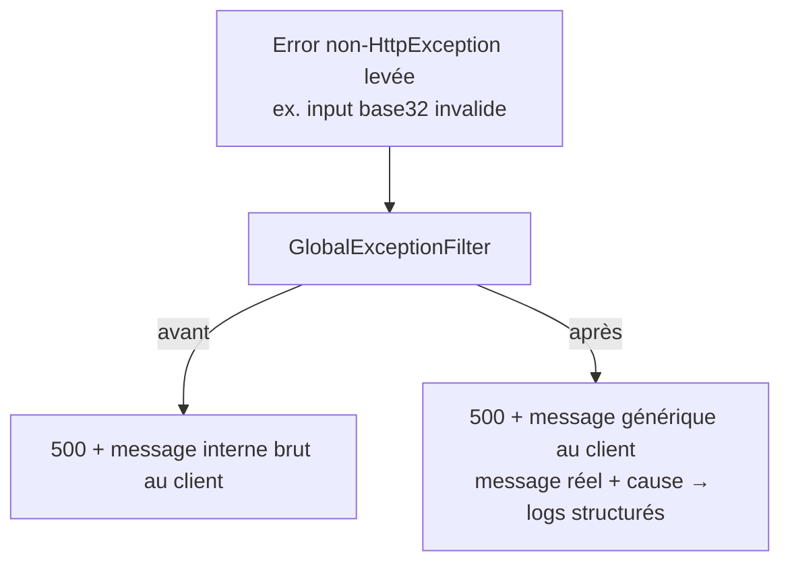

# Instruction: Ne plus fuiter les messages internes des 500

> **Bug (P1, réel) :** `GlobalExceptionFilter.handleErrorException` renvoie
> `getErrorMessage(exception)` — le `exception.message` brut — au client pour toute erreur qui
> n'est pas une `HttpException`, dans **tous** les environnements
> (`global-exception.filter.ts:250-261,286-290`). Des internes crypto (« Decrypted amount is not a
> valid number », « Unwrapped DEK has invalid length ») et même du input attaquant reflété
> (`Invalid base32 character: ${char}`) atteignent le body de réponse. Seule la stack est
> env-gatée ; le message ne l'est pas. `BusinessException` (une `HttpException`) n'est pas concernée
> — ses messages sont intentionnels et restent tels quels.

## Architecture projection

> Tree of the final files. ✅ create · ✏️ modify · ❌ delete

```txt
backend-nest/src/common/filters/
├── global-exception.filter.ts        ✏️ message client générique pour les 500 non maîtrisées ; vrai message → logs
└── global-exception.filter.spec.ts   ✏️ assert : aucun message brut dans le body, logger reçoit le détail
```

## User Journey



## Tasks to do

### `1)` Body générique pour les erreurs non maîtrisées, détail en logs

> Le client voit un 500 stable ; l'opérateur voit la cause.

1. Dans `handleErrorException`, remplacer le `message` client par `ERROR_DEFINITIONS.INTERNAL_SERVER_ERROR.message()` (générique) au lieu de `getErrorMessage(exception)`.
2. Conserver `originalError: exception` dans l'`ErrorData` interne pour que le chemin de log existant enregistre toujours le vrai message + chaîne `cause` — ne pas affaiblir le logging.
3. Ne pas toucher `handleHttpException` — les messages `BusinessException`/`HttpException` sont délibérés et déjà sûrs.
4. Garder le dev-gate de la stack tel quel.

### `2)` Test

1. Lever une `Error('ENCRYPTION_MASTER_KEY must be …')` à travers le filtre avec `NODE_ENV` production/unset → `message` de réponse = texte générique, `code` = `INTERNAL_SERVER_ERROR`, chaîne brute absente du body.
2. Asserter que le logger a bien reçu le message réel (spy sur l'appel error).

## Test acceptance criteria

| Task | Acceptance criteria                                                                                                          |
| ---- | ---------------------------------------------------------------------------------------------------------------------------- |
| 1    | Une erreur non-`HttpException` produit une réponse dont le `message` est le texte interne générique, dans tous les envs.      |
| 1    | Les réponses `BusinessException` sont inchangées au caractère près (message + code toujours exposés).                        |
| 2    | La spec prouve que la chaîne interne brute est loggée mais jamais présente dans le body sérialisé.                           |
