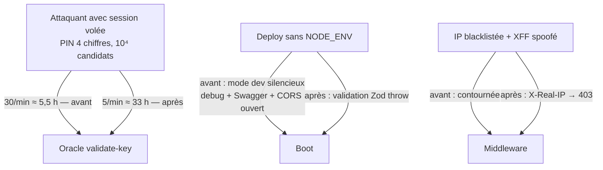

# Instruction: Durcissement config — throttle validate-key, NODE_ENV fail-loud, IP blacklist

> Trois items P1 de défense en profondeur. La direction du throttle est décidée : **resserrer
> `validate-key` à 5/min** pour matcher la doc. Le défaut `NODE_ENV=development` ne mord pas la
> prod actuelle (Railway + `Dockerfile:48` fixent `production`, vérifié) mais doit échouer
> bruyamment pour tout déploiement futur mal configuré. L'IP blacklist réintroduit une confiance
> dans `X-Forwarded-For` que le throttler a déjà corrigée.

## Architecture projection

> Tree of the final files. ✅ create · ✏️ modify · ❌ delete

```txt
backend-nest/src/
├── modules/encryption/infrastructure/http/encryption.controller.ts   ✏️ throttle validate-key → 5/min (:112)
├── modules/encryption/encryption.rate-limit.spec.ts                  ✏️ aligne les attentes sur 5/min
├── config/environment.ts                                             ✏️ NODE_ENV sans défaut (fail-loud) (:24-26)
├── config/environment.spec.ts                                        ✏️ parsing sans NODE_ENV → throw
└── common/middleware/
    ├── ip-blacklist.middleware.ts                                    ✏️ X-Real-IP d'abord, XFF ignoré (:50-63)
    └── ip-blacklist.middleware.spec.ts (si existant, sinon à créer)  ✏️ spoof XFF ≠ bypass
```

## User Journey



## Tasks to do

### `1)` Réconcilier le throttle `validate-key`

> Code `{ limit: 30, ttl: 60000 }` (`encryption.controller.ts:112`) vs `docs/ENCRYPTION.md:188` qui dit 5/min.

1. Passer `validate-key` à `{ limit: 5, ttl: 60000 }`.
2. Garder `verify-recovery-key` (`:219`) à 30/min — clés haute-entropie, non brute-forçables — et ne pas toucher `/recover` + `/change-pin` (5/h).
3. Aligner `encryption.rate-limit.spec.ts` sur la nouvelle limite.
4. Le lockout progressif (backoff sur échecs répétés) est une feature séparée — noté, non construit ici.

### `2)` Refus de boot si `NODE_ENV` absent

1. Supprimer le `.default('development')` sur l'enum `NODE_ENV` (`environment.ts:24-26`) → un env absent échoue la validation Zod au boot (fail-loud).
2. Vérifier les entrypoints (déjà conformes, confirmé à l'écriture du plan) : `start`, `dev`, `dev:local`, `dev:watch` fixent `NODE_ENV=development`, `start:prod` fixe `production`, `bun test` fixe `test`. Vérifier aussi les scripts CI/Docker : `Dockerfile:48` fixe `ENV NODE_ENV=production` ✓.
3. Si un chemin de boot non couvert est trouvé (script, Railway preview, e2e), y fixer NODE_ENV explicitement plutôt que réintroduire un défaut.

### `3)` IP blacklist : même extraction que le throttler

> `ip-blacklist.middleware.ts:50-63` lit `X-Forwarded-For` EN PREMIER alors que
> `user-throttler.guard.ts:190-211` documente pourquoi XFF est contrôlable par le client.

1. Réordonner `#extractIp` : `X-Real-IP` (posé par Railway) → `req.ip` ; ne plus lire `x-forwarded-for`.
2. Test : requête avec `X-Real-IP` blacklistée + `X-Forwarded-For: 1.2.3.4` → 403 ; requête avec seul un XFF blacklisté (sans X-Real-IP) → comportement documenté dans le test (selon `req.ip`).

### `4)` Qualité

1. `cd backend-nest && bun test` (config + middleware + encryption rate-limit) puis `pnpm quality`.

## Test acceptance criteria

| Task | Acceptance criteria                                                                                                        |
| ---- | -------------------------------------------------------------------------------------------------------------------------- |
| 1    | Le throttle `validate-key` lit `{ limit: 5, ttl: 60000 }`, conforme à `docs/ENCRYPTION.md` ; `verify-recovery-key` reste à 30/min. |
| 2    | Boot avec `NODE_ENV` absent → erreur de validation explicite au démarrage ; boot avec valeur fixée → comportement inchangé. |
| 3    | Une IP blacklistée ne contourne plus le blocage en forgeant `X-Forwarded-For`.                                              |
| 4    | Suites concernées vertes ; `pnpm quality` passe.                                                                            |
