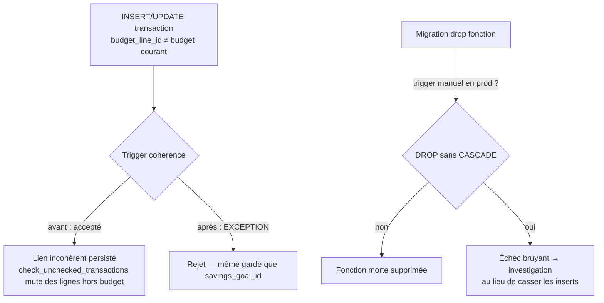

# Instruction: Cohérence DB transaction↔budget_line + suppression de la fonction morte

> **Périmètre écarté (documenté) :** NE PAS ajouter de `WITH CHECK` aux 4 policies UPDATE
> (`budget_line`, `transaction`, `savings_goal`, `template`). Le finding initial est un faux
> positif : Postgres réutilise l'expression `USING` comme `WITH CHECK` quand celui-ci est absent
> ([doc officielle](https://www.postgresql.org/docs/current/ddl-rowsecurity.html), exemple
> identique au scénario d'attaque). La relocation cross-tenant est déjà bloquée.
>
> **Ce qui reste (P2, réel mais faible) :** `transaction.budget_line_id` n'est validé par aucune
> contrainte DB (`20251223121017:19-28`, validation délibérément déléguée à l'app) — la même
> classe d'incohérence que celle déjà fermée pour `savings_goal_id` par le trigger
> `enforce_savings_goal_line_link` (`20260701083300`). Et `auto_confirm_user()` est du code mort
> orphelin (aucun `CREATE TRIGGER` dans le repo).

## Architecture projection

> Tree of the final files. ✅ create · ✏️ modify · ❌ delete

```txt
backend-nest/supabase/
├── migrations/
│   ├── 20260723120000_enforce_transaction_budget_line_coherence.sql   ✅ trigger miroir de 20260701083300
│   └── 20260723120100_drop_orphaned_auto_confirm_user.sql             ✅ DROP FUNCTION IF EXISTS (sans CASCADE)
└── tests/
    └── transaction_budget_line_coherence.sql (nom au format existant)  ✅ régression : lien cross-budget rejeté
```

## User Journey



## Tasks to do

### `1)` Test de régression Supabase (rouge d'abord)

> Suivre le pattern des tests existants dans `backend-nest/supabase/tests/`.

1. INSERT d'une transaction de user A avec `budget_line_id` d'une ligne appartenant à un AUTRE budget de A → doit lever une EXCEPTION après le trigger (rouge aujourd'hui).
2. Cas nominal : transaction avec `budget_line_id` du même budget, et transaction sans `budget_line_id` → passent.
3. `supabase start` + commande de test existante → constater le rouge.

### `2)` Trigger de cohérence

1. Créer `20260723120000_enforce_transaction_budget_line_coherence.sql` en miroir strict de `20260701083300` : SECURITY DEFINER, `set search_path` pinné, EXECUTE révoqué des rôles API ; sur INSERT/UPDATE de `transaction`, si `budget_line_id` non null, vérifier que la `budget_line` cible a le même `budget_id` que la transaction (la jointure `monthly_budget` garantit alors le même tenant).
2. Vérifier que les RPC SECURITY DEFINER qui écrivent des transactions (spread, toggle, `check_unchecked_transactions`) passent toujours — le trigger valide aussi leurs écritures.

### `3)` Suppression de la fonction morte

1. Créer `20260723120100_drop_orphaned_auto_confirm_user.sql` : `DROP FUNCTION IF EXISTS public.auto_confirm_user();` **sans CASCADE**, avec un commentaire expliquant pourquoi (orpheline ; l'auto-confirm live = setting Auth `mailer_autoconfirm`, décision phase 7).
2. Si la migration échoue en dry-run contre la prod parce qu'un trigger manuel y dépend → ne PAS forcer ; remonter à la phase 7 (vérification dashboard) avant de continuer.

### `4)` Validation

1. Tests Supabase au vert ; `supabase db push --dry-run` propre ; laisser `migrate-dryrun` CI valider la PR.
2. Pas de `generate-types` (ni colonnes ni types modifiés).

## Test acceptance criteria

| Task | Acceptance criteria                                                                                                                              |
| ---- | ------------------------------------------------------------------------------------------------------------------------------------------------ |
| 1-2  | INSERT/UPDATE de `transaction` avec `budget_line_id` d'un autre budget → EXCEPTION ; liens cohérents et `budget_line_id` null → OK ; RPC existantes vertes. |
| 3    | `auto_confirm_user` absente du schéma après migration (ou échec documenté → phase 7) ; signup/login/email flows non impactés.                       |
| 4    | Suite Supabase verte ; dry-run sans erreur.                                                                                                       |
