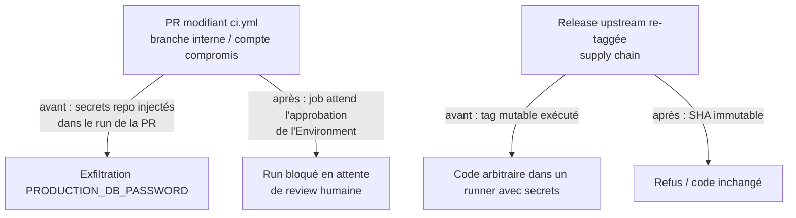

# Instruction: Infra & CI/CD — Node LTS, gates Environment, supply chain pinnée

> Quatre chantiers vérifiés. Node 20 est EOL (mars 2026,
> [nodejs.org](https://nodejs.org/en/about/previous-releases)) alors que la prod tourne dessus et
> que la CI/`engines` valident Node 24. Les secrets prod sont des secrets de repo simples,
> atteignables par un job déclenché sur `pull_request` (`ci.yml:733-763`) — repo **public**. Les
> actions tierces sont pinnées sur des tags mutables. Bun est installé par `curl | bash` non pinné.
> Prérequis humain : la phase 7 (création de l'Environment GitHub) doit être faite pour que la
> tâche 2 ait un effet réel — merger phase 6 sans phase 7 laisse `migrate` en échec bloquant.

## Architecture projection

> Tree of the final files. ✅ create · ✏️ modify · ❌ delete

```txt
backend-nest/Dockerfile                          ✏️ node:24-slim (digest pinné) ×2 + Bun version pinnée
.github/
├── workflows/
│   ├── ci.yml                                   ✏️ environment: production sur migrate + migrate-dryrun ; actions SHA-pinnées
│   ├── ios.yml                                  ✏️ actions SHA-pinnées
│   ├── claude-code-review.yml                   ✏️ claude-code-action SHA-pinnée
│   ├── claude-on-demand.yml                     ✏️ claude-code-action SHA-pinnée
│   └── supabase-deploy.yml                      ❌ fichier entièrement commenté, inerte
├── actions/
│   ├── setup-supabase-cli/action.yml            ✏️ actions/cache@v4 → @v5 (drift de version)
│   └── setup-monorepo/                          ❌ action composite inutilisée
└── dependabot.yml                               ✅ écosystème github-actions (bumps hebdo)
```

## User Journey



## Tasks to do

### `1)` Dockerfile : runtime LTS + install reproductible

1. Remplacer `node:20-slim` par `node:24-slim` pinné par digest (`node:24-slim@sha256:…`) aux lignes 2 et 41 — récupérer le digest courant (`docker buildx imagetools inspect node:24-slim`).
2. Pin Bun : `curl -fsSL https://bun.sh/install | bash -s "bun-v<version figée>"` (version = celle de la CI locale de référence) au lieu du `| bash` non pinné (`Dockerfile:10-12`).
3. Vérifier le build : `docker build -t pulpe-backend-test backend-nest/..` (contexte racine) puis `docker run --rm  node --version` → `v24.x`.

### `2)` Gates Environment sur les jobs migration

> Ne prend effet qu'une fois la phase 7 (création de l'Environment + déplacement des secrets) faite.

1. `ci.yml` job `migrate-dryrun` (:733) et job `migrate` (:808) : ajouter `environment: production`.
2. Référencer les secrets depuis l'Environment (même syntaxe `secrets.*` — la résolution change automatiquement une fois les valeurs déplacées côté GitHub).
3. Envisager de faire pointer le dry-run vers le projet **preview** (`lrphlfjkzkwyllejanrd`) au lieu de la prod — réduit encore le blast radius ; si retenu, secrets preview dans un Environment séparé.

### `3)` SHA-pin des actions + dependabot

1. Dans chaque workflow : remplacer les tags par le SHA complet du commit correspondant (`actions/checkout@v5` → `actions/checkout@<sha40> # v5.x`), pour toutes les actions listées par l'audit (`oven-sh/setup-bun`, `EnricoMi/publish-unit-test-result-action`, `maxim-lobanov/setup-xcode`, `anthropics/claude-code-action`, `actions/*`, `pnpm/action-setup`).
2. Aligner `actions/cache@v4` → `@v5` dans `.github/actions/setup-supabase-cli/action.yml:17`.
3. Créer `.github/dependabot.yml` avec l'écosystème `github-actions` (intervalle weekly) pour maintenir les pins à jour.

### `4)` Hygiène (petit, explicite)

1. Supprimer `.github/workflows/supabase-deploy.yml` (entièrement commenté) et `.github/actions/setup-monorepo/` (inutilisé).

### `5)` Validation

1. CI verte sur la PR (jobs fork-PR : `migrate-dryrun` skippé sans secret = comportement déjà géré par `ci-success`).
2. Build image OK (tâche 1.3) ; `grep -R "uses: .*@v" .github/workflows/` ne retourne plus de tag mutable.

## Test acceptance criteria

| Task | Acceptance criteria                                                                                                                            |
| ---- | ----------------------------------------------------------------------------------------------------------------------------------------------- |
| 1    | L'image finale exécute Node 24.x ; le Dockerfile ne contient plus `node:20` ni d'install Bun sans version.                                      |
| 2    | Les deux jobs migration déclarent `environment: production` ; après phase 7, un run `pull_request` sur ces jobs reste « Waiting » en attente d'approbation. |
| 3    | Toutes les actions référencées par SHA 40 chars ; `dependabot.yml` ouvre des PRs de bump d'actions.                                             |
| 4-5  | Fichiers morts supprimés ; CI complète verte.                                                                                                    |
