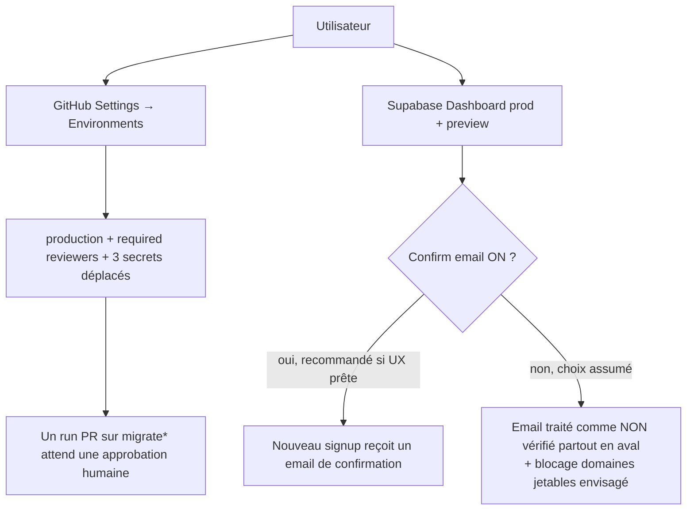

# Instruction: Actions manuelles dashboards (utilisateur uniquement)

> Ces actions sont hors de portée du code : consoles GitHub/Supabase/PostHog. Elles ferment deux
> findings réels (secrets CI exposés aux PR runs ; emails jamais vérifiés) et conditionnent
> l'efficacité de la phase 6 tâche 2. À faire dans l'ordre.

## User Journey

## Tasks to do

### `1)` GitHub Environment « production » + déplacement des secrets

> Sans ça, `environment: production` (phase 6) bloque `migrate` définitivement ; avec, les runs PR attendent une approbation.

1. Repo GitHub → **Settings → Environments → New environment** : nom `production` (exact, minuscules).
2. **Required reviewers** : t'ajouter toi-même (même solo : ça transforme tout run utilisant ces secrets en approbation explicite).
3. Dans l'Environment, créer les 3 secrets avec les valeurs actuelles : `SUPABASE_ACCESS_TOKEN`, `PRODUCTION_DB_PASSWORD`, `PRODUCTION_PROJECT_ID`.
4. Supprimer ces 3 secrets de **Settings → Secrets and variables → Actions** (niveau repo) pour qu'ils ne soient plus accessibles aux runs hors Environment.
5. Test : ouvrir une PR touchant `ci.yml` → le job `migrate-dryrun` doit apparaître « Waiting » jusqu'à approbation.

### `2)` Décision email — `mailer_autoconfirm` (prod `qhhlloqisgzwcsrbdppn` + preview `lrphlfjkzkwyllejanrd`)

> Vérifié live : `mailer_autoconfirm: true` → n'importe quel email est confirmé sans vérification (squatting d'email, comptes jetables sans friction).

1. Pré-requis : vérifier que le frontend a un écran/flux post-signup « vérifie ta boîte » (deep link `pulpe://reset-password` existe déjà dans `config.toml` ; vérifier l'équivalent confirmation). Si l'UX n'est pas prête, planifier d'abord l'écran.
2. Recommandé : Supabase Dashboard → **Authentication → Sign In / Providers → Email → activer « Confirm email »** sur prod ET preview.
3. Si le choix assumé est de garder l'auto-confirm : documenter la décision, traiter l'email comme **non vérifié** dans tous les process en aval (support, récupération, remboursements) et envisager le blocage des domaines jetables (Auth hook `before-user-created`).
4. Coup d'œil **Database → Triggers** sur `auth.users` : si un trigger `auto_confirm_user` y existe (créé manuellement hors migrations), le noter avant la phase 5 tâche 3 — sinon la migration DROP passera seule.

### `3)` Optionnel — PostHog

1. Remplacer la clé personnelle unique `POSTHOG_PERSONAL_API_KEY` (CI webapp, iOS, Vercel) par des clés dédiées par pipeline — limite le blast radius si une pipeline est compromise.

## Test acceptance criteria

| Task | Acceptance criteria                                                                                                                     |
| ---- | --------------------------------------------------------------------------------------------------------------------------------------- |
| 1    | Une PR modifiant `ci.yml` laisse `migrate-dryrun` en attente d'approbation ; les secrets n'apparaissent plus au niveau repo.             |
| 2    | Selon le choix : un nouveau signup reçoit un email de confirmation (et doit confirmer avant d'entrer), OU la décision d'auto-confirm est écrite et l'email est traité comme non vérifié en aval. |
| 2    | Aucun trigger inattendu sur `auth.users` en prod (ou il est documenté et la phase 5 tâche 3 a été adaptée).                              |
| 3    | (Optionnel) Chaque pipeline utilise sa propre clé PostHog.                                                                               |
