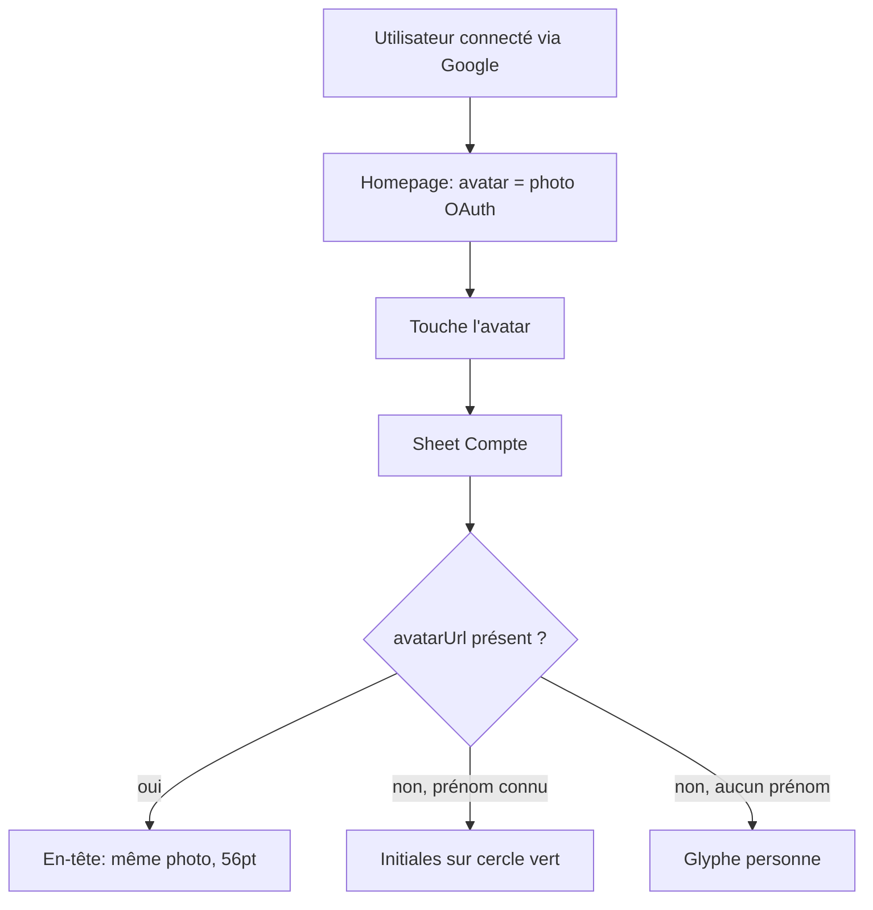

# Instruction: Avatar partagé (homepage + Compte)

## Architecture projection

> Tree of the final files. ✅ create · ✏️ modify · ❌ delete

```txt
.
├── ios/Pulpe/Shared/Components/
│   └── ProfileAvatar.swift                          ✅ cascade photo → initiales → glyphe, seule source de vérité
├── ios/Pulpe/Features/CurrentMonth/Components/
│   └── DashboardGreeting.swift                      ✏️ délègue à ProfileAvatar, perd avatar/avatarContent/avatarFallback/initials
├── ios/Pulpe/Features/Account/
│   └── AccountView.swift                            ✏️ profileHeaderSection utilise ProfileAvatar (photo + 56pt tokenisé)
└── ios/PulpeTests/Shared/
    └── ProfileAvatarTests.swift                     ✅ couvre la dérivation des initiales
```

## User Journey



## Wireframe

```txt
┌─────────────────────────────────────┐
│ Fermer                               │
│ Compte                               │
│                                      │
│              ┌───────┐               │
│              │  (1)  │               │
│              └───────┘               │
│           (2) email                  │
│               Pulpe                  │
│                                      │
│ PARAMÈTRES DE L'APPLICATION          │
│ ┌──────────────────────────────────┐ │
│ │ (3) Sécurité · Préférences · Tags│ │
│ └──────────────────────────────────┘ │
│ SUPPORT / LÉGAL / Déconnexion        │
└─────────────────────────────────────┘
```

1. Avatar 56pt : photo de profil si disponible, sinon initiales, sinon glyphe. Seule zone qui change.
2. Email et nom de l'app, inchangés, sous l'avatar.
3. Sections de réglages existantes, inchangées.

## Tasks to do

### `1)` Créer `ProfileAvatar`

> Un seul composant rend la cascade photo → initiales → glyphe, paramétré pour les deux surfaces.

1. Créer `ios/Pulpe/Shared/Components/ProfileAvatar.swift` : `struct ProfileAvatar: View` avec `firstName: String?`, `email: String?`, `avatarUrl: String?`, puis `diameter: CGFloat = DesignTokens.IconSize.listRow`, `background: Color = .surfaceContainerLowest`, `foreground: Color = .textTertiary`, `font: Font = PulpeTypography.metricLabelBold` (les défauts reproduisent la homepage).
2. Corps : `Circle().fill(background)` à `diameter`, `.overlay { content }`, `.clipShape(Circle())`. Aucune ombre dans le composant — le caller la pose (la homepage en a une, Compte non).
3. Contenu : si `avatarUrl` parse en `URL`, `CachedAsyncImage(url:)` → `image.resizable().scaledToFill()`, placeholder = le fallback (jamais de trou pendant le chargement) ; sinon le fallback direct.
4. Fallback : `Text(initials)` si initiales dérivables, sinon `Image(systemName: "person.fill")`, tous deux en `font` + `foreground`.
5. Exposer la dérivation en `static func initials(firstName: String?, email: String?) -> String?` (testable) : jusqu'à deux premières lettres des mots du prénom, sinon première lettre de l'email, sinon `nil`. Reprendre la logique actuelle de `DashboardGreeting`, sans la réécrire.
6. Ajouter un `#Preview` couvrant les trois états (photo, initiales, glyphe) sur les deux tailles.

### `2)` Brancher la homepage

> `DashboardGreeting` cesse d'être propriétaire du rendu avatar.

1. Dans `DashboardGreeting`, remplacer le contenu du `Button(action: onAvatarTap)` par `ProfileAvatar(firstName:email:avatarUrl:)` suivi de `.shadow(DesignTokens.Shadow.subtle)`.
2. Supprimer `avatar`, `avatarContent`, `avatarFallback` et `initials` du fichier.
3. Conserver à l'identique `circleIconButtonStyle()`, `accessibilityLabel("Mon compte")` et `accessibilityElement(children: .contain)`.

### `3)` Brancher l'écran Compte

> L'en-tête Compte affiche la photo, garde son identité visuelle verte, et perd sa valeur magique.

1. Dans `AccountView.profileHeaderSection`, remplacer le `ZStack { Circle().fill(.pulpePrimary).frame(width: 56, height: 56); Text(initial) }` par `ProfileAvatar(firstName: appState.currentUser?.firstName, email: appState.currentUser?.email, avatarUrl: appState.currentUser?.avatarUrl, diameter: DesignTokens.IconSize.heroBadge, background: .pulpePrimary, foreground: .textOnPrimary, font: PulpeTypography.amountXL)`.
2. Supprimer la variable locale `initial` ; garder `let email = ...` pour la ligne de texte en dessous.
3. Marquer l'avatar `.accessibilityHidden(true)` : l'email juste dessous porte déjà l'information, VoiceOver n'a pas à énoncer une lettre isolée.

### `4)` Test de la dérivation d'initiales

> Une seule brique porte de la logique : elle laisse une vérification exécutable.

1. Créer `ios/PulpeTests/Shared/ProfileAvatarTests.swift` (Swift Testing, `@Suite`, anglais).
2. Cas : prénom à deux mots → deux lettres majuscules ; prénom simple → une lettre ; prénom vide ou absent → première lettre de l'email en majuscule ; ni prénom ni email → `nil`.

## Test acceptance criteria

| Task | Acceptance criteria                                                                                                                                    |
| ---- | ------------------------------------------------------------------------------------------------------------------------------------------------------ |
| 1    | Le `#Preview` de `ProfileAvatar` montre les trois états ; aucune valeur visuelle brute n'apparaît dans le fichier (tout passe par `DesignTokens` / `Color+Pulpe`). |
| 2    | La homepage rend un avatar identique à avant la modification (photo Google, ombre, cercle 40pt, tap ouvrant la sheet Compte).                            |
| 3    | Compte connecté via Google : l'en-tête de la sheet Compte affiche la photo de profil dans un cercle 56pt. Compte email/Apple : initiales blanches sur cercle vert, comme aujourd'hui. |
| 4    | `xcodebuild test -only-testing:PulpeTests/ProfileAvatarTests` passe.                                                                                     |
