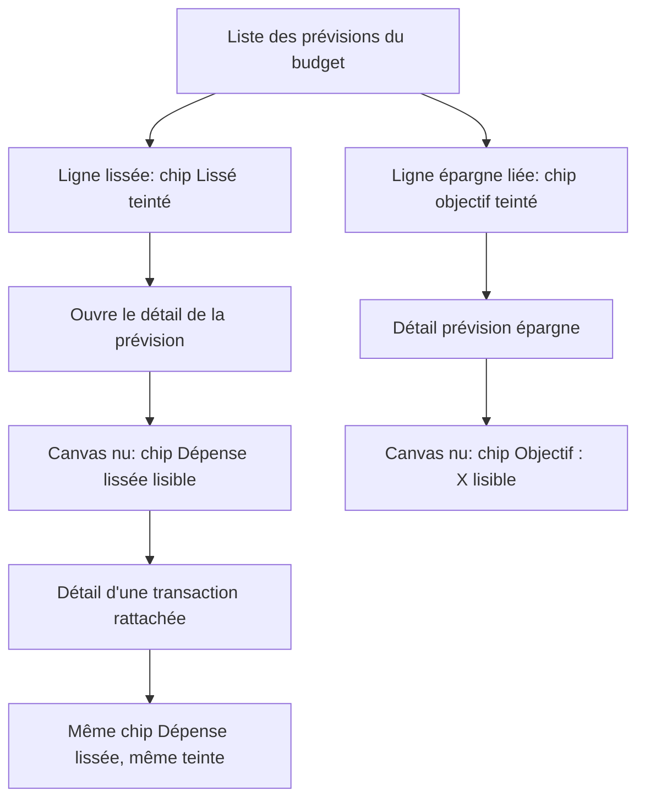

# Instruction: Teinte des chips informatifs (Lissé, Objectif)

## Architecture projection

> Tree of the final files. ✅ create · ✏️ modify · ❌ delete

```txt
.
├── ios/Pulpe/Shared/Components/
│   └── PulpeChip.swift                                      ✏️ `Style.semantic(_:)`, recette unique teinte + encre
├── ios/Pulpe/Features/Budgets/BudgetDetails/
│   ├── BudgetLineMixedRow.swift                             ✏️ chips « Lissé » et objectif → vert épargne
│   ├── BudgetLineDetailPage+SavingsGoalLink.swift            ✏️ chip « Objectif : X » → vert épargne
│   └── Spread/SpreadAffordanceButton.swift                   ✏️ chip « Dépense lissée » → vert épargne (page prévision + page transaction)
├── ios/Pulpe/Features/SavingsGoals/Components/
│   └── SavingsGoalStatusBadge.swift                         ✏️ consomme `Style.semantic(_:)` au lieu de recomposer la recette
└── ios/DESIGN.md                                            ✏️ §Chips & Pills : documenter `semantic(_:)` comme voie par défaut
```

## User Journey



## Wireframe

```txt
┌─────────────────────────────────────┐   ┌─────────────────────────────────────┐
│ (1) Liste des prévisions             │   │ (3) Détail de la prévision           │
│ ┌─────────────────────────────────┐ │   │  Nom · point de catégorie            │
│ │ ○ DÉPENSE                        │ │   │  ┌───────────────────┐               │
│ │   [ 2 ] Lissé                    │ │   │  │ (4) Objectif : X  │               │
│ │   Assurance          120.00 CHF  │ │   │  └───────────────────┘               │
│ └─────────────────────────────────┘ │   │  ┌───────────────────┐               │
│ ┌─────────────────────────────────┐ │   │  │ (5) Dépense lissée│ ›             │
│ │ ○ ÉPARGNE                        │ │   │  └───────────────────┘               │
│ │   [ 2 ] Objectif : Vacances      │ │   │  ── hero + transactions ──           │
│ │   Épargne             80.00 CHF  │ │   │                                      │
│ └─────────────────────────────────┘ │   │  [ Ajouter une transaction ]          │
└─────────────────────────────────────┘   └─────────────────────────────────────┘
```

1. Liste des prévisions : les chips vivent sur une carte blanche (`surfaceContainerLowest`).
2. Emplacement des chips dans la colonne centrale de la ligne, au-dessus du libellé. Position inchangée.
3. Page détail : les chips vivent sur le canvas nu (`appBackground`), là où `.muted` est interdit.
4. Chip objectif : teinte épargne, aligné sur le badge de statut d'objectif.
5. Chip lissage : même teinte, chevron conservé. Même composant sur la page détail transaction.

## Tasks to do

### `1)` Extraire la recette de teinte

> Une seule façon de composer « teinte à 12 % + encre pleine », celle du commit `c42f124b5`.

1. Dans `PulpeChip.swift`, ajouter sur `Style` un `static func semantic(_ color: Color) -> Style` retournant `.tinted(surface: color.opacity(DesignTokens.Opacity.badgeBackground), foreground: color)`. Commenter qu'il couvre le cas « teinte et encre partagent la couleur » et que les paires dissymétriques restent en `.tinted` explicite.
2. `SavingsGoalStatusBadge.swift` : les cas `.active` / `.completed` consomment `Style.semantic(.financialSavings)` ; `.paused` garde son `.tinted` explicite (teinte et encre y diffèrent). Rendu inchangé.

### `2)` Teinter les chips « Lissé »

> Les deux surfaces du lissage sortent de `.muted`.

1. `BudgetLineMixedRow.swift` : le `PulpeChip(icon: "calendar", label: "Lissé", ...)` passe de `style: .muted` à `style: .semantic(.financialSavings)`.
2. `SpreadAffordanceButton.swift` : même bascule sur le chip `"Dépense lissée"`. Le chevron trailing perd son `foregroundStyle(Color.textTertiary)` explicite pour hériter de l'encre du chip.
3. Mettre à jour le commentaire de doc de `SpreadAffordanceButton` qui annonce encore « un `.muted` PulpeChip ».

### `3)` Teinter les chips « Objectif »

> Le chip de lien vers l'objectif rejoint le badge de statut, sur les deux surfaces.

1. `BudgetLineDetailPage+SavingsGoalLink.swift` : `style: .muted` → `style: .semantic(.financialSavings)`, et le chevron trailing hérite de l'encre du chip.
2. `BudgetLineMixedRow.swift` : même bascule sur le chip `savingsGoalName`.

### `4)` Verrouiller la règle dans la doc

> La règle « `.muted` jamais sur `appBackground` » gagne le vocabulaire qui permet de l'appliquer.

1. Dans `ios/DESIGN.md` §Chips & Pills : ajouter `Style.semantic(_:)` comme voie par défaut pour un chip d'état ou informatif, et nommer le vert épargne comme teinte des chips objectif et lissage.

## Test acceptance criteria

| Task | Acceptance criteria                                                                                                                                     |
| ---- | ------------------------------------------------------------------------------------------------------------------------------------------------------- |
| 1    | Aucun appel ne recompose `X.opacity(badgeBackground)` à la main hors `Style.semantic`. Le badge de statut d'objectif est visuellement inchangé.           |
| 2    | Sur la page détail d'une prévision lissée, le chip « Dépense lissée » se détache visiblement du canvas, en clair comme en sombre. Même rendu sur la page détail d'une transaction rattachée. |
| 3    | Sur la page détail d'une prévision d'épargne liée, le chip « Objectif : X » se détache du canvas ; dans la liste des prévisions, les chips « Lissé » et « Objectif » restent lisibles sur la carte blanche. |
| 4    | `ios/DESIGN.md` nomme la teinte à utiliser pour un nouveau chip informatif sans avoir à lire le code.                                                    |
| all  | `xcodebuild build -scheme PulpeLocal` passe (ajouter `-configuration Local` si l'erreur de dépendance de module apparaît) et `PulpeChipTests` reste vert. |
