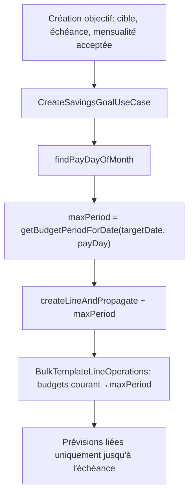

# Instruction: borner la propagation à la création de l'objectif

## Architecture projection

```txt
backend-nest/src/modules/
├── budget-template/
│   ├── application/
│   │   ├── bulk-template-line-operations.use-case.ts        ✏️ filtre les budgets de propagation au-delà d'une période max optionnelle
│   │   └── bulk-template-line-operations.use-case.spec.ts   ✏️ repro : un budget post-borne n'est pas propagé
│   ├── domain/ports/
│   │   └── template-line-propagation.port.ts                ✏️ `maxPeriod` sur `LinkedTemplateLineCreateInput`
│   └── infrastructure/adapters/
│       └── template-line-propagation.adapter.ts             ✏️ transmet `maxPeriod` au bulk use case
└── savings-goal/
    └── application/
        ├── create-savings-goal.use-case.ts                  ✏️ calcule la période d'échéance payDay-aware et la passe au port
        └── create-savings-goal.use-case.spec.ts             ✏️ repro : la baseline s'arrête à la période d'échéance
```

## User Journey



## Tasks to do

### `1)` Test de repro rouge

> Prouver que la propagation dépasse l'échéance avant de la corriger.

1. Dans `create-savings-goal.use-case.spec.ts`, un cas : `targetDate` à 3 périodes du mois courant, mock `findPayDayOfMonth` → 27.
2. Asserter que `createLineAndPropagate` reçoit une `maxPeriod` égale à la période d'échéance.
3. Dans `bulk-template-line-operations.use-case.spec.ts`, un cas : `fetchFutureBudgets` renvoie 6 budgets dont 3 au-delà de `maxPeriod` → seuls les 3 premiers ids partent au repo.
4. Les deux tests échouent (paramètre inexistant).

### `2)` Porter la borne jusqu'au sélecteur de budgets

> Un seul chemin, optionnel, sans toucher le contrat HTTP du bulk endpoint.

1. `LinkedTemplateLineCreateInput` : ajouter `maxPeriod?: BudgetPeriod` (type de `pulpe-shared`).
2. `BulkTemplateLineOperationsUseCase.execute` : 4e paramètre optionnel `options?: { maxPeriod?: BudgetPeriod }` — le contrôleur ne le passe pas.
3. `fetchPropagationBudgetIds` : après `fetchFutureBudgets`, écarter les budgets dont `periodIndex({ month, year })` dépasse `periodIndex(maxPeriod)`.
4. `TemplateLinePropagationAdapter.createLineAndPropagate` : relayer `input.maxPeriod` dans `options`.

### `3)` Calculer la période d'échéance à la création

> Même primitive payDay-aware que la progression — aucune formule nouvelle.

1. `CreateSavingsGoalUseCase.generateLinkedBaseline` : lire `this.repo.findPayDayOfMonth()`.
2. `maxPeriod = getBudgetPeriodForDate(parseIsoDateLocal(goal.targetDate), payDay)` — échéance **incluse**.
3. Passer `maxPeriod` à `createLineAndPropagate`.
4. Les deux tests de la tâche 1 passent.

### `4)` Documenter la borne

> `docs/SAVINGS.md` est la source de vérité métier ; le contrat change.

1. §3.5, puce « Écriture » : préciser que la propagation s'arrête à la période d'échéance, celle-ci incluse.

## Test acceptance criteria

| Task | Acceptance criteria                                                                                                                                    |
| ---- | ------------------------------------------------------------------------------------------------------------------------------------------------------ |
| 1    | Les deux specs échouent contre le code actuel et nomment la période fautive.                                                                           |
| 2    | Le bulk endpoint HTTP existant propage toujours à tous les budgets futurs — aucun cas de sa spec ne change.                                             |
| 3    | Créer un objectif échéant dans 3 périodes avec `monthlyContribution` pose la prévision sur les périodes courante→échéance et sur aucune période au-delà. |
| 4    | `docs/SAVINGS.md` §3.5 énonce la borne d'échéance.                                                                                                     |
