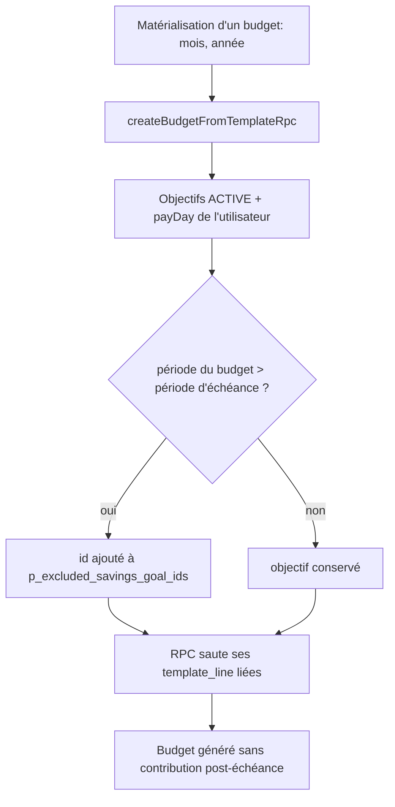

# Instruction: borner la génération mensuelle des budgets

## Architecture projection

```txt
backend-nest/
├── supabase/migrations/
│   └── 20260724120000_skip_savings_goal_lines_past_target.sql   ✅ `create_budget_from_template` accepte des objectifs à exclure
├── src/modules/budget/
│   ├── domain/ports/budget-repository.port.ts                   ✏️ signature de `createBudgetFromTemplateRpc`
│   └── infrastructure/persistence/
│       └── supabase-budget.repository.ts                        ✏️ calcule les objectifs échus pour la période, les passe à la RPC
├── src/modules/budget-template/
│   └── savings-goal-propagation.integration.spec.ts             ✏️ repro : période post-échéance générée sans la ligne liée
└── src/types/database.types.ts                                  ✏️ régénéré (`bun run generate-types:local`)
```

## User Journey



## Tasks to do

### `1)` Test de repro rouge

> Le chemin SQL est testable tel quel contre le Postgres local.

1. Dans `savings-goal-propagation.integration.spec.ts`, un cas : objectif `ACTIVE` dont `target_date` tombe dans la période courante, `template_line` liée sur le Mois Type.
2. Appeler `create_budget_from_template` pour une période **postérieure** à l'échéance.
3. Asserter qu'aucune `budget_line` du budget créé ne porte ce `savings_goal_id`, et que les lignes non liées du Mois Type sont bien copiées.
4. Le test échoue aujourd'hui : la ligne est copiée.

### `2)` Migration : exclusion explicite par id

> La RPC ne calcule aucune période ; elle reçoit la décision déjà prise.

1. `CREATE OR REPLACE FUNCTION public.create_budget_from_template(...)` avec un paramètre final `p_excluded_savings_goal_ids uuid[] DEFAULT '{}'` — la signature actuelle reste appelable.
2. Étendre le prédicat de la boucle : `AND (tl.savings_goal_id IS NULL OR (sg.status = 'ACTIVE' AND NOT (tl.savings_goal_id = ANY(p_excluded_savings_goal_ids))))`.
3. Conserver à l'identique le reste du corps (copie des tags, colonnes FX, `budget_lines_created`).
4. `bun run generate-types:local` puis `bun run format`.

### `3)` Calculer les objectifs échus au bord RPC

> Un seul point de passage couvre les trois use cases appelants.

1. Dans `supabase-budget.repository.ts`, avant l'appel RPC : charger `savings_goal` (`id`, `target_date`) en `status = 'ACTIVE'` pour l'utilisateur.
2. Lire `payDayOfMonth` depuis `auth.getUser()` (même lecture que `SupabaseSavingsGoalRepository.findPayDayOfMonth`).
3. Exclure les objectifs dont `periodIndex(getBudgetPeriodForDate(parseIsoDateLocal(target_date), payDay))` est strictement inférieur à `periodIndex({ month: p_month, year: p_year })`.
4. Passer la liste dans `p_excluded_savings_goal_ids`.
5. Le test de la tâche 1 passe ; les specs existantes de `create-budget`, `generate-budgets` et `ensure-budgets-for-periods` restent vertes.

### `4)` Documenter l'arrêt par échéance

> §6 n'énonce aujourd'hui qu'un seul motif d'arrêt de génération.

1. `docs/SAVINGS.md` §6 : ajouter que la génération saute aussi une `template_line` liée dès que la période dépasse l'échéance, l'objectif restant `ACTIVE`.

## Test acceptance criteria

| Task | Acceptance criteria                                                                                                                       |
| ---- | ----------------------------------------------------------------------------------------------------------------------------------------- |
| 1    | Le test d'intégration échoue contre la RPC actuelle et passe après la migration.                                                          |
| 2    | Un appel sans le nouveau paramètre produit exactement le budget d'avant — tags et métadonnées FX inclus.                                   |
| 3    | Un budget matérialisé pour une période postérieure à l'échéance ne porte aucune prévision liée à l'objectif ; les autres lignes sont là.   |
| 3    | Un budget matérialisé pour la période d'échéance elle-même porte bien la prévision liée.                                                   |
| 4    | `docs/SAVINGS.md` §6 mentionne l'arrêt par échéance à côté de l'arrêt par statut.                                                          |
