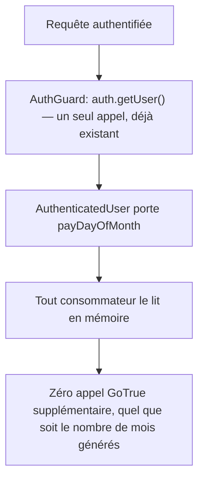

# Instruction: le jour de paie voyage avec l'utilisateur authentifié

> **Livrée** le 25.07 — [PR #546](https://github.com/neogenz/pulpe/pull/546), ticket PUL-315.
> 1192 tests backend au vert, releasable indépendamment du reste du chantier.

## Architecture projection

```txt
backend-nest/src/
├── common/
│   ├── decorators/user.decorator.ts                              ✏️ `payDayOfMonth` sur `AuthenticatedUser`
│   └── guards/
│       ├── auth.guard.ts                                         ✏️ mappe la métadonnée déjà en main
│       ├── auth.guard.spec.ts                                    ✏️ payDay porté, borné, absent
│       └── user-throttler.guard.ts                               ✏️ même mappage, même source
└── modules/budget/infrastructure/persistence/
    ├── supabase-budget.repository.ts                             ✏️ lit l'utilisateur, plus GoTrue
    └── supabase-budget.repository.spec.ts                        ✏️ `auth.getUser` n'est jamais appelé
```

## User Journey



## Tasks to do

### `1)` Test de repro

> Compter les appels, pas les supposer.

1. Spec du repository : générer un budget pour un utilisateur porteur d'un objectif actif, asserter que `auth.getUser` n'est **pas** appelé.
2. Le test échoue aujourd'hui : `getPayDayOfMonth` le rappelle à chaque matérialisation.

### `2)` Porter la métadonnée depuis les guards

> La donnée est déjà chargée ; elle était jetée.

1. `AuthenticatedUser` gagne `payDayOfMonth: number | null`.
2. `auth.guard.ts` la mappe depuis `user_metadata`, avec la même normalisation que les lectures existantes : entier, borné `PAY_DAY_MIN`/`PAY_DAY_MAX`, sinon `null`.
3. `user-throttler.guard.ts` construit le même objet — deux formes divergentes d'`AuthenticatedUser` seraient un piège pour la suite.
4. Vérifier les fabriques de tests et les mocks qui construisent un `AuthenticatedUser`.

### `3)` Débrancher la lecture réseau du repository budget

> Le gain est là : jusqu'à 36 allers-retours supprimés sur une génération longue.

1. `supabase-budget.repository.ts` : supprimer `getPayDayOfMonth` et lire `this.supabaseProvider.user.payDayOfMonth`.
2. Conserver le comportement fail-closed sur la lecture des objectifs, et le raccourci « aucun objectif actif ⇒ rien à résoudre ».
3. Le test de la tâche 1 passe.

> Les quatre autres copies de cette lecture, dans `budget/application/`, servent l'affichage et sortent du périmètre. Elles pourront suivre le même chemin plus tard, sans urgence.

## Test acceptance criteria

| Task | Acceptance criteria                                                                                                   |
| ---- | ------------------------------------------------------------------------------------------------------------------------ |
| 1    | La spec échoue avant la correction et passe après.                                                                    |
| 2    | Un utilisateur sans `payDayOfMonth` en métadonnée obtient `null`, et une valeur hors bornes est ramenée dans les bornes. |
| 2    | Les deux guards produisent un `AuthenticatedUser` de forme identique.                                                 |
| 3    | Générer douze budgets n'émet aucun appel GoTrue au-delà de celui du guard.                                            |
| 3    | Le comportement de bornage livré par PUL-311 est inchangé : la suite backend reste verte sans retouche de ses cas.     |
