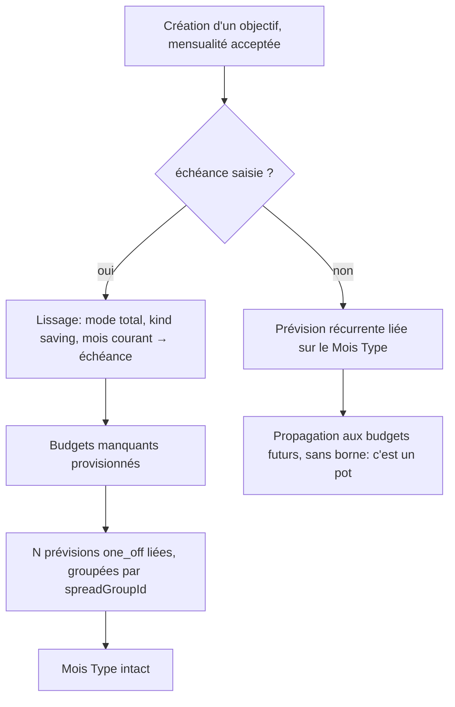

# Instruction: un objectif daté se décompose en prévisions bornées

> **Livrée** le 25.07 — [PR #547](https://github.com/neogenz/pulpe/pull/547), ticket PUL-316.
> Backend 1189 tests, frontend 2360, iOS 1860 — tous verts. Net −75 lignes.

## Ce que l'implémentation a démenti

Quatre écarts au plan, tous constatés en écrivant le code :

1. **Aucun port à créer (tâche 2).** `BUDGET_LINE_SPREAD_PORT` portait déjà `savingsGoalId`
   (`budget-line-spread.port.ts:29`) et l'injectait dans les lignes créées
   (`create-budget-line-spread.use-case.ts:389`). La tâche tombe entièrement — zéro fichier
   nouveau côté lissage.
2. **La branche « objectif sans échéance » est injouable (tâche 3.2).** `target_date` est
   `NOT NULL` aux trois couches : colonne DB, entité `SavingsGoal`, `savingsGoalCreateSchema`.
   L'écrire aurait été du code mort. Elle appartient à PUL-314, qui rendra l'échéance
   optionnelle — et c'est aussi pourquoi `TEMPLATE_LINE_PROPAGATION_PORT` a pu partir
   entièrement plutôt que d'être conservé pour un appelant futur.
3. **Le lissage provisionne — il a fallu trancher jusqu'où.** Le plan promettait « un mois de
   la période sans budget est provisionné ». Poussé au bout, un objectif à dix ans créait
   jusqu'à 120 budgets dans un seul POST. Décision produit de Maxime, prise en cours
   d'implémentation : **aucun budget créé à la création d'un objectif**. Seules les périodes
   déjà budgétées reçoivent leur prévision ; les autres restent des trous que le simulateur
   comble. Effet de bord heureux : plus besoin de garde « modèle par défaut », et le plafond
   `MAX_SPREAD_TRANCHES` (36) ne peut plus être atteint.
4. **Mode `perMonth`, pas `total`.** La mensualité est une intention **par mois**, pas un total
   à rediviser. Passer par `total` aurait fait `contribution × N` puis redivisé par `N`, en
   ajoutant une dérive au centime pour rien.

## Architecture projection

```txt
backend-nest/src/modules/
├── budget-line/domain/ports/
│   └── savings-baseline-spread.port.ts                     ✅ port serveur vers le lissage, sans passer par l'API publique
├── budget-line/infrastructure/adapters/
│   ├── savings-baseline-spread.adapter.ts                  ✅ délègue au lissage existant, avec `savingsGoalId`
│   └── savings-baseline-spread.adapter.spec.ts             ✅
├── savings-goal/application/
│   ├── create-savings-goal.use-case.ts                     ✏️ daté ⇒ lissage ; non daté ⇒ ligne de Mois Type
│   └── create-savings-goal.use-case.spec.ts                ✏️ les deux branches, et le Mois Type non touché
├── budget-template/domain/ports/
│   └── template-line-propagation.port.ts                   ✏️ `maxPeriod` retiré : plus de récurrence datée à borner
├── budget-template/application/
│   ├── bulk-template-line-operations.use-case.ts           ✏️ option `maxPropagationPeriod` retirée
│   └── bulk-template-line-operations.use-case.spec.ts      ✏️ describe « propagation horizon » retiré
└── savings-goal/savings-goal.module.ts                     ✏️ câble le nouveau port
docs/SAVINGS.md                                             ✏️ §3.5 réécrit : deux contenants selon l'horizon
```

## User Journey



## Tasks to do

### `1)` Test de repro

> Le geste de la capture : objectif de juillet à octobre, budgets existants jusqu'en 2027.

1. Spec de `CreateSavingsGoalUseCase` : objectif daté avec mensualité ⇒ le lissage est appelé sur les périodes courante→échéance, et **aucune** `template_line` n'est créée.
2. Asserter la borne exacte : période d'échéance incluse, période suivante absente.
3. Objectif **sans** échéance ⇒ comportement inverse : ligne de Mois Type, pas de lissage.
4. Les trois échouent aujourd'hui.

### `2)` Ouvrir un port serveur vers le lissage

> Ne pas toucher au contrat HTTP du lissage, qui ne porte pas `savingsGoalId`.

1. Vérifier d'abord si `BUDGET_LINE_SPREAD_PORT` couvre déjà le besoin ; ne créer un port que s'il ne convient pas.
2. Le port accepte : nom, montant total, `kind: 'saving'`, périodes, `savingsGoalId`, clé d'idempotence.
3. L'adapter délègue au lissage existant — division au centime en mode `total`, provisioning des budgets absents, groupement par `spreadGroupId`. Ne rien réimplémenter.
4. Respecter la règle de dépendance : port et token exposés, jamais d'import direct entre modules.

### `3)` Brancher la création d'objectif sur le bon contenant

> C'est ici que le modèle se corrige.

1. Objectif **daté** avec mensualité : appeler le port de lissage sur les périodes du mois courant à l'échéance incluse, avec le total `mensualité × nombre de périodes`, et une clé d'idempotence stable pour un retry sûr.
2. Objectif **sans échéance** avec mensualité : conserver la ligne récurrente sur le Mois Type — un pot est réellement perpétuel.
3. Best-effort inchangé : un échec de matérialisation ne fait jamais échouer la création de l'objectif ; un échec après commit reste signalé au client par son code dédié.
4. Retirer `maxPeriod` du port de propagation et l'option `maxPropagationPeriod` du lot bulk : plus aucune récurrence datée n'est posée par ce chemin. La borne du chemin manuel arrive en phase 4.
5. Les tests de la tâche 1 passent.

### `4)` Rendre « Ajuster mon plan » autonome du Mois Type

> Décision du 25.07 : si on peut ajouter une épargne dans un mois et la rattacher à la main, la page de l'objectif doit savoir faire le même geste.

1. Aujourd'hui un mois sans prévision n'est proposé à l'ajout que si le Mois Type porte une ligne liée, qui sert de modèle à recopier. Un objectif daté n'en aura plus : la condition doit disparaître.
2. Le simulateur crée directement la prévision liée dans le mois visé, avec le montant posé, en provisionnant le budget s'il manque — exactement ce que fait un ajout manuel dans le budget du mois.
3. La règle vaut pour les deux sortes d'objectifs : datés comme pots. Un seul comportement à expliquer.
4. Gardes inchangées : jamais de mois passé, jamais de ligne pointée, rien d'écrit avant confirmation.

### `5)` Documenter les deux contenants

> `docs/SAVINGS.md` §3.5 décrit aujourd'hui un seul modèle, qui devient le cas non daté.

1. Énoncer la règle : horizon connu ⇒ prévisions bornées ; horizon ouvert ⇒ récurrence sur le Mois Type.
2. Dire pourquoi le lien survit sans `template_line` dans le cas daté : des `one_off` ne sont jamais régénérées, il n'y a rien à quoi survivre.
3. Noter que le lissage provisionne les budgets absents, ce qui supprime le trou de couverture de la mensualité relevé le 24.07.

## Test acceptance criteria

| Task | Acceptance criteria                                                                                                                      |
| ---- | -------------------------------------------------------------------------------------------------------------------------------------------- |
| 1    | Créer un objectif daté avec mensualité ne crée aucune `template_line` et laisse le solde net du Mois Type inchangé.                       |
| 3    | Les prévisions créées couvrent le mois courant jusqu'à l'échéance incluse, et aucune période au-delà.                                     |
| 3    | La somme des prévisions créées égale la cible restante au centime près.                                                                   |
| 3    | Un mois de la période sans budget est provisionné, et porte sa prévision — la mensualité couvre réellement la cible.                      |
| 3    | Rejouer la création avec la même clé d'idempotence ne crée pas un second groupe.                                                          |
| 3    | Un objectif sans échéance pose toujours une ligne récurrente sur le Mois Type.                                                            |
| 3    | Le lissage échoue ⇒ l'objectif existe quand même, sans prévision, avec un avertissement journalisé.                                       |
| 3    | Aucune occurrence de `maxPeriod` ni `maxPropagationPeriod` ne subsiste.                                                                   |
| 4    | Depuis la page d'un objectif daté, poser un montant sur un mois vide crée la prévision liée, sans que le Mois Type porte quoi que ce soit. |
| 4    | Le même geste sur un mois sans budget provisionne le budget puis y pose la prévision.                                                     |
| 5    | `docs/SAVINGS.md` §3.5 énonce les deux contenants et la raison de chacun.                                                                 |
