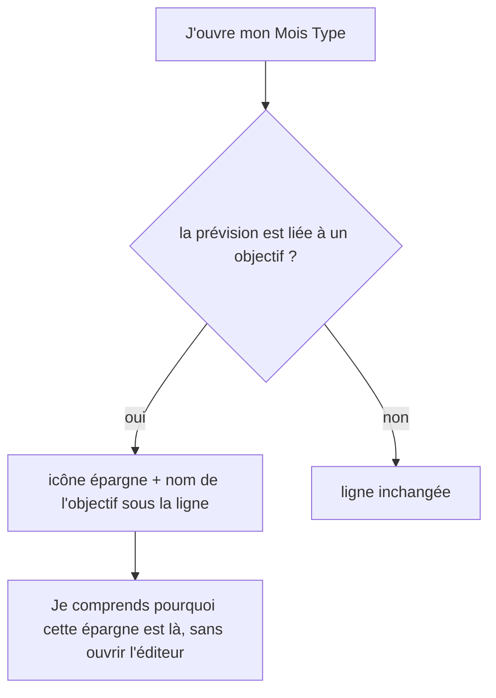

# Instruction: rendre le lien vers l'objectif visible là où il manque

> **Cette phase a été vidée des trois quarts de son contenu après vérification.** Elle devait
> « faire lire le nom de l'objectif par la relation ». C'est déjà le cas partout : les deux clients
> résolvent le nom depuis la liste des objectifs, par identifiant, jamais depuis la prévision — et
> renommer invalide déjà le cache web et patche le store iOS. Aucune jointure à ajouter, aucun
> contrat d'API à changer, aucun écran existant à corriger.
>
> Ce qui reste est le manque que le balayage a révélé, et qui n'était dans aucun plan : **le lien
> n'est visible nulle part hors du détail d'un budget.**

## Architecture projection

```txt
frontend/projects/webapp/src/app/feature/
├── budget-templates/details/
│   ├── services/template-details-store.ts                  ✏️ table id → nom des objectifs, miroir du store de budget
│   ├── components/template-line-card.ts                    ✏️ affordance lien sur une prévision liée
│   └── components/template-lines-grid.ts                   ✏️ passe le nom résolu à la carte
└── budget/budget-details/components/budget-table/          ✏️ même affordance dans le mode Tableau
frontend/projects/webapp/src/app/feature/savings-goals/detail/components/
└── goal-contributions-list.spec.ts                         ✏️ fixtures à noms distincts
ios/                                                        ❓ parité du même manque, à confirmer
```

## User Journey



## Tasks to do

### `1)` Montrer le lien dans le Mois Type

> Sur la capture du 25.07, « Canapé 925 » ressemble à une épargne ordinaire. Rien ne dit qu'elle alimente un objectif — c'est ce qui rend la ligne déroutante à cet endroit.

1. Construire dans le store du Mois Type la même table `id → nom` que celle du détail de budget, alimentée par la même ressource de liste d'objectifs. Ne pas inventer un second mécanisme : reprendre celui qui existe.
2. Afficher sur une prévision liée la même affordance que dans le détail de budget — icône épargne et nom de l'objectif — pour que les deux écrans se lisent pareil.
3. Une prévision non liée reste strictement inchangée.
4. Renommer l'objectif doit repeindre cette affordance sans rechargement, comme ailleurs.

### `2)` Décider du mode Tableau du détail de budget

> Même manque, moindre conséquence : l'utilisateur peut basculer en mode Enveloppes ou ouvrir le panneau.

1. Trancher : y porter la même affordance, ou l'assumer comme une vue dense volontairement dépouillée.
2. Si on l'ajoute, la source est la table déjà présente dans le store de détail de budget — rien à câbler de plus.

### `3)` Ajuster les fixtures qui supposent des noms homogènes

> Conséquence directe de la phase 2, sans code applicatif à changer.

1. La liste des contributions d'un objectif affiche le nom de chaque prévision. Aujourd'hui elles portent toutes la même chaîne, recopiée depuis l'objectif ; demain elles porteront des noms distincts.
2. Aligner les fixtures de sa spec, qui supposent l'homogénéité, pour qu'elles décrivent le comportement réel plutôt que l'artefact.
3. Même effet côté iOS sur la section des contributions : à vérifier, rien à coder a priori.

### `4)` Vérifier la parité iOS

1. Confirmer si l'app iOS présente le même manque sur son écran de Mois Type, et l'aligner le cas échéant.
2. Ne rien toucher au DTO : il ne porte que l'identifiant, et c'est le bon contrat — le nom vient du store.

## Test acceptance criteria

| Task | Acceptance criteria                                                                                                  |
| ---- | ------------------------------------------------------------------------------------------------------------------------ |
| 1    | Une prévision du Mois Type liée à un objectif affiche le nom de cet objectif ; une non liée n'affiche rien de plus.   |
| 1    | Renommer l'objectif change ce nom sans rechargement de page.                                                         |
| 1    | Aucune requête supplémentaire n'est émise : la liste des objectifs est déjà chargée par ailleurs.                     |
| 2    | La décision sur le mode Tableau est tranchée et écrite, quelle qu'elle soit.                                         |
| 3    | La spec des contributions décrit des prévisions aux noms distincts et passe.                                          |
| 4    | La parité iOS est constatée, et alignée si l'écart existe.                                                            |
