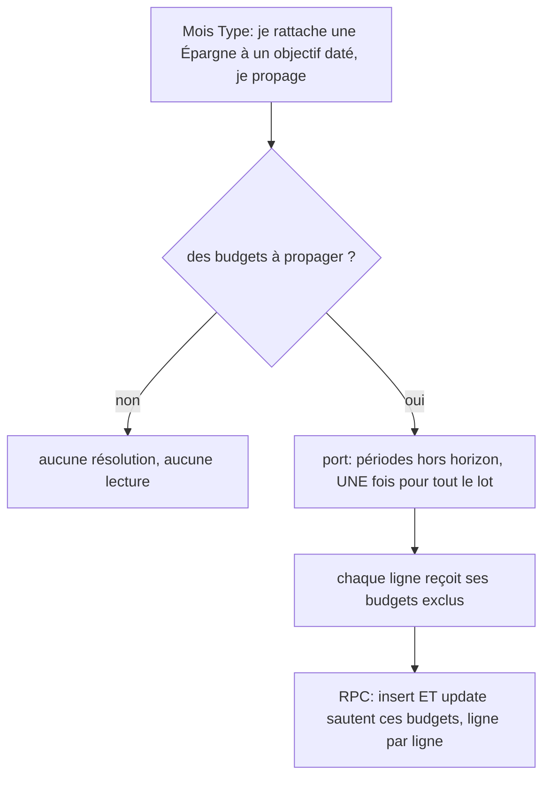

# Instruction: borner le rattachement manuel depuis le Mois Type

## Architecture projection

```txt
backend-nest/
├── supabase/migrations/
│   └── 20260726120000_bound_linked_template_line_propagation.sql  ✅ `excluded_budget_ids` par ligne, signature RPC inchangée
├── src/modules/budget/
│   ├── domain/ports/savings-goal-horizon.port.ts                  ✅ deux opérations nommées, aucune arête de module nouvelle
│   └── infrastructure/persistence/
│       ├── supabase-savings-goal-horizon.adapter.ts               ✅ la comparaison de période, une seule fois
│       └── supabase-savings-goal-horizon.adapter.spec.ts          ✅
├── src/modules/budget/infrastructure/persistence/
│   └── supabase-budget.repository.ts                              ✏️ consomme le port au lieu de calculer
├── src/modules/budget-template/
│   ├── application/bulk-template-line-operations.use-case.ts      ✏️ une résolution par lot, pas par ligne
│   ├── application/bulk-template-line-operations.use-case.spec.ts ✏️ un objectif, deux objectifs, détachement, sans propagation
│   ├── domain/budget-template.entity.ts                           ✏️ `excludedBudgetIds` sur la ligne RPC
│   └── infrastructure/persistence/
│       ├── supabase-budget-template.repository.ts                 ✏️ sérialise le champ
│       ├── schemas/rpc-payload.schemas.ts                         ✏️ champ optionnel dans le schéma strict
│       └── schemas/rpc-payload.schemas.spec.ts                    ✏️
└── src/modules/budget-template/savings-goal-propagation.integration.spec.ts ✏️ repro bout en bout
```

## User Journey



## Tasks to do

### `1)` Test de repro

> Le geste manuel, celui qui reste possible après la phase 2.

1. Intégration : objectif daté, budgets avant, sur et après l'échéance, rattachement avec propagation.
2. Asserter qu'aucune prévision post-échéance ne porte le lien, que celle de l'échéance le porte, et que les lignes non liées sont intactes.
3. Le test échoue aujourd'hui.

### `2)` Poser le port dans `budget/`

> Deux opérations nommées : la règle reste unique, les appelants n'arithmétisent rien.

1. `goalIdsPastPeriod(period)` — pour la génération, qui ne connaît aucun id : les objectifs de l'utilisateur dont l'échéance précède la période.
2. `periodsPastHorizon(goalIds, periods)` — pour le lot, qui connaît ses objectifs : par objectif, les périodes au-delà de son échéance.
3. La comparaison de période est une fonction privée de l'adapter, écrite **une** fois ; `target_date` et `payDayOfMonth` ne sont lus nulle part ailleurs dans le module.
4. **Aucun filtre de statut** : l'échéance d'un objectif en pause reste son échéance. Le filtre `ACTIVE` reste chez l'appelant génération, qui seul en a besoin.
5. Objectif sans échéance ou inconnu : rien n'est écarté.
6. Jamais de mémoïsation sur l'adapter — les providers sont des singletons et l'identité vient du contexte de requête ; un cache d'instance servirait les objectifs d'un utilisateur à un autre.
7. Basculer le repository budget sur `goalIdsPastPeriod` : comportement de PUL-311 inchangé, calcul local supprimé.

### `3)` Résoudre par lot et transporter la borne

> Une seule résolution, quel que soit le nombre de lignes.

1. Sortir immédiatement si aucun budget n'est à propager : un enregistrement de Mois Type sans propagation ne doit rien coûter.
2. Collecter l'ensemble **distinct** des `savingsGoalId` du lot, appeler `periodsPastHorizon` **une fois**, puis dériver en mémoire les `excludedBudgetIds` de chaque ligne.
3. Ligne sans objectif, ou détachement explicite : aucune exclusion.
4. Migration `CREATE OR REPLACE` à **signature inchangée** : lire `line->'excluded_budget_ids'` (défaut vide) dans la branche insert **et** dans la branche update.
5. Déclarer le champ dans le schéma Zod strict du payload, le sérialiser dans le repository, régénérer les types.

### `4)` N'exclure que la création, jamais la mise à jour

> Tranché le 25.07 : la borne empêche de **créer** au-delà de l'échéance, elle ne gèle pas l'existant.

1. Seule la branche insert honore `excluded_budget_ids`. La branche update continue de maintenir toutes les prévisions liées, y compris d'éventuelles lignes post-échéance héritées.
2. C'est ce qui évite la divergence relevée par la vérification : une ligne gelée sur ses montants mais toujours atteinte par la synchronisation des tags serait à moitié à jour, sans erreur ni trace.
3. Une prévision post-échéance ne peut de toute façon plus naître après cette phase ; celles qui existent sont des données héritées, et les maintenir normalement est le comportement le moins surprenant.
4. Un test fige ce choix : éditer une ligne liée met à jour **toutes** ses prévisions, tandis que la propager n'en crée aucune au-delà de l'échéance.

### `5)` Documenter la borne unique

1. `docs/SAVINGS.md` : la borne d'horizon vaut pour tout rattachement, quelle que soit la surface, avec une implémentation unique côté écriture.
2. Dire honnêtement ce qui n'est pas couvert : le validateur du simulateur garde sa propre comparaison, et deux copies d'affichage vivent dans les calculateurs partagés.

## Test acceptance criteria

| Task | Acceptance criteria                                                                                                        |
| ---- | ------------------------------------------------------------------------------------------------------------------------------ |
| 1    | Le test d'intégration échoue avant la migration et passe après.                                                            |
| 2    | Un objectif en pause conserve sa borne.                                                                                    |
| 2    | Un objectif sans échéance n'écarte rien.                                                                                   |
| 2    | La génération de budget se comporte exactement comme après PUL-311, port à l'appui.                                        |
| 3    | Un enregistrement de Mois Type sans propagation n'émet aucune lecture d'horizon.                                           |
| 3    | Un lot de N lignes liées n'émet qu'une seule résolution d'horizon, quel que soit N.                                        |
| 3    | Un lot mêlant deux objectifs d'échéances différentes borne chaque ligne sur son propre objectif.                           |
| 3    | Un appel omettant le champ se comporte exactement comme avant — les specs d'intégration existantes restent vertes.          |
| 4    | Le comportement retenu sur la branche update est couvert par un test qui échouerait si les tags et les champs divergeaient. |
| 5    | `docs/SAVINGS.md` énonce la borne unique et nomme ce qui reste hors de son périmètre.                                      |
