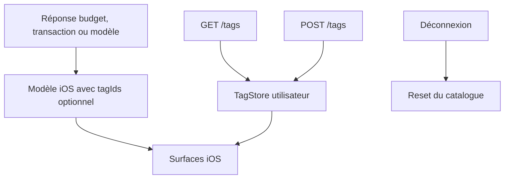

# Instruction: Contrat iOS et catalogue utilisateur

## Architecture projection

> Tree of the final files. ✅ create · ✏️ modify · ❌ delete

```txt
ios/
├── Pulpe/
│   ├── App/
│   │   ├── ✏️ PulpeApp.swift                         # injecter le catalogue à la racine
│   │   └── ✏️ SessionDataResetting.swift             # vider les tags à la déconnexion
│   ├── Core/
│   │   ├── Config/
│   │   │   └── ✏️ AppConfiguration.swift             # déclarer la limite de dix tags
│   │   └── Network/
│   │       └── ✏️ APIError.swift                     # localiser le conflit de nom
│   └── Domain/
│       ├── Models/
│       │   ├── ✏️ Tag.swift                          # ajouter le DTO de création
│       │   ├── ✏️ BudgetLine.swift                   # lire/écrire et préserver tagIds
│       │   ├── ✏️ Transaction.swift                  # lire/écrire et préserver tagIds
│       │   └── ✏️ BudgetTemplate.swift               # tagIds sur ligne et propagation bulk
│       ├── Services/
│       │   └── ✏️ TagService.swift                   # exposer POST /tags
│       └── Store/
│           └── ✅ TagStore.swift                     # catalogue utilisateur partagé
└── PulpeTests/
    ├── App/
    │   └── ✏️ SessionDataResetterTests.swift         # prouver l’effacement inter-session
    └── Domain/
        ├── Models/
        │   └── ✅ TagCodableTests.swift              # verrouiller les formes JSON
        ├── Services/
        │   └── ✏️ TagServiceTests.swift              # vérifier GET et POST /tags
        └── Store/
            └── ✅ TagStoreTests.swift                # chargement, création, cache et reset

❌ aucun fichier
```

## User Journey



## Tasks to do

### `1)` Aligner les modèles et DTO sur le contrat existant

> Transporter les ids sans modifier le backend et sans casser les réponses qui omettent encore le champ.

1. Ajouter `TagCreate` avec le seul nom en clair.
2. Ajouter `tagIds` optionnel à `BudgetLine`, `Transaction` et `TemplateLine`.
3. Préserver `tagIds` dans les copies `toggled()`.
4. Ajouter `tagIds` optionnel aux DTO de création et de mise à jour, y compris `TemplateLineUpdateWithId`.
5. Garder la distinction JSON PATCH: clé absente pour préserver, tableau vide pour détacher.

### `2)` Centraliser le catalogue utilisateur

> Charger et enrichir une seule liste de tags pour toutes les surfaces.

1. Étendre `TagServicing` et `TagService` avec `create(_:)` sur l’endpoint `.tags` en POST.
2. Ajouter `AppConfiguration.maxTagsPerTransaction = 10`.
3. Mapper `ERR_TAG_ALREADY_EXISTS` vers une erreur française exploitable par le formulaire.
4. Créer `TagStore` sur le pattern minimal de `SavingsGoalStore`: chargement court, tri alphabétique, création locale après succès, dictionnaire id→nom, invalidation et reset.
5. Injecter le store dans `PulpeApp` et l’ajouter au reset de session.

### `3)` Verrouiller le contrat

> Laisser un test exécutable pour chaque sémantique qui pourrait supprimer silencieusement des tags.

1. Tester le décodage avec et sans `tagIds` pour les trois modèles.
2. Tester l’encodage des créations et les trois états PATCH: absent, ids, tableau vide.
3. Tester que `toggled()` conserve les ids.
4. Tester la requête POST de création, l’ajout au catalogue et le reset inter-session.
5. Générer avec `xcodegen generate --use-cache`, puis exécuter les suites ciblées avec `xcodebuild test -scheme PulpeLocal`.

## Test acceptance criteria

| Task | Acceptance criteria |
| ---- | ------------------- |
| 1 | Une réponse contenant `tagIds` est décodée; une réponse qui l’omet reste valide; pointer/dépointer ne modifie pas les ids |
| 1 | Un PATCH sans `tagIds` n’encode aucune clé et un PATCH avec `[]` encode bien un tableau vide |
| 2 | Le catalogue charge les tags triés, ajoute immédiatement le tag créé et ne conserve rien après déconnexion |
| 2 | Un nom déjà utilisé produit un message français sans altérer le catalogue |
| 3 | Les tests ciblés du contrat, du service, du store et du reset passent sur le simulateur configuré |
