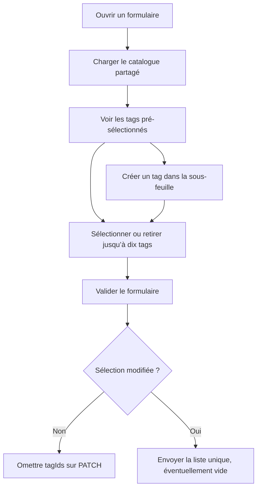

# Instruction: Sélection, création et mutations

## Architecture projection

> Tree of the final files. ✅ create · ✏️ modify · ❌ delete

```txt
ios/
├── Pulpe/
│   ├── Shared/
│   │   └── Components/
│   │       ├── ✅ TagPickerField.swift               # champ, sous-feuille et logique de sélection
│   │       ├── ✅ TagChips.swift                     # rendu commun via PulpeChip
│   │       └── ✏️ EditBudgetLineSheet.swift          # édition d’une prévision
│   └── Features/
│       ├── Budgets/
│       │   └── BudgetDetails/
│       │       ├── ✏️ AddBudgetLineSheet.swift       # création standard d’une prévision
│       │       ├── ✏️ AddAllocatedTransactionLogic.swift # DTO d’un réel lié
│       │       ├── ✏️ AddAllocatedTransactionPage.swift  # création d’un réel lié
│       │       ├── ✏️ EditTransactionLogic.swift     # PATCH d’un réel
│       │       └── ✏️ EditTransactionPage.swift      # édition d’un réel
│       ├── CurrentMonth/
│       │   └── Components/
│       │       └── ✏️ AddTransactionSheet.swift      # création d’un réel libre
│       └── Templates/
│           └── TemplateDetails/
│               └── ✏️ EditTemplateLineSheet.swift   # édition et propagation d’une ligne modèle
└── PulpeTests/
    ├── Shared/
    │   └── Components/
    │       ├── ✅ TagPickerFieldTests.swift          # limite, unicité et payload différentiel
    │       ├── ✅ TagChipsTests.swift                # résumé et débordement des chips
    │       └── ✏️ EditBudgetLineSheetTests.swift     # pré-sélection et CA8
    └── Features/
        ├── Budgets/
        │   └── BudgetDetails/
        │       └── ✏️ EditTransactionLogicTests.swift # PATCH tags d’un réel
        └── Templates/
            └── ✏️ EditTemplateLineSheetTests.swift   # PATCH direct et bulk

❌ aucun fichier
```

## User Journey



## Wireframe

```txt
┌────────────────────────────────────┐
│ (1) Barre du formulaire            │
├────────────────────────────────────┤
│ (2) Type · montant · description   │
│                                    │
│ (3) Champ tags                     │
│     [tag] [tag] [compteur]   [>]   │
│                                    │
│ (4) Champs propres à la ligne      │
├────────────────────────────────────┤
│ (5) Action principale              │
└────────────────────────────────────┘

1. Barre: titre et fermeture ou retour.
2. Données financières déjà présentes.
3. Résumé de la sélection et accès au composant partagé.
4. Date, récurrence, pointage ou objectif selon le formulaire.
5. Création ou enregistrement.

┌────────────────────────────────────┐
│ (1) Barre du sélecteur             │
├────────────────────────────────────┤
│ (2) Sélection courante · limite    │
│                                    │
│ (3) Nouveau tag [____________] [+] │
│                                    │
│ (4) Catalogue                      │
│     [✓] Tag                         │
│     [ ] Tag                         │
│     [✓] Tag                         │
├────────────────────────────────────┤
│ (5) Validation                     │
└────────────────────────────────────┘

1. Sous-feuille conservant le formulaire parent.
2. Nombre sélectionné sur le maximum.
3. Création intégrée au flux.
4. Liste multi-sélection et états de chargement, erreur ou vide.
5. Retour de la sélection au formulaire.
```

## Tasks to do

### `1)` Construire le sélecteur partagé

> Offrir une seule implémentation multi-sélection et création pour tous les formulaires.

1. Créer `TagPickerField` avec binding sur un `Set<String>`, chargement via `TagStore` et sous-feuille standard.
2. Afficher le catalogue avec état sélectionné, compteur `n/10`, retry et état vide.
3. Valider le nom après trim, longueur 1…30 et doublon insensible à la casse avant POST.
4. Sélectionner automatiquement le tag créé et conserver le formulaire parent ouvert.
5. Bloquer une onzième sélection sans supprimer les dix choix existants.
6. Utiliser `PulpeChip` et `DesignTokens.ChipMetrics`; aucun chip ad hoc.
7. Centraliser la normalisation en ids uniques triés et le calcul du payload: `nil` si inchangé, `[]` si tout est retiré.

### `2)` Rattacher les tags aux créations

> Couvrir les créations standard de prévision et les deux chemins de création d’un réel.

1. Ajouter le champ à `AddBudgetLineSheet` uniquement en mode ligne simple; le masquer en mode lissage dont le contrat ne transporte pas `tagIds`.
2. Envoyer `nil` quand aucune sélection n’existe et une liste unique sinon.
3. Ajouter le même champ à `AddTransactionSheet`.
4. Ajouter le champ à `AddAllocatedTransactionPage` et transporter les ids via `AddAllocatedTransactionLogic.FormInput`.

### `3)` Rattacher les tags aux éditions

> Pré-sélectionner l’existant et ne toucher aux associations que si le résultat diffère.

1. Initialiser la sélection depuis `BudgetLine.tagIds`, `Transaction.tagIds` et `TemplateLine.tagIds`.
2. Ajouter le champ à `EditBudgetLineSheet`, `EditTransactionPage` et `EditTemplateLineSheet`.
3. Transmettre `nil` au builder PATCH quand les ensembles initial et final sont égaux.
4. Transmettre la liste finale, y compris `[]`, quand elle change.
5. Recopier `tagIds` dans `TemplateLineUpdateWithId` pour le chemin « Appliquer aux mois suivants ».

### `4)` Tester les invariants de formulaire

> Prouver la limite, l’unicité, la création inline et surtout CA8.

1. Tester trim, longueur, doublon exact insensible à la casse et plafond de dix.
2. Tester que la création réussie ajoute et sélectionne le nouveau tag.
3. Tester le payload différentiel inchangé, modifié et entièrement vidé.
4. Étendre les tests des builders BudgetLine, Transaction et Template, incluant la propagation bulk.
5. Exécuter les suites ciblées du sélecteur et des trois builders avec `xcodebuild test -scheme PulpeLocal`.

## Test acceptance criteria

| Task | Acceptance criteria |
| ---- | ------------------- |
| 1 | Le même champ sélectionne plusieurs tags, crée un tag sans fermer le formulaire et refuse une onzième sélection |
| 1 | Les noms vides, supérieurs à 30 caractères ou déjà présents sans distinction de casse ne déclenchent pas de création |
| 2 | Une prévision simple, un réel libre et un réel lié nouvellement créés reçoivent exactement les ids choisis |
| 3 | Les éditions pré-sélectionnent les associations serveur et permettent ajout, retrait partiel ou détachement total |
| 3 | Enregistrer sans modifier la sélection omet `tagIds`; le backend conserve donc les associations existantes |
| 3 | La propagation d’une ligne modèle transporte la même sélection que le PATCH direct |
| 4 | Les tests ciblés de sélection et de payload passent sur le simulateur configuré |
