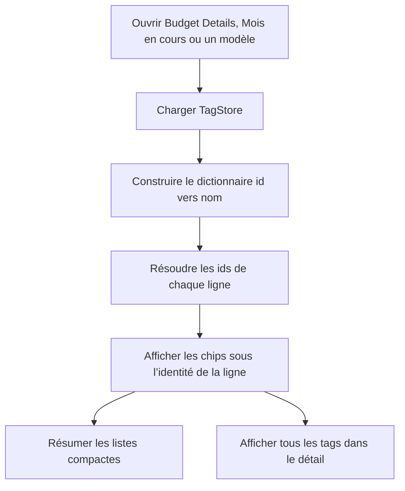

# Instruction: Consultation sur les surfaces de ligne

## Architecture projection

> Tree of the final files. ✅ create · ✏️ modify · ❌ delete

```txt
ios/
├── Pulpe/
│   └── Features/
│       ├── Budgets/
│       │   └── BudgetDetails/
│       │       ├── ✏️ BudgetDetailsView.swift                # charger et distribuer le catalogue
│       │       ├── ✏️ BudgetDetailsView+Routing.swift        # fournir les noms à la page détail
│       │       ├── ✏️ BudgetMixedSection.swift               # résoudre les tags de prévision
│       │       ├── ✏️ BudgetLineMixedRow.swift               # afficher les tags de prévision
│       │       ├── ✏️ BudgetDetailsFreeTransactionsList.swift # afficher les tags des réels libres
│       │       ├── ✏️ BudgetLineDetailPage.swift             # afficher les tags de la prévision détaillée
│       │       └── ✏️ BudgetLineDetailTransactionRow.swift   # afficher les tags des réels liés
│       ├── CurrentMonth/
│       │   ├── ✏️ CurrentMonthView.swift                     # charger et distribuer le catalogue
│       │   └── Components/
│       │       ├── ✏️ ActivityCard.swift                     # tags des réels récents
│       │       ├── ✏️ UncheckedOperationsCard.swift          # tags des réels et prévisions à pointer
│       │       └── ✏️ DriftCard.swift                        # tags des prévisions en dérive
│       └── Templates/
│           └── TemplateDetails/
│               └── ✏️ TemplateDetailsView.swift              # tags sur les lignes de modèle
└── PulpeTests/
    └── Shared/
        └── Components/
            └── ✏️ TagChipsTests.swift                        # ordre, limite visuelle et accessibilité

✅ aucun nouveau fichier
❌ aucun fichier
```

## User Journey



## Wireframe

```txt
┌────────────────────────────────────┐
│ (1) Budget Details                 │
├────────────────────────────────────┤
│ (2) Prévision ou réel      montant │
│     [tag] [tag]                     │
│     métadonnée                     │
└────────────────────────────────────┘

1. Structure actuelle de Budget Details.
2. Tags sous l’identité de la ligne, avant les métadonnées secondaires.

┌────────────────────────────────────┐
│ (1) Mois en cours                  │
├────────────────────────────────────┤
│ (2) Carte d’activité ou pointage   │
│     Ligne                  montant │
│     [tag] [tag]                     │
└────────────────────────────────────┘

1. Tableau de bord actuel.
2. Tags associés à l’opération visible sans ouvrir le web.

┌────────────────────────────────────┐
│ (1) Détail du modèle               │
├────────────────────────────────────┤
│ (2) Ligne du modèle        montant │
│     [tag] [tag]                     │
└────────────────────────────────────┘

1. Liste des lignes du modèle.
2. Tags persistés visibles avant l’édition.
```

## Tasks to do

### `1)` Afficher les tags dans Budget Details

> Résoudre les noms une fois au niveau écran et conserver des rows à entrées primitives.

1. Charger `TagStore` dans `BudgetDetailsView` et passer son dictionnaire id→nom.
2. Afficher le résumé des tags dans `BudgetLineMixedRow` et les transactions libres.
3. Afficher tous les tags de la prévision dans `BudgetLineDetailPage`.
4. Afficher les tags de chaque transaction liée dans `BudgetLineDetailTransactionRow`.
5. Garder les transformations hors des bodies de la feature et chaque fichier sous 350 lignes.

### `2)` Afficher les tags dans Mois en cours

> Rendre les associations visibles sur les opérations réellement rendues par le dashboard actuel.

1. Charger le même catalogue dans `CurrentMonthView`.
2. Passer le dictionnaire à `ActivityCard`, `UncheckedOperationsCard` et `DriftCard`.
3. Montrer les tags des transactions récentes, des opérations à pointer et des prévisions en dérive.

### `3)` Afficher les tags des lignes de modèle

> Permettre de consulter les associations avant d’ouvrir l’éditeur.

1. Charger le catalogue avec le détail du modèle.
2. Passer le dictionnaire à `TemplateLineRow`.
3. Afficher les chips sous le nom et la récurrence sans modifier les totaux.

### `4)` Garder les listes lisibles et accessibles

> Faire tenir jusqu’à dix associations sans casser les rows compactes.

1. Dans les listes, afficher les deux premiers noms puis un chip de débordement.
2. Dans les pages détail et le sélecteur, rendre tous les noms disponibles.
3. Donner à VoiceOver la liste complète des tags, même quand le visuel est résumé.
4. Tester l’ordre stable, le nombre masqué et le libellé d’accessibilité.
5. Exécuter les tests `TagChips`, les invariants d’architecture Budget Details et un build `PulpeLocal`.

## Test acceptance criteria

| Task | Acceptance criteria |
| ---- | ------------------- |
| 1 | Budget Details montre les tags d’une prévision, d’un réel libre et d’un réel lié sans observation de store dans les rows |
| 2 | Mois en cours montre les tags dans Activité, À pointer et Ça dérive lorsque les lignes concernées en possèdent |
| 3 | Une ligne de modèle montre ses tags avant l’ouverture de l’éditeur |
| 4 | Dix tags ne débordent pas horizontalement; les listes restent compactes et le détail permet de tous les consulter |
| 4 | VoiceOver annonce tous les noms et les tests d’architecture, de composant et de build passent |
