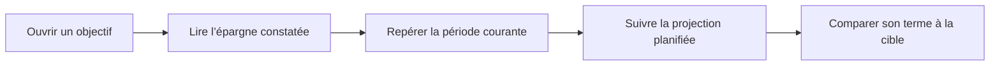

# Instruction: Adapter la grammaire Chart.js

## Architecture projection

> Tree of the final files. ✅ create · ✏️ modify · ❌ delete

```txt
frontend/projects/webapp/src/app/feature/savings-goals/detail/components/
├── ✏️ goal-projection-chart.config.spec.ts
├── ✏️ goal-projection-chart.config.ts
├── ✅ goal-projection-chart.plugin.ts
└── ✏️ goal-projection-chart.ts
```

- `goal-projection-chart.config.ts` : conserver les trois séries de solde et appliquer la hiérarchie cible / réalisé / futur.
- `goal-projection-chart.config.spec.ts` : verrouiller la sémantique, les styles structurants et les cas limites.
- `goal-projection-chart.plugin.ts` : dessiner uniquement la zone future et le repère de période courante.
- `goal-projection-chart.ts` : fournir le plugin local au canvas sans modifier le contrat du composant.
- Suppressions : aucune.

## User Journey



## Wireframe

```txt
┌──────────────────────────────────────────────────────────────┐
│ (1) Zone graphique                                           │
│                                                              │
│  ─────────────────────────────── (2) Référence               │
│       ━━━━━━━━━━━━━●                                         │
│                    │┄┄┄┄┄┄┄┄┄┄┄●                            │
│                    (3)                                       │
│ (4) Repères de périodes                                      │
└──────────────────────────────────────────────────────────────┘
```

1. Zone graphique : superpose les trois séries sur une seule échelle de solde.
2. Référence : matérialise la valeur de comparaison.
3. Séparation temporelle : marque la jonction entre constat et horizon.
4. Repères : borne la période sans grille dense.

## Tasks to do

### `1)` Isoler l’implémentation

> Garder ce travail visuel hors du PR de correction fonctionnelle.

1. Créer `codex/goal-trajectory-linear-chart` au-dessus du PR `#550`, puis la rebaser sur `preview` après son intégration.
2. Vérifier que le graphe reçu contient déjà les séries Cible, Épargné et Projection planifiée ancrée sur l’épargne.

### `2)` Verrouiller la sémantique avant le rendu

> Préserver les données corrigées et tester uniquement la nouvelle présentation.

1. Conserver la cible comme référence séparée sur tout l’horizon.
2. Conserver l’épargne réelle jusqu’à la période courante, avec une queue `null`.
3. Conserver la projection planifiée depuis le dernier point réel jusqu’au montant projeté à l’échéance, y compris en simulation.
4. Ajouter les assertions de styles qui empêchent de confondre cible, réel et futur.
5. Couvrir un objectif à échéance dépassée : aucun faux repère « période courante » ne doit être dessiné.

### `3)` Appliquer le langage visuel minimal

> Reprendre la clarté de Linear sans ajouter une quatrième mesure.

1. Rendre la cible neutre, fine et continue.
2. Rendre l’épargne solide en vert épargne, avec remplissage très léger et point terminal.
3. Rendre la projection dans le même vert, pointillée, démarrant exactement au point terminal réel et finissant sur le montant de la carte.
4. Masquer la grille et l’axe vertical ; garder des repères mensuels et annuels peu nombreux sur l’axe horizontal.
5. Utiliser un plugin Chart.js local pour teinter discrètement l’horizon futur et tracer le repère courant, uniquement lorsqu’une période `current` existe.
6. Respecter le thème clair/sombre et neutraliser l’animation sous `prefers-reduced-motion`.

## Test acceptance criteria

| Task | Acceptance criteria |
| --- | --- |
| 1 | La branche du graphe est distincte du PR `#550`, contient sa correction fonctionnelle et pourra être rebasée sur `preview` sans mêler les deux diffs. |
| 2 | Les données du graphe restent `[réel…, null…]` pour l’épargne et `[null…, ancre réelle, projection…]` pour le futur ; le terme égale la projection à l’échéance en lecture comme en simulation. |
| 2 | Un objectif sans période courante ne reçoit aucun repère temporel trompeur. |
| 3 | La cible, le réalisé et la projection sont distinguables par libellé et forme de trait sans introduire de couleur ambre ou rouge. |
| 3 | Le canvas reste net et lisible en thème clair, sombre et reduced motion, sans axe vertical ni grille dense. |
| 3 | Les tests ciblés du configurateur Chart.js passent sans modification des calculateurs shared ou du contrat API. |
