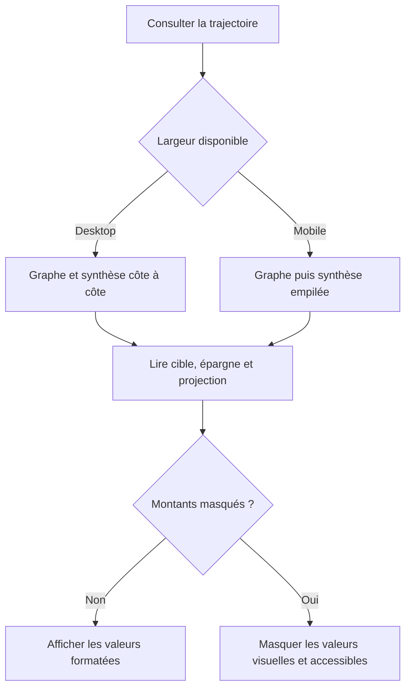

# Instruction: Composer la synthèse responsive et accessible

## Architecture projection

> Tree of the final files. ✅ create · ✏️ modify · ❌ delete

```txt
frontend/
├── e2e/tests/features/
│   └── ✏️ savings-goals-progress.spec.ts
└── projects/webapp/
    ├── public/i18n/
    │   └── ✏️ fr.json
    └── src/app/feature/savings-goals/detail/components/
        ├── ✏️ goal-projection-chart.config.ts
        ├── ✅ goal-projection-chart.spec.ts
        └── ✏️ goal-projection-chart.ts
```

- `goal-projection-chart.ts` : remplacer la légende canvas par une synthèse Angular latérale ou empilée et aligner l’alternative accessible.
- `goal-projection-chart.config.ts` : désactiver la légende intégrée une fois la synthèse HTML en place.
- `goal-projection-chart.spec.ts` : couvrir valeurs, simulation, confidentialité et structure sémantique.
- `fr.json` : ajouter uniquement le libellé du repère courant et l’alternative sans montants ; réutiliser les libellés existants pour les trois séries.
- `savings-goals-progress.spec.ts` : vérifier le parcours réel sur desktop et mobile.
- Suppressions : aucune.

## User Journey



## Wireframe

```txt
Desktop
┌──────────────────────────────────────────────────────────────────┐
│ (1) En-tête de section                                           │
├──────────────────────────────────────────────┬───────────────────┤
│ (2) Zone graphique                           │ (3) Synthèse      │
│                                              │ indicateur + valeur│
│     ───────────── série de référence         │ indicateur + valeur│
│        ━━━━━━━ série réalisée                │ indicateur + valeur│
│                 ┄┄┄┄ série future            │                   │
│                   │                          │                   │
│                   (4) Repère temporel        │                   │
│ (5) Repères de périodes                      │                   │
├──────────────────────────────────────────────┴───────────────────┤
│ (6) Alternative textuelle accessible                            │
└──────────────────────────────────────────────────────────────────┘

Mobile
┌──────────────────────────────────────┐
│ (1) En-tête de section               │
├──────────────────────────────────────┤
│ (2) Zone graphique                   │
│   ────────                           │
│      ━━━━━━━                         │
│           ┄┄┄┄┄┄                    │
│          (4)│                        │
│ (5) Repères de périodes              │
├──────────────────────────────────────┤
│ (3) Synthèse en liste                │
│ indicateur + libellé + valeur        │
│ indicateur + libellé + valeur        │
│ indicateur + libellé + valeur        │
├──────────────────────────────────────┤
│ (6) Alternative textuelle accessible │
└──────────────────────────────────────┘
```

1. En-tête : conserve la place actuelle de la trajectoire dans le détail.
2. Graphe : porte la comparaison temporelle.
3. Synthèse : expose les trois valeurs hors du canvas.
4. Repère : sépare constat et projection.
5. Périodes : donnent les bornes temporelles.
6. Alternative : annonce les mêmes informations sans dépendre de la vision.

## Tasks to do

### `1)` Remplacer la légende canvas par une synthèse Angular

> Garder Chart.js responsable du dessin et Angular responsable du contenu.

1. Désactiver la légende intégrée Chart.js.
2. Construire trois lignes depuis les inputs existants : Cible, Épargné et le libellé déjà utilisé pour Projection à l’échéance.
3. Représenter chaque série avec sa forme de trait et son libellé, jamais par la couleur seule.
4. Formater les montants avec la devise du compte et des chiffres tabulaires.
5. Utiliser `draft.simulatedFinal` comme valeur projetée pendant la simulation, sinon `projected`.
6. Placer la synthèse à droite sur desktop et sous le canvas sur mobile, sans débordement horizontal.

### `2)` Aligner confidentialité et accessibilité

> Une nouvelle valeur visible ne doit créer ni fuite ni divergence.

1. Réutiliser `AmountsVisibilityService` pour masquer les trois valeurs de la synthèse et des tooltips.
2. Lorsque les montants sont masqués, remplacer la phrase `aria-live` chiffrée par une phrase dédiée sans montant.
3. Lorsque les montants sont visibles, annoncer Cible, Épargné et Projection à l’échéance dans le même ordre que la synthèse.
4. Garder le canvas décoratif pour les lecteurs d’écran et la synthèse HTML sémantique.
5. Conserver un contraste WCAG AA, un focus inchangé et aucune information portée uniquement par une teinte.

### `3)` Vérifier la surface complète

> Prouver le rendu sans installer une infrastructure de snapshots absente du dépôt.

1. Ajouter un test composant ciblé pour les trois lignes, la projection simulée et le masquage.
2. Étendre le scénario Playwright existant pour confirmer que le terme de la projection du graphe égale la carte Projection à l’échéance.
3. Vérifier manuellement les viewports `390 × 844`, `768 × 1024` et `1440 × 900`, en thèmes clair et sombre.
4. Vérifier le graphe avec un horizon court, un horizon multi-années, une cible dépassée et un objectif à échéance dépassée.
5. Exécuter les tests frontend ciblés, le scénario Playwright concerné puis `pnpm quality`.

## Test acceptance criteria

| Task | Acceptance criteria |
| --- | --- |
| 1 | Desktop affiche le graphe et les trois valeurs côte à côte ; mobile place les mêmes valeurs sous le graphe sans scroll horizontal. |
| 1 | La valeur de projection affichée dans la synthèse correspond à `projected`, ou à `draft.simulatedFinal` pendant une simulation. |
| 1 | Les trois séries restent identifiables sans couleur grâce au trait, au libellé et à leur valeur. |
| 2 | Le mode montants masqués ne révèle aucune somme dans la synthèse, les tooltips ou l’annonce `aria-live`. |
| 2 | Le mode visible annonce Cible, Épargné et Projection à l’échéance avec la devise active, dans le même ordre que l’interface. |
| 3 | La carte Projection à l’échéance, le dernier point projeté et la synthèse affichent le même montant dans le scénario E2E. |
| 3 | Les trois viewports, les deux thèmes et les horizons court ou long restent lisibles sans chevauchement ni troncature trompeuse. |
| 3 | Les tests ciblés, le scénario Playwright et la qualité du dépôt passent sans nouvelle dépendance ni modification backend, shared ou iOS. |
