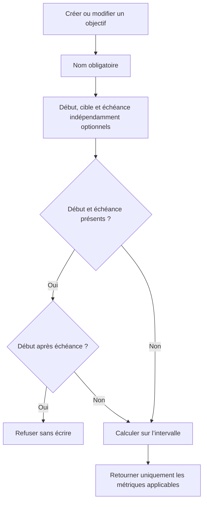

# Instruction: Poser le contrat nullable et les calculs d’intervalle

## Architecture projection

> Tree of the final files. ✅ create · ✏️ modify · ❌ delete

```txt
shared/
├── ✏️ schemas.ts
└── src/
    ├── ✏️ savings-goal-schema.spec.ts
    └── calculators/
        ├── ✏️ savings-goal-progress.ts
        ├── ✏️ savings-goal-progress.spec.ts
        ├── ✏️ savings-goal-plan.ts
        └── ✏️ savings-goal-plan.spec.ts
backend-nest/
├── supabase/migrations/
│   └── ✅ 20260726120000_savings_goal_optional_interval.sql
└── src/
    ├── ✏️ types/database.types.ts
    └── modules/
        ├── encryption/
        │   └── ✏️ encryption.integration.spec.ts
        └── savings-goal/
            ├── application/
            │   ├── ✏️ create-savings-goal.use-case.ts
            │   ├── ✏️ create-savings-goal.use-case.spec.ts
            │   ├── ✏️ update-savings-goal.use-case.ts
            │   ├── ✏️ update-savings-goal.use-case.spec.ts
            │   ├── ✏️ get-savings-goal-progress.use-case.ts
            │   ├── ✏️ get-savings-goal-progress.use-case.spec.ts
            │   ├── ✏️ apply-savings-goal-plan.use-case.ts
            │   └── ✏️ apply-savings-goal-plan.use-case.spec.ts
            ├── domain/
            │   ├── ✏️ savings-goal.entity.ts
            │   └── ports/✏️ savings-goal-repository.port.ts
            └── infrastructure/
                ├── http/dto/✏️ savings-goal-swagger.dto.ts
                ├── mappers/
                │   ├── ✏️ savings-goal.mapper.ts
                │   └── ✏️ savings-goal.mapper.spec.ts
                └── persistence/
                    ├── ✏️ supabase-savings-goal.repository.ts
                    └── ✏️ supabase-savings-goal.repository.spec.ts
docs/
└── ✏️ SAVINGS.md
```

## User Journey



## Tasks to do

### `1)` Faire évoluer la base et le chiffrement sans altérer l’existant

1. Ajouter `start_date date NULL`, retirer les contraintes `NOT NULL` de `target_date` et `target_amount`, sans convertir les objectifs existants.
2. Régénérer `backend-nest/src/types/database.types.ts` avec `bun run generate-types:local`.
3. Conserver `target_amount` en `text` chiffré ; une valeur absente reste SQL `NULL`, jamais un chiffrement de zéro.
4. Ajouter une intégration de rekey qui prouve qu’un `target_amount = NULL` reste nul avant et après changement de PIN ; ne modifier aucun code de chiffrement déjà null-safe.
5. Lorsqu’une cible est retirée, vider dans le même patch `target_amount`, `original_target_amount`, `original_currency`, `target_currency` et `exchange_rate`.

### `2)` Définir le contrat create/read/update

1. Rendre `targetAmount`, `targetDate` et `startDate` nullables en lecture ; seul `name` reste obligatoire à la création.
2. Sur update, accepter pour chaque champ : omission = inchangé, `null` = retrait, valeur = remplacement.
3. Valider `startDate <= targetDate` dans le schéma lorsque les deux valeurs sont présentes, puis sur l’entité fusionnée dans le backend pour les patches partiels.
4. Appliquer les règles de date passée et la borne de 120 périodes uniquement lorsqu’une échéance existe.
5. Rendre nullables les métriques dépendantes de la cible ou de l’échéance, sans aucune conversion `null → 0`.
6. Ajouter `plannedProjection`, calculée côté métier comme montant de départ + prévisions liées dans la fenêtre ; garder `plannedCumulative` inchangé.

### `3)` Rendre les calculateurs payDay-aware sur un intervalle ouvert

1. Définir un ancrage historique stable `max(cycle createdAt, cycle startDate si présente)` ; sans début, un objectif existant conserve donc tout son historique depuis sa création.
2. Pour `monthsRemaining`, les suggestions, les nouvelles écritures et la redistribution, utiliser `max(cycle courant, ancrage historique)` ; une date absente ou passée équivaut à maintenant uniquement pour cette fenêtre restante.
3. Exclure des cumuls, de la contribution et de la redistribution chaque période antérieure à l’ancrage historique, sans supprimer ses lignes.
4. Sans cible, retourner `achievementPercent`, `suggestCompletion`, `gapToTarget`, `isTargetMet` et `attainedPeriod` à `null`.
5. Sans échéance, retourner `monthsRemaining`, `required`, `projected` et `paceStatus` à `null`, avec `isOverdue = false`.
6. Avec cible sans échéance, conserver l’estimation d’atteinte calculée depuis le rythme confirmé.
7. Sans échéance, terminer la timeline au dernier mois portant une prévision liée, avec un plancher au cycle courant ; conserver le plafond de 120 uniquement pour une timeline datée.
8. Désactiver la redistribution sans cible, mais conserver la simulation mensuelle et le cumul final.

### `4)` Aligner persistence, mapping et documentation

1. Mapper `start_date`, les deux champs nullables et les métriques optionnelles dans l’entité, le repository, Swagger et les réponses.
2. Utiliser `encryptOptionalAmount` à la création et distinguer propriété absente de propriété explicitement nulle au patch.
3. Adapter immédiatement les use cases create, update, progress et apply-plan à la nullabilité afin que le backend reste type-checkable ; la phase 3 ajoutera ensuite la matérialisation récurrente du pot.
4. Valider le patch sur l’entité fusionnée, sans réappliquer à une échéance historique inchangée la règle réservée à une nouvelle date saisie.
5. Mettre à jour `docs/SAVINGS.md` : matrice cible/échéance, fenêtre de début, projection du prévu et sémantique du montant de départ.
6. Exécuter les tests shared ciblés, les tests use cases/repository/mapper, l’intégration de chiffrement et le type-check des packages touchés.

## Test acceptance criteria

| Task | Acceptance criteria |
| --- | --- |
| 1 | La migration conserve chaque objectif existant, autorise les trois champs absents et les types générés reflètent exactement leur nullabilité. |
| 1 | Un rekey conserve `target_amount = NULL`; un retrait de cible vide aussi toutes les métadonnées FX. |
| 2 | Une création `{ name }` est valide ; toutes les combinaisons début/cible/échéance sont acceptées ; début après échéance est refusé. |
| 2 | Un patch omis préserve, un patch nul retire et un patch valorisé remplace chacun des trois champs. |
| 2 | `plannedProjection` inclut le montant de départ sans modifier `plannedCumulative`. |
| 3 | Sans cible, aucune valeur cible fictive n’est émise ; sans échéance, aucune métrique d’échéance fictive n’est émise. |
| 3 | Une cible sans échéance expose une estimation seulement si le rythme confirmé la rend calculable. |
| 3 | L’historique d’un objectif sans début reste stable depuis `createdAt`; aucun mois avant un début explicite ne contribue ni ne reçoit une redistribution. |
| 3 | La fenêtre restante et les nouvelles écritures commencent à `max(cycle courant, ancrage historique)` sans déplacer les cumuls historiques. |
| 3 | Une timeline ouverte s’arrête au dernier mois lié ou au cycle courant ; une timeline datée reste plafonnée à 120 périodes. |
| 4 | Create, update, progress et apply-plan restent type-checkables et valident le contrat nullable avant la matérialisation complète de phase 3. |
| 4 | Repository, mapper, Swagger et documentation décrivent le même contrat ; les suites ciblées passent. |
