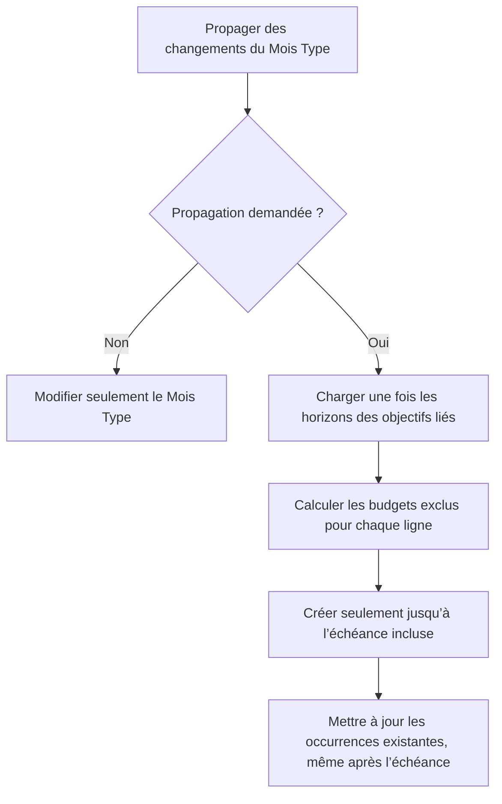

# Instruction: Borner la propagation depuis le Mois Type (PUL-312)

## Architecture projection

> Tree of the final files. ✅ create · ✏️ modify · ❌ delete

```txt
backend-nest/
├── supabase/migrations/
│   └── ✅ 20260726121000_bound_template_goal_propagation.sql
└── src/modules/
    ├── budget/
    │   ├── ✏️ budget.module.ts
    │   ├── domain/ports/
    │   │   └── ✅ savings-goal-horizon.port.ts
    │   └── infrastructure/persistence/
    │       ├── ✏️ supabase-budget.repository.ts
    │       └── ✏️ supabase-budget.repository.spec.ts
    └── budget-template/
        ├── application/
        │   ├── ✏️ bulk-template-line-operations.use-case.ts
        │   └── ✏️ bulk-template-line-operations.use-case.spec.ts
        ├── domain/
        │   └── ✏️ budget-template.entity.ts
        ├── infrastructure/persistence/
        │   ├── schemas/
        │   │   ├── ✏️ rpc-payload.schemas.ts
        │   │   └── ✏️ rpc-payload.schemas.spec.ts
        │   ├── ✏️ supabase-budget-template.repository.ts
        │   └── ✏️ supabase-budget-template.repository.spec.ts
        └── ✏️ savings-goal-propagation.integration.spec.ts
```

## User Journey



## Tasks to do

### `1)` Reproduire le bug avant la correction

1. Ajouter un test du use case bulk avec deux lignes liées à deux objectifs d’échéances différentes et des budgets avant, à et après chaque échéance.
2. Prouver que l’implémentation actuelle transmet la même liste de budgets à chaque création et dépasse les deux horizons.
3. Ajouter les cas sans propagation, objectif `PAUSED`, échéance nulle, ligne non liée et lien retiré.

### `2)` Extraire la résolution d’horizon imposée dans le module budget

1. Créer le port `SAVINGS_GOAL_HORIZON_PORT` avec `goalIdsPastPeriod(period)` pour la génération d’un budget et `periodsPastHorizon(goalIds, periods)` pour le bulk.
2. Faire porter l’implémentation par `SupabaseBudgetRepository`, l’exporter depuis `BudgetModule` et remplacer la méthode privée introduite par PUL-311.
3. Lire les paires `id,target_date` en une requête pour N objectifs ; ne filtrer ni `ACTIVE` ni `PAUSED`.
4. Considérer une échéance nulle comme non bornée et utiliser la période payDay-aware déjà disponible.
5. Ne mémoriser aucun horizon entre requêtes ou utilisateurs.

### `3)` Transmettre des exclusions par ligne

1. Collecter les IDs d’objectifs uniques dans les créations et mises à jour liées, puis résoudre tous leurs horizons une seule fois lorsque `propagateToBudgets=true`.
2. Ajouter `excludedBudgetIds` au modèle interne de chaque ligne et le sérialiser en `excluded_budget_ids` dans le JSONB strict.
3. N’effectuer aucune lecture d’horizon si la propagation est désactivée ou si aucune ligne n’est liée.
4. Préserver le comportement des lignes non liées et des lignes explicitement détachées.

### `4)` Filtrer seulement les INSERT SQL

1. Remplacer `apply_template_line_operations` par migration sans changer sa signature ni celle du wrapper atomique avec tags.
2. Dans la branche de création d’occurrences, exclure les budgets listés par la ligne ; l’échéance elle-même reste incluse.
3. Laisser la branche UPDATE inchangée afin qu’une occurrence existante après échéance reçoive encore une modification manuelle du Mois Type.
4. Exécuter les tests unitaires ciblés puis l’intégration Supabase couvrant création, modification, pause, nullabilité et objectifs mixtes.

## Test acceptance criteria

| Task | Acceptance criteria |
| --- | --- |
| 1 | Le test échoue avant correction parce qu’au moins une création dépasse l’échéance de son objectif. |
| 1 | Les cas non lié, détaché, `PAUSED`, échéance nulle et propagation désactivée sont présents avant l’implémentation. |
| 2 | N objectifs provoquent une seule lecture groupée ; aucune lecture n’a lieu sans propagation. |
| 2 | `PAUSED` reste borné, une échéance nulle reste non bornée et aucun cache inter-requête n’est introduit. |
| 3 | Chaque élément JSONB porte uniquement ses propres `excluded_budget_ids`; le schéma strict refuse une forme inconnue. |
| 3 | Une ligne non liée ou détachée continue à se propager sans borne. |
| 4 | Une création existe jusqu’au mois d’échéance inclus et n’existe pas après. |
| 4 | Une mise à jour continue à modifier une occurrence déjà présente après échéance. |
| 4 | La signature des RPC reste inchangée et l’intégration `savings-goal-propagation` passe. |
