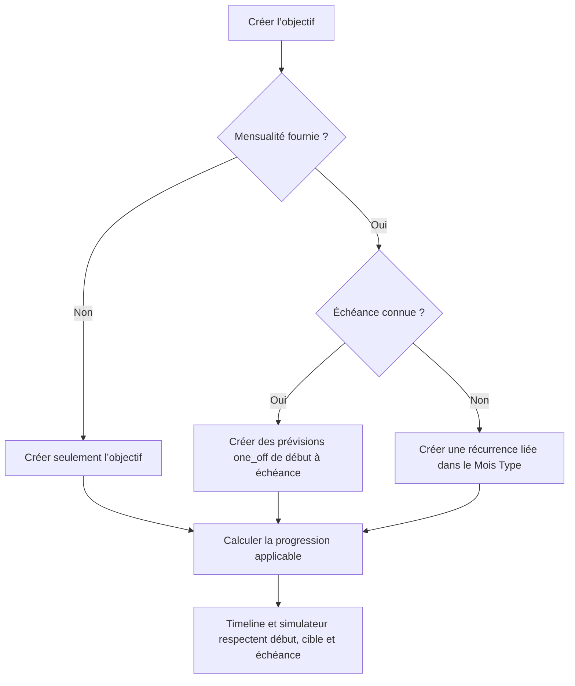

# Instruction: Implémenter les parcours backend de l’objectif libre

## Architecture projection

> Tree of the final files. ✅ create · ✏️ modify · ❌ delete

```txt
backend-nest/src/modules/
├── budget-template/
│   ├── ✏️ budget-template.module.ts
│   ├── domain/ports/
│   │   └── ✅ template-line-propagation.port.ts
│   └── infrastructure/adapters/
│       ├── ✅ template-line-propagation.adapter.ts
│       └── ✅ template-line-propagation.adapter.spec.ts
└── savings-goal/
    ├── ✏️ savings-goal.module.ts
    ├── application/
    │   ├── ✏️ create-savings-goal.use-case.ts
    │   ├── ✏️ create-savings-goal.use-case.spec.ts
    │   ├── ✏️ update-savings-goal.use-case.ts
    │   ├── ✏️ update-savings-goal.use-case.spec.ts
    │   ├── ✏️ get-savings-goal-progress.use-case.ts
    │   ├── ✏️ get-savings-goal-progress.use-case.spec.ts
    │   ├── ✏️ apply-savings-goal-plan.use-case.ts
    │   └── ✏️ apply-savings-goal-plan.use-case.spec.ts
    ├── ✏️ savings-goal.integration.spec.ts
    ├── ✏️ savings-goal-progress.integration.spec.ts
    └── ✏️ savings-goal-plan.integration.spec.ts
```

## User Journey



## Tasks to do

### `1)` Restaurer uniquement l’adaptateur de propagation utile aux pots

1. Restaurer depuis le parent du commit `650f0a71d` le port, l’adaptateur et son test supprimés par PUL-316.
2. Réutiliser `BulkTemplateLineOperationsUseCase` et son chiffrement, sa propagation RG-001, ses recalculs et ses invalidations.
3. Retirer l’ancienne option `maxPeriod` de cet adaptateur : PUL-312 porte désormais la borne par objectif.
4. Fournir et exporter le port depuis `BudgetTemplateModule`, puis l’injecter dans `SavingsGoalModule`.

### `2)` Créer le bon plan selon l’horizon

1. Autoriser une création nom-seul et une `monthlyContribution` facultative dans toutes les combinaisons.
2. Sans mensualité, ne créer ni ligne du Mois Type ni prévision budgétaire.
3. Avec mensualité et échéance, conserver le découpage `one_off`, mais commencer à `max(cycle courant, startDate)` et finir à l’échéance incluse.
4. Avec mensualité sans échéance, créer une seule ligne récurrente liée dans le Mois Type et la propager aux budgets existants courant/futurs.
5. Ne calculer ni injecter automatiquement une mensualité lorsque cible ou échéance manque.

### `3)` Appliquer la fenêtre au progrès et au plan

1. Alimenter les calculateurs avec `startDate`, `targetAmount` et `targetDate` nullables, les périodes matérialisées et les lignes liées.
2. Retourner `plannedProjection` et les métriques conditionnelles sans réimplémenter les formules dans le controller.
3. À l’application d’un plan, refuser toute modification antérieure au début effectif.
4. Sans échéance, ne provisionner aucun mois manquant via le simulateur ; la récurrence du Mois Type remplira les budgets lors de leur création normale.
5. Sans cible, accepter les ajustements mensuels mais refuser la redistribution d’un effort cible inexistant.

### `4)` Verrouiller les parcours d’intégration

1. Couvrir la création nom-seul, la création avec début futur, le plan daté historique et le pot avec mensualité récurrente.
2. Vérifier qu’un ajout ou retrait de cible/date change uniquement les lectures dérivées et ne réécrit aucune prévision existante ; l’avancement d’une échéance existante est réservé à PUL-313.
3. Vérifier qu’un début avancé masque les contributions antérieures du calcul sans les supprimer de la base.
4. Exécuter les specs de use cases et les trois intégrations savings-goal ciblées.

## Test acceptance criteria

| Task | Acceptance criteria |
| --- | --- |
| 1 | L’adaptateur restauré délègue au bulk existant ; aucun second chemin de chiffrement, propagation ou recalcul n’est créé. |
| 2 | `{ name }` crée un objectif et aucune prévision. |
| 2 | Une mensualité datée produit des `one_off` uniquement dans l’intervalle ; une mensualité ouverte produit une récurrence liée. |
| 2 | Aucune suggestion automatique n’est calculée si cible ou échéance manque. |
| 3 | Les réponses sans cible/date contiennent exactement les `null` contractuels et une timeline exploitable. |
| 3 | Aucun apply-plan n’écrit avant `startDate`; un pot n’effectue aucun fan-out de mois manquants. |
| 3 | Les ajustements sans cible restent possibles, la redistribution reste indisponible. |
| 4 | Ajouter ou retirer cible/date ne touche aucune prévision existante ; le cas distinct d’une échéance avancée reste couvert par les phases PUL-313. |
| 4 | Les tests unitaires et les intégrations savings-goal ciblées passent. |
