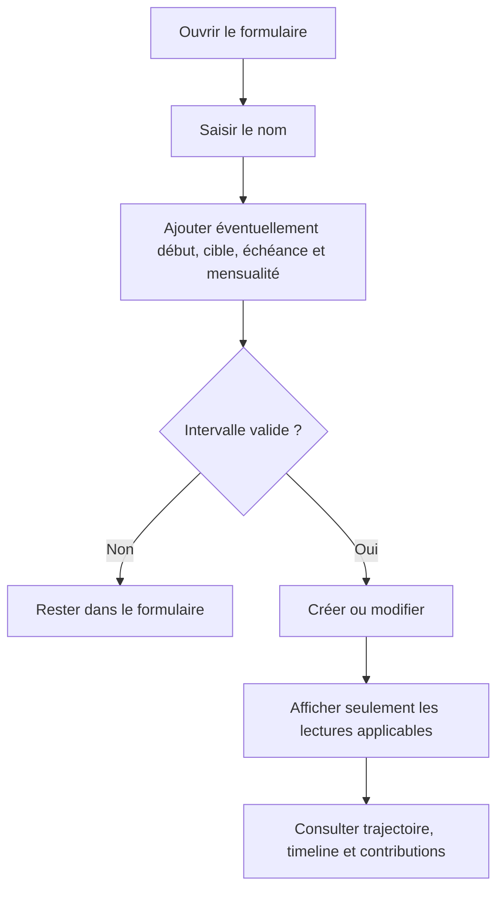

# Instruction: Adapter le parcours Angular aux quatre combinaisons

## Architecture projection

> Tree of the final files. ✅ create · ✏️ modify · ❌ delete

```txt
frontend/
├── e2e/tests/features/
│   └── ✏️ savings-goals-progress.spec.ts
└── projects/webapp/
    ├── public/i18n/
    │   └── ✏️ fr.json
    └── src/app/
        ├── core/savings-goal/
        │   ├── ✏️ savings-goal-api.ts
        │   └── ✏️ savings-goal-api.spec.ts
        └── feature/savings-goals/
            ├── components/
            │   ├── ✏️ savings-goal-form-dialog.schema.ts
            │   ├── ✏️ savings-goal-form-dialog.schema.spec.ts
            │   ├── ✏️ savings-goal-form-dialog.ts
            │   ├── ✏️ savings-goal-card.ts
            │   └── ✏️ savings-goal-card.spec.ts
            ├── detail/
            │   ├── ✏️ savings-goal-detail-page.ts
            │   ├── ✏️ savings-goal-detail-page.spec.ts
            │   ├── components/
            │   │   ├── ✏️ goal-projection-chart.config.ts
            │   │   ├── ✏️ goal-projection-chart.config.spec.ts
            │   │   └── ✏️ goal-projection-chart.ts
            │   └── services/
            │       ├── ✏️ goal-plan-simulator-store.ts
            │       └── ✏️ goal-plan-simulator-store.spec.ts
            └── services/
                ├── ✏️ savings-goals-store.ts
                └── ✏️ savings-goals-store.spec.ts
```

## User Journey



## Wireframe

```txt
┌────────────────────────────────────────┐
│ (1) Titre                              │
├────────────────────────────────────────┤
│ (2) Nom *                              │
│ (3) Montant de départ                  │
│ (4) Début optionnel                    │
│ (5) Cible optionnelle                  │
│ (6) Échéance optionnelle               │
│ (7) Plan mensuel facultatif            │
│     suggestion seulement si (5) + (6)  │
├────────────────────────────────────────┤
│ (8) Annuler                 Enregistrer │
└────────────────────────────────────────┘

┌────────────────────────────────────────┐
│ (9) Nom · statut · intervalle éventuel │
├────────────────────────────────────────┤
│ (10) Progression cible, si cible        │
│ (11) Épargné · prévu · projection      │
│ (12) Rythme, si échéance                │
│ (13) Estimation, si cible sans échéance│
├────────────────────────────────────────┤
│ (14) Trajectoire, cible conditionnelle │
│ (15) Plan mois par mois                │
│ (16) Contributions                    │
└────────────────────────────────────────┘
```

1. En-tête du dialogue existant.
2. Seul champ obligatoire.
3. Stock initial existant, toujours facultatif.
4-6. Bornes et cible indépendantes.
7. Montant manuel toujours facultatif ; la suggestion automatique n’existe qu’avec cible et échéance.
8. Validation puis mutation.
9-13. Résumé conditionné par les données réellement disponibles.
14. La série cible disparaît sans cible, les séries de cumul restent.
15-16. Timeline et contributions restent accessibles dans chaque combinaison.

## Tasks to do

### `1)` Rendre le formulaire explicite et réversible

1. Ajouter `startDate` et rendre cible/échéance facultatives dans le schéma Signal Forms.
2. Permettre de vider explicitement chaque champ à l’édition et envoyer `null`, jamais une omission accidentelle.
3. Refuser début après échéance avec les erreurs et patterns Angular existants.
4. Garder la mensualité facultative ; afficher la suggestion seulement avec cible et échéance, tout en permettant une saisie manuelle pour un pot ouvert.
5. Conserver les champs natifs/Material existants, les cibles tactiles et les libellés accessibles.

### `2)` Décliner liste et détail sans données fictives

1. Couvrir les cartes cible+date, cible seule, date seule et aucun des deux.
2. Sans cible, masquer pourcentage, barre, écart et suggestion de complétion ; afficher épargné, prévu cumulé et `plannedProjection`.
3. Sans échéance, masquer requis, projection à échéance et statut de rythme.
4. Avec cible sans échéance, afficher l’estimation d’atteinte quand elle existe.
5. Afficher début et échéance seulement lorsqu’ils existent, sans laisser de slot vide.

### `3)` Adapter graphe et simulateur

1. Omettre la série et la légende Cible uniquement lorsque `targetAmount == null`.
2. Garder les séries prévues et confirmées, la timeline et les contributions.
3. Sans cible, conserver les ajustements mensuels mais masquer redistribution, verdict d’atteinte et CTA dépendant d’un effort cible.
4. Consommer les métriques du backend ; ne pas transformer un `null` en zéro.

### `4)` Prouver la matrice Angular

1. Étendre les specs formulaire, carte, détail, graphe, simulateur, API et store pour les quatre combinaisons.
2. Ajouter le happy path E2E : créer un objectif nom-seul, ouvrir son détail et vérifier les métriques libres sans barre cible.
3. Garder un scénario objectif daté pour prouver l’absence de régression.
4. Exécuter les tests Angular ciblés, le type-check puis l’E2E ciblé.

## Test acceptance criteria

| Task | Acceptance criteria |
| --- | --- |
| 1 | Un nom suffit ; chaque champ optionnel peut être ajouté, modifié puis retiré. |
| 1 | Début après échéance bloque l’enregistrement ; une mensualité manuelle reste disponible sans échéance. |
| 2 | Chaque combinaison cible/échéance rend uniquement les métriques applicables. |
| 2 | Sans cible, `plannedProjection` est visible et aucune cible à zéro n’est inventée. |
| 3 | Le graphe contient la série Cible avec une cible et l’omet sans cible. |
| 3 | Un pot autorise les ajustements mensuels mais ni redistribution ni verdict cible. |
| 4 | Le parcours E2E nom-seul et le scénario daté historique passent. |
| 4 | Les tests ciblés et le type-check Angular passent. |
