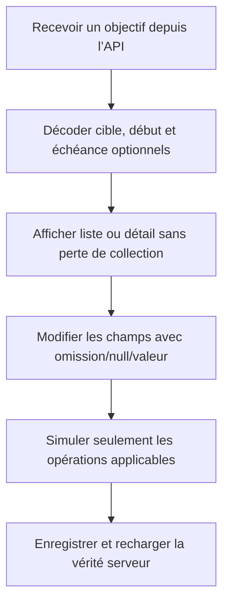

# Instruction: Adapter le parcours iOS et sécuriser le rollout

## Architecture projection

> Tree of the final files. ✅ create · ✏️ modify · ❌ delete

```txt
ios/
├── Pulpe/
│   ├── Domain/
│   │   ├── Formulas/
│   │   │   └── ✏️ SavingsPlanCalculator.swift
│   │   └── Models/
│   │       ├── ✏️ SavingsGoal.swift
│   │       ├── ✏️ SavingsGoalPlan.swift
│   │       └── ✏️ SavingsGoalProgress.swift
│   └── Features/SavingsGoals/
│       ├── ✏️ SavingsGoalFormSheet.swift
│       ├── ✏️ SavingsGoalsListView.swift
│       ├── ✏️ SavingsGoalDetailView.swift
│       ├── Components/
│       │   ├── ✏️ GoalDerivedStateCards.swift
│       │   └── ✏️ GoalProjectionChart.swift
│       └── Simulator/
│           └── ✏️ GoalPlanSimulatorSheet.swift
└── PulpeTests/
    ├── Domain/
    │   ├── Formulas/
    │   │   ├── ✏️ SavingsPlanCalculatorTests.swift
    │   │   └── ✏️ SavingsPlanSuggestedContributionTests.swift
    │   └── Models/
    │       ├── ✏️ SavingsGoalCodableTests.swift
    │       └── ✏️ SavingsGoalProgressCodableTests.swift
    └── Features/SavingsGoals/
        ├── ✏️ SavingsGoalFormSheetTests.swift
        ├── ✏️ SavingsGoalDetailViewModelTests.swift
        └── ✏️ GoalProjectionSeriesTests.swift
```

## User Journey



## Wireframe

```txt
┌──────────────────────────────────┐
│ (1) Navigation                   │
├──────────────────────────────────┤
│ (2) Nom *                        │
│ (3) Montant de départ            │
│ (4) Cible optionnelle            │
│ (5) Début optionnel              │
│ (6) Échéance optionnelle         │
│ (7) Plan mensuel facultatif      │
│     suggestion si (4) + (6)      │
├──────────────────────────────────┤
│ (8) Action principale            │
└──────────────────────────────────┘

┌──────────────────────────────────┐
│ (9) Statut · intervalle éventuel │
├──────────────────────────────────┤
│ (10) Épargné · prévu · projection│
│ (11) Cible/barre si cible        │
│ (12) Rythme si échéance          │
│ (13) Estimation si cible ouverte │
├──────────────────────────────────┤
│ (14) Trajectoire conditionnelle  │
│ (15) Timeline                    │
│ (16) Contributions              │
└──────────────────────────────────┘
```

1. Fermeture et titre de la sheet existante.
2. Seul champ obligatoire.
3-6. Stock, cible et intervalle indépendants.
7. Montant manuel facultatif ; suggestion uniquement avec cible et échéance.
8. Création ou mise à jour.
9-13. Résumé sans emplacement vide ni métrique inventée.
14. La règle cible est conditionnelle.
15-16. Plan et contributions restent disponibles.

## Tasks to do

### `1)` Rendre le wire contract Swift tolérant

1. Passer `SavingsGoal.targetAmount` et `targetDate` en optionnels, ajouter `startDate`, puis rendre les champs correspondants optionnels dans les DTO create.
2. Pour les updates, réutiliser le pattern d’encodage tri-state de `BudgetLineUpdate.savingsGoalId` : non fourni, JSON `null`, valeur.
3. Rendre optionnelles les métriques de `SavingsGoalProgress` conformément au schéma shared, sans affaiblir les montants toujours disponibles.
4. Tester les fixtures avec valeur, `null` et champ absent ; une entrée libre ne doit jamais faire échouer le décodage de la liste entière.

### `2)` Garder le miroir de calcul Swift cohérent

1. Ancrer la suggestion à `max(cycle courant, startDate)` et la désactiver sans cible ou échéance.
2. Exclure les périodes avant le début des ajustements et de la redistribution.
3. Rendre `gapToTarget`, `isTargetMet` et la période atteinte optionnels sans cible.
4. Sans cible, conserver la simulation mensuelle et `simulatedFinal`, mais refuser la redistribution.
5. Rendre la cible du graphe optionnelle et omettre son `RuleMark` lorsqu’elle est absente.

### `3)` Adapter formulaire, liste et détail

1. Faire du nom le seul champ requis et permettre le retrait explicite de début, cible et échéance.
2. Afficher une section de mensualité manuelle pour un pot ouvert et une suggestion seulement pour cible+échéance.
3. Refuser début après échéance avant tout appel service.
4. Décliner liste, cartes dérivées, détail et simulateur selon la même matrice que le web.
5. Respecter les composants, tokens, sheets, Dynamic Type, VoiceOver et cibles tactiles définis par `ios/DESIGN.md`.

### `4)` Produire la build de compatibilité avant activation serveur

1. Exécuter les tests Codable, calculateur, formulaire, détail et graphe ciblés.
2. Générer le projet, exécuter les tests `PulpeTests` ciblés puis construire `PulpeLocal` sur le simulateur configuré.
3. Livrer cette capacité de décodage avant d’autoriser en production la création d’objectifs contenant des nulls.
4. Si cette séquence de release est impossible, bloquer l’activation backend derrière la politique de version minimale existante ; ne créer ni endpoint v2 ni feature flag local sans besoin confirmé.

## Test acceptance criteria

| Task | Acceptance criteria |
| --- | --- |
| 1 | iOS décode une liste mêlant objectifs historiques et nom-seul, avec champs valorisés, nuls ou absents. |
| 1 | Chaque update encode distinctement omission, `null` et valeur. |
| 2 | Une cible de 1’400 CHF de juin à décembre suggère 200 CHF ; aucun mois avant le début n’est contributif. |
| 2 | Sans cible, le cumul simulé existe mais le verdict, l’écart et la redistribution sont absents. |
| 3 | Les quatre combinaisons cible/échéance sont utilisables sans crash et sans valeur fictive. |
| 3 | Le formulaire nom-seul est valide ; début après échéance est bloqué ; retirer un champ encode `null`. |
| 4 | Tests ciblés et build `PulpeLocal` passent. |
| 4 | La release iOS tolérante précède l’activation des écritures nullable en production. |
