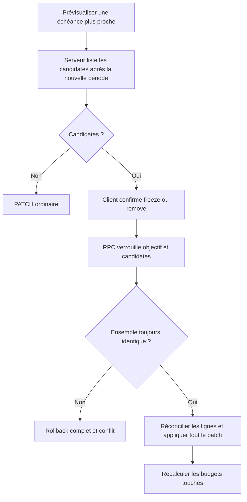

# Instruction: Rendre l’avancement d’échéance atomique côté serveur (PUL-313)

## Architecture projection

> Tree of the final files. ✅ create · ✏️ modify · ❌ delete

```txt
shared/
├── ✏️ schemas.ts
├── ✏️ src/error-codes.ts
└── ✏️ src/savings-goal-schema.spec.ts
backend-nest/
├── supabase/migrations/
│   └── ✅ 20260726122000_reconcile_savings_goal_target_date.sql
└── src/
    ├── ✏️ types/database.types.ts
    ├── common/constants/
    │   └── ✏️ error-definitions.ts
    └── modules/savings-goal/
        ├── application/
        │   ├── ✏️ get-savings-goal-future-lines.use-case.ts
        │   ├── ✏️ get-savings-goal-future-lines.use-case.spec.ts
        │   ├── ✏️ update-savings-goal.use-case.ts
        │   └── ✏️ update-savings-goal.use-case.spec.ts
        ├── domain/
        │   ├── ✏️ savings-goal.entity.ts
        │   └── ports/✏️ savings-goal-repository.port.ts
        ├── infrastructure/
        │   ├── http/
        │   │   ├── ✏️ savings-goal.controller.ts
        │   │   └── dto/✏️ savings-goal-swagger.dto.ts
        │   └── persistence/
        │       ├── schemas/
        │       │   ├── ✏️ rpc-payload.schemas.ts
        │       │   └── ✏️ rpc-payload.schemas.spec.ts
        │       ├── ✏️ supabase-savings-goal.repository.ts
        │       └── ✏️ supabase-savings-goal.repository.spec.ts
        └── ✏️ savings-goal-generation-stop.integration.spec.ts
```

## User Journey



## Tasks to do

### `1)` Étendre la prévisualisation existante

1. Ajouter un query paramètre optionnel `targetDate` à `GET /savings-goals/:id/future-lines`.
2. Lorsque ce paramètre existe, retourner seulement les lignes éligibles strictement après la nouvelle période payDay-aware.
3. Conserver les gardes actuelles : utilisateur propriétaire, épargne liée, non pointée, non ajustée manuellement, période courante ou future.
4. Ne filtrer aucune candidate côté client et ne modifier aucune donnée pendant la prévisualisation.

### `2)` Étendre le PATCH avec une décision explicite

1. Ajouter au schéma de requête une `reconciliation` optionnelle réutilisant les modes `freeze|remove` et les IDs présentés.
2. Sur une date non nulle avancée par rapport à une date existante, détecter les candidates avant toute écriture.
3. S’il existe des candidates et aucune décision, répondre avec `SAVINGS_GOAL_RECONCILIATION_REQUIRED` et ne rien écrire.
4. Une date repoussée, identique, retirée, ajoutée à un objectif non daté ou sans candidate suit le PATCH ordinaire.
5. Faire porter par la même commande les autres changements du formulaire, dont les champs chiffrés.

### `3)` Appliquer date et décision dans une seule transaction

1. Créer une RPC dédiée qui reprend le verrou advisory de `apply_savings_goal_plan`.
2. Recalculer dans la transaction l’ensemble exact des candidates après la nouvelle échéance et le comparer aux IDs confirmés ; tout drift provoque un rollback.
3. Réutiliser les règles SQL de `apply_savings_goal_generation_stop` pour figer ou retirer, puis appliquer le patch objectif dans la même transaction.
4. Pour `freeze`, délier et protéger de RG-001 ; pour `remove`, supprimer et laisser les transactions se libérer via la FK existante.
5. Retourner les budgets touchés, invalider les caches avant recalcul et signaler une éventuelle erreur post-commit comme échec partiel critique.

### `4)` Prouver les garanties transactionnelles

1. Couvrir les candidates après date, l’exclusion des périodes passées, lignes pointées et lignes ajustées.
2. Couvrir freeze et remove, puis un drift entre preview et confirmation.
3. Prouver qu’un drift, un ID étranger, une ligne devenue pointée ou un patch invalide n’écrit ni date ni ligne.
4. Régénérer les types DB, puis exécuter specs repository/use cases et intégration generation-stop.

## Test acceptance criteria

| Task | Acceptance criteria |
| --- | --- |
| 1 | La preview retourne uniquement les lignes strictement après la date proposée, selon le cycle payDay-aware. |
| 1 | La preview est pure et applique les mêmes gardes que la future mutation. |
| 2 | Une échéance avancée avec candidates et sans décision répond en conflit sans écriture. |
| 2 | Recul, retrait, ajout depuis `null`, égalité ou zéro candidate ne demandent aucune réconciliation. |
| 3 | Freeze/remove et patch objectif sont validés et écrits dans une seule transaction. |
| 3 | Les IDs confirmés doivent être exactement l’ensemble encore éligible ; tout drift annule l’ensemble. |
| 3 | Les budgets touchés sont invalidés puis recalculés après commit. |
| 4 | Les tests prouvent zéro écriture sur décision manquante, conflit, drift ou payload invalide. |
| 4 | Les types générés et toutes les suites backend ciblées passent. |
