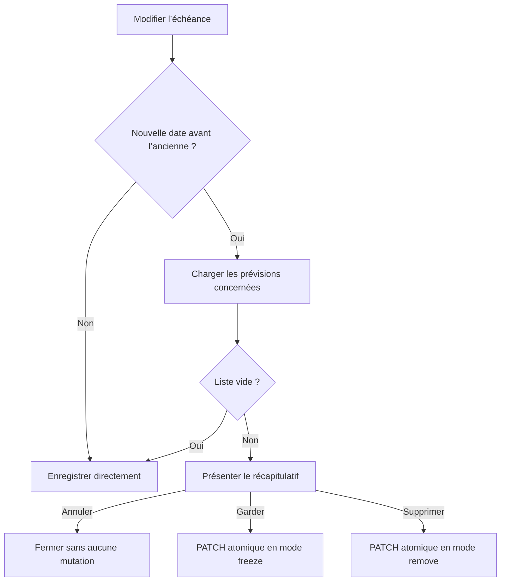

# Instruction: Ajouter la confirmation d’échéance sur Angular et iOS

## Architecture projection

> Tree of the final files. ✅ create · ✏️ modify · ❌ delete

```txt
frontend/projects/webapp/
├── public/i18n/
│   └── ✏️ fr.json
└── src/app/
    ├── core/savings-goal/
    │   ├── ✏️ savings-goal-api.ts
    │   └── ✏️ savings-goal-api.spec.ts
    └── feature/savings-goals/
        ├── components/
        │   └── ✏️ savings-goal-form-dialog.ts
        ├── detail/
        │   ├── ✏️ savings-goal-detail-page.ts
        │   ├── ✏️ savings-goal-detail-page.spec.ts
        │   └── components/
        │       └── ✏️ goal-generation-stop-dialog.ts
        └── services/
            ├── ✏️ savings-goals-dialog.service.ts
            ├── ✏️ savings-goals-store.ts
            └── ✏️ savings-goals-store.spec.ts
ios/
├── Pulpe/
│   ├── Core/Network/
│   │   └── ✏️ Endpoints.swift
│   ├── Domain/
│   │   ├── Models/✏️ SavingsGoal.swift
│   │   └── Store/✏️ SavingsGoalStore.swift
│   └── Features/SavingsGoals/
│       ├── ✏️ SavingsGoalFormSheet.swift
│       ├── ✏️ SavingsGoalDetailView.swift
│       └── Components/✏️ GoalGenerationStopSheet.swift
└── PulpeTests/
    ├── Domain/Store/✏️ SavingsGoalStoreTests.swift
    ├── Features/SavingsGoals/✏️ SavingsGoalFormSheetTests.swift
    └── Helpers/✏️ MockSavingsGoalService.swift
```

## User Journey



## Wireframe

```txt
┌──────────────────────────────────────┐
│ (1) Échéance avancée                 │
│ (2) Nouvelle période                 │
├──────────────────────────────────────┤
│ (3) Prévisions concernées            │
│     période                 montant  │
│     …                                │
│     total                            │
├──────────────────────────────────────┤
│ (4) Garder sans objectif             │
│ (5) Supprimer                        │
│ (6) Annuler                          │
└──────────────────────────────────────┘
```

1. Contexte distinct de l’arrêt par statut.
2. Date qui crée la nouvelle borne.
3. Liste serveur exacte, sans filtrage local.
4. Conserve les prévisions, les délie et les protège.
5. Supprime les prévisions ; action destructive explicitement décrite.
6. Ne déclenche aucun appel d’écriture.

## Tasks to do

### `1)` Intercepter l’édition avant toute écriture

1. Faire retourner au formulaire le patch complet sans lancer lui-même la mutation.
2. Comparer l’ancienne et la nouvelle période avec la logique payDay-aware du contrat.
3. Appeler la preview seulement lorsque deux dates non nulles existent et que la nouvelle est antérieure.
4. Sans candidate, exécuter le PATCH ordinaire ; avec candidates, ouvrir le récapitulatif.
5. Transmettre `targetDate` comme query paramètre jusque dans l’endpoint iOS, sans filtrage client.

### `2)` Réutiliser les dialogues et sheets existants

1. Généraliser `GoalGenerationStopDialog` et `GoalGenerationStopSheet` avec un contexte arrêt de statut ou échéance avancée.
2. Réutiliser la liste, les totaux et les choix freeze/remove existants ; ne pas créer un second composant.
3. Adapter titre, explication, accessibilité et style destructif au contexte d’échéance.
4. Garder la cible tactile minimale et un ordre d’actions non ambigu sur web et iOS.

### `3)` Envoyer une seule mutation atomique

1. Sur confirmation, envoyer le patch complet avec le mode et les IDs affichés dans un seul PATCH.
2. Sur annulation, ne lancer aucun PATCH et aucun POST generation-stop.
3. Conserver le POST generation-stop actuel uniquement pour le changement de statut.
4. Invalider les caches objectifs et budgets après succès ; sur conflit/drift, recharger la preview et ne présenter aucun succès.

### `4)` Verrouiller l’orchestration des deux clients

1. Tester annulation, freeze, remove, zéro candidate, date reculée, date retirée et date ajoutée depuis `null`.
2. Prouver que confirmation = un PATCH et zéro POST séparé.
3. Prouver que le patch complet conserve les autres modifications du formulaire.
4. Exécuter les specs Angular ciblées et les tests iOS store/formulaire ciblés.

## Test acceptance criteria

| Task | Acceptance criteria |
| --- | --- |
| 1 | Une date avancée déclenche preview avant mutation ; toute autre transition de date suit le PATCH ordinaire. |
| 1 | Zéro candidate n’ouvre aucun dialogue. |
| 2 | Web et iOS réutilisent le composant d’arrêt existant avec un contexte et des libellés adaptés. |
| 2 | Freeze et remove sont clairement distingués ; remove est annoncé comme destructif. |
| 3 | Annuler produit zéro écriture ; confirmer produit exactement un PATCH atomique. |
| 3 | Le POST generation-stop reste réservé au changement de statut. |
| 3 | Un conflit recharge l’état sans faux succès ni patch partiel. |
| 4 | Les scénarios d’orchestration Angular et iOS passent, y compris les modifications simultanées d’autres champs. |
