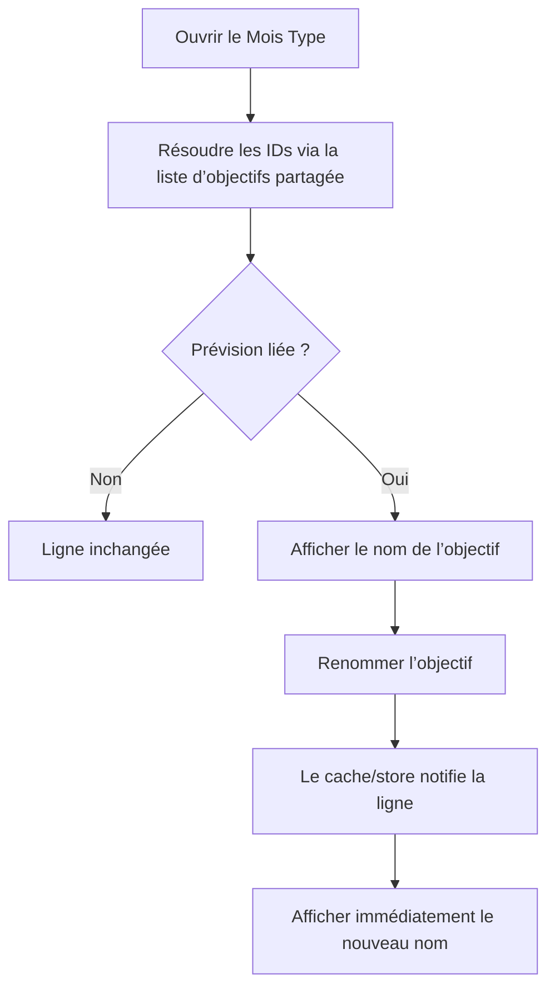

# Instruction: Afficher l’objectif lié dans le Mois Type (PUL-317)

## Architecture projection

> Tree of the final files. ✅ create · ✏️ modify · ❌ delete

```txt
frontend/projects/webapp/src/app/feature/
├── budget-templates/details/
│   ├── ✏️ template-detail.ts
│   ├── ✏️ template-detail.spec.ts
│   ├── components/
│   │   ├── ✏️ template-lines-grid.ts
│   │   ├── ✏️ template-lines-grid.spec.ts
│   │   ├── ✏️ template-line-card.ts
│   │   └── ✏️ template-line-card.spec.ts
│   └── services/
│       ├── ✏️ template-details-store.ts
│       └── ✏️ template-details-store.spec.ts
└── budget/budget-details/components/
    ├── ✏️ budget-items-container.ts
    └── budget-table/
        ├── ✏️ budget-table.ts
        └── cells/
            ├── ✏️ name-cell.ts
            └── ✅ name-cell.spec.ts
ios/
├── Pulpe/Features/Templates/TemplateDetails/
│   └── ✏️ TemplateDetailsView.swift
└── PulpeTests/Features/Templates/
    └── ✅ TemplateDetailsGoalLinkTests.swift
```

## User Journey



## Wireframe

```txt
┌────────────────────────────────┐
│ (1) Prévision             ⋯    │
│ (2) Objectif · Nom objectif    │
│ (3) Montant · fréquence        │
└────────────────────────────────┘

┌────────────────────────────────┐
│ (4) Prévision · montant        │
│     Objectif · Nom objectif    │
└────────────────────────────────┘
```

1. Ligne/carte existante du Mois Type.
2. Affordance secondaire avec l’icône et la couleur sémantique épargne existantes.
3. Montant et récurrence restent inchangés.
4. Même information dans le mode Tableau budget Angular ; iOS n’a pas ce mode.

## Tasks to do

### `1)` Résoudre les noms sans N+1

1. Dans `TemplateDetailsStore`, lire la liste via le `SavingsGoalApi.cache` et construire une map réactive `id → nom`.
2. Réutiliser la clé `['savings-goals','list']` déjà partagée par le store objectifs et le picker.
3. Sur navigation froide, autoriser un seul GET de liste ; ne lancer aucune requête par ligne ou par ID.
4. Sur iOS, lire le `SavingsGoalStore` applicatif et appeler `loadIfNeeded()` une seule fois.

### `2)` Ajouter l’affordance au Mois Type web

1. Transmettre la map du store au détail, à la grille puis à chaque carte.
2. Pour une ligne liée, afficher l’icône épargne et le nom résolu dans la hiérarchie secondaire existante.
3. Garder une ligne non liée strictement inchangée.
4. Ne pas extraire de nouveau composant partagé : l’affordance tient dans la carte existante.

### `3)` Décider et implémenter le mode Tableau

1. Appliquer PUL-317 CA5 au mode Tableau Angular : transmettre `savingsGoalNameById` à `BudgetTable` puis à `NameCell`.
2. Afficher le même nom d’objectif sous la prévision, sans ajouter de colonne.
3. Garder les modes enveloppes/mobile déjà conformes et ne pas les refactorer.
4. Ne rien ajouter côté iOS pour ce mode inexistant ; le détail budget iOS affiche déjà le chip objectif.

### `4)` Ajouter la parité iOS et les tests

1. Dans `TemplateDetailsView.TemplateLineRow`, résoudre le nom depuis le store global.
2. Réutiliser `PulpeChip(icon: "target", style: .semantic(.financialSavings))` déjà employé sur les prévisions budget.
3. Tester lié, non lié, ID inconnu et renommage avec le même ID sur web et iOS.
4. Prouver qu’une liste déjà cachée ne déclenche aucun GET et qu’une entrée froide en déclenche au plus un.
5. Exécuter les specs Angular ciblées, le test iOS ciblé et le build `PulpeLocal`.

## Test acceptance criteria

| Task | Acceptance criteria |
| --- | --- |
| 1 | Toutes les lignes sont résolues depuis une seule liste ; aucune requête par ligne ou par ID n’existe. |
| 1 | Une navigation froide produit au plus un GET, une liste déjà cachée n’en produit aucun. |
| 2 | Une ligne liée du Mois Type web affiche le nom courant de l’objectif ; une ligne libre ne change pas. |
| 2 | Un renommage met à jour l’affordance via le cache réactif. |
| 3 | Le mode Tableau Angular affiche l’objectif dans la cellule nom sans nouvelle colonne. |
| 3 | Les modes mobile/enveloppes web et le détail budget iOS restent inchangés. |
| 4 | Le Mois Type iOS réutilise le chip épargne existant et reflète un renommage. |
| 4 | Tests Angular/iOS ciblés et build `PulpeLocal` passent. |
