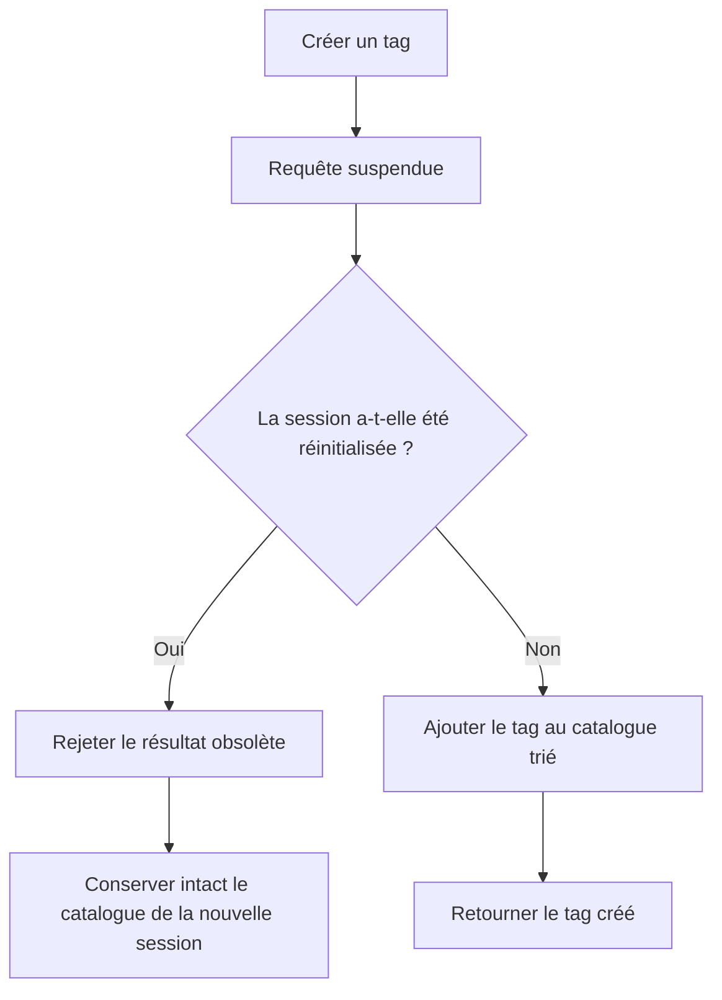

# Instruction: Isoler les créations de tag par session

## Architecture projection

> Tree of the final files. ✅ create · ✏️ modify · ❌ delete

```txt
ios/
├── Pulpe/
│   └── Domain/
│       └── Store/
│           └── ✏️ TagStore.swift          # invalider les mutations terminées après un reset
└── PulpeTests/
    └── Domain/
        └── Store/
            └── ✏️ TagStoreTests.swift     # reproduire la création suspendue entre deux sessions

✅ aucun nouveau fichier
❌ aucun fichier
```

## User Journey



## Tasks to do

### `1)` Reproduire la fuite inter-session

> Verrouiller le scénario exact signalé par la revue avant de modifier le store.

1. Ajouter au mock de `TagStoreTests` une barrière contrôlable qui suspend `create`.
2. Démarrer une création pour la session A, attendre son entrée dans le service, puis appeler `reset()`.
3. Charger un catalogue de session B avant de libérer la création A.
4. Prouver que le résultat A ne rejoint jamais le catalogue B.

### `2)` Distinguer session et chargement

> Invalider uniquement les mutations qui traversent un reset utilisateur.

1. Ajouter une génération de session indépendante de `loadGeneration`.
2. Capturer cette génération avant `await service.create`.
3. Après la réponse, vérifier la génération avant toute mutation de `tags`.
4. Signaler l’annulation au caller quand la session a changé.
5. Incrémenter la génération de session dans `reset()` sans modifier le comportement de refresh.

### `3)` Préserver les créations légitimes

> Éviter qu’un refresh du catalogue soit confondu avec un changement d’utilisateur.

1. Tester qu’une création suspendue reste applicable après un `forceRefresh()` dans la même session.
2. Conserver le tri alphabétique et le retour du tag créé sur le chemin normal.
3. Exécuter les suites ciblées `TagStoreTests` et `SessionDataResetterTests`.

## Test acceptance criteria

| Task | Acceptance criteria |
| ---- | ------------------- |
| 1 | Une création de la session A qui termine après `reset()` ne modifie pas le catalogue déjà chargé de la session B |
| 2 | Le caller reçoit une annulation et aucun nom de tag de la session A ne devient visible ou sélectionnable après le reset |
| 3 | Un `forceRefresh()` dans la même session n’annule pas une création valide |
| 3 | Une création normale ajoute une seule fois le tag au catalogue trié et les tests ciblés passent |
