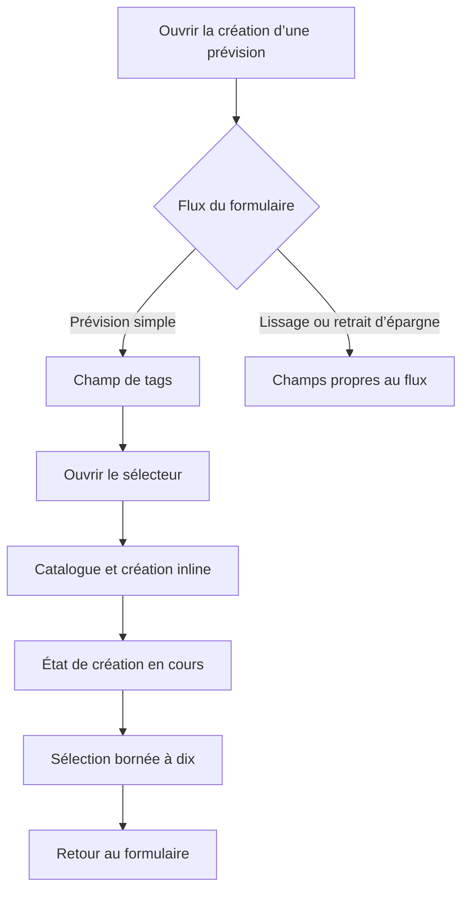

# Instruction: Sécuriser le sélecteur et le flux de prévision

## Architecture projection

> Tree of the final files. ✅ create · ✏️ modify · ❌ delete

```txt
ios/
├── Pulpe/
│   ├── Shared/
│   │   └── Components/
│   │       └── ✏️ TagPickerField.swift       # rendre la création inline atomique côté interface
│   └── Features/
│       └── Budgets/
│           └── BudgetDetails/
│               └── ✏️ AddBudgetLineSheet.swift # masquer le champ dans les flux sans tagIds
└── PulpeTests/
    ├── Shared/
    │   └── Components/
    │       └── ✏️ TagPickerFieldTests.swift   # verrouiller la limite après création
    └── Features/
        └── Budgets/
            └── BudgetDetails/
                └── ✅ AddBudgetLineSheetTests.swift # verrouiller la visibilité par mode

❌ aucun fichier
```

## User Journey



## Wireframe

```txt
┌────────────────────────────────────┐
│ (1) Données de la prévision        │
├────────────────────────────────────┤
│ (2) Champ tags                     │
│ (3) Option de retrait d’épargne    │
├────────────────────────────────────┤
│ (4) Action principale              │
└────────────────────────────────────┘

┌────────────────────────────────────┐
│ (1) Données de la prévision        │
├────────────────────────────────────┤
│ (3) Option de retrait d’épargne    │
├────────────────────────────────────┤
│ (4) Action principale              │
└────────────────────────────────────┘

┌────────────────────────────────────┐
│ (5) Barre du sélecteur             │
├────────────────────────────────────┤
│ (6) Sélection courante             │
│ (7) Catalogue                      │
│ (8) Création en cours              │
└────────────────────────────────────┘
```

1. Données de la prévision: type, montant et description existants.
2. Champ tags: présent uniquement quand le flux sauvegarde `tagIds`.
3. Option de retrait d’épargne: conserve sa place dans le formulaire revenu.
4. Action principale: validation du flux actuellement choisi.
5. Barre du sélecteur: titre et confirmation.
6. Sélection courante: tags déjà choisis et compteur.
7. Catalogue: tags existants.
8. Création en cours: progression de l’ajout inline.

## Tasks to do

### `1)` Borner la complétion d’une création

> Faire respecter la limite de dix même si l’état change pendant un appel réseau.

1. Écrire le test où la complétion reçoit une sélection déjà pleine.
2. Réutiliser la logique bornée de sélection pour intégrer le tag créé.
3. Garantir qu’aucun chemin du composant ne produit onze ids.

### `2)` Rendre la création inline atomique

> Empêcher le formulaire de poursuivre ou de changer de sélection avant la réponse.

1. Désactiver le catalogue, la saisie et la confirmation pendant `isCreating`.
2. Bloquer le swipe de fermeture avec le pattern `interactiveDismissDisabled`.
3. Réactiver toutes les interactions après succès ou erreur.
4. Conserver la sélection automatique du tag créé sur le chemin normal.

### `3)` Masquer le champ dans les flux incompatibles

> Ne montrer le sélecteur que lorsque le submit transporte réellement `tagIds`.

1. Centraliser la décision de visibilité à partir des modes simple, lissage et retrait d’épargne.
2. Garder le champ visible pour une prévision simple.
3. Le masquer pour le lissage et quand `isSavingsWithdrawalMode` est actif.
4. Ne modifier ni `SavingsWithdrawalPrefill`, ni `SavingsWithdrawalCreate`, ni le schéma shared.
5. Préserver la sélection locale si l’utilisateur revient au mode simple.
6. Garder `AddBudgetLineSheet.swift` sous la limite d’architecture de 350 lignes sans créer de fichier de production dédié à cette seule condition.

### `4)` Vérifier les deux régressions UI

> Couvrir la limite et la visibilité sans introduire de dépendance de test UI.

1. Étendre `TagPickerFieldTests` avec le cas de complétion à dix tags.
2. Ajouter un test pur de visibilité pour les trois modes de `AddBudgetLineSheet`.
3. Générer le projet Xcode puis exécuter les suites ciblées et un build `PulpeLocal`.

## Test acceptance criteria

| Task | Acceptance criteria |
| ---- | ------------------- |
| 1 | La complétion d’une création ne fait jamais passer la sélection de dix à onze ids |
| 2 | Tant que la création est en cours, le catalogue, la confirmation et la fermeture interactive ne permettent aucune action concurrente |
| 2 | Après succès ou erreur, le sélecteur redevient utilisable et une création normale sélectionne son tag |
| 3 | Le champ tags est visible pour une prévision simple et absent en mode lissage ou retrait d’épargne |
| 3 | Revenir du retrait d’épargne au mode simple restaure la sélection locale sans modifier le contrat `SavingsWithdrawalCreate` |
| 4 | Les tests ciblés de store, sélection, visibilité et architecture ainsi que le build `PulpeLocal` passent |
