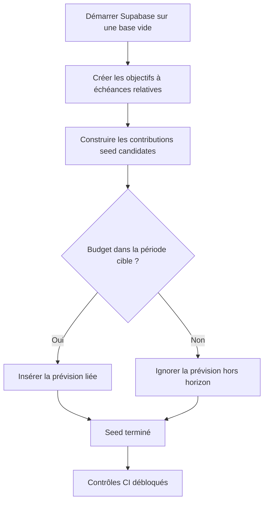

# Instruction: Aligner les contributions seed sur l’horizon des objectifs

## Architecture projection

> Tree of the final files. ✅ create · ✏️ modify · ❌ delete

```txt
backend-nest
└── supabase
    └── ✏️ seed.sql
```

- Création : aucune.
- Suppression : aucune.

## User Journey



## Tasks to do

### `1)` Conserver la reproduction du défaut

> Utiliser le démarrage complet Supabase comme test de régression du seed.

1. Constater que le produit cartésien actuel tente de lier chaque objectif aux douze budgets 2026.
2. Établir qu’une échéance relative peut précéder décembre 2026, comme l’objectif MacBook actuellement borné à novembre.
3. Garder le trigger `enforce_savings_goal_line_link` comme oracle de l’invariant au démarrage.

### `2)` Borner les contributions seed

> Écarter chaque budget situé après la période cible de l’objectif concerné.

1. Relier les candidates aux objectifs déjà insérés pour lire leur `target_date` réelle.
2. Comparer la période du budget à la période calendaire de l’échéance et conserver toutes les candidates d’un objectif ouvert.
3. Ne pas recopier la logique `payDay` du trigger : l’utilisateur seed ne configure aucun jour de paie.
4. Préserver les budgets 2026, les échéances relatives, les montants, les libellés et le pointage existants.
5. Ne modifier ni migration, ni contrat, ni type Supabase.

### `3)` Vérifier le démarrage et les données utiles

> Prouver que le seed passe sans masquer l’invariant métier.

1. Démarrer une pile Supabase locale éphémère appliquant migrations et seed depuis une base vide.
2. Vérifier qu’aucune prévision liée seed n’est postérieure à la période cible de son objectif.
3. Vérifier que chaque objectif conserve ses contributions historiques et dans l’horizon pour alimenter progression et trajectoire.
4. Exécuter les contrôles qualité du monorepo et les intégrations d’horizon existantes.
5. Confirmer sur la CI que `Setup Supabase Local` réussit et que les jobs dépendants ne sont plus ignorés.

## Test acceptance criteria

| Task | Acceptance criteria |
| --- | --- |
| 1–2 | Un objectif daté ne reçoit aucune prévision seed dans un budget postérieur à sa période cible. |
| 2 | Un objectif sans échéance continuerait à recevoir toutes ses contributions candidates. |
| 2–3 | Les contributions historiques et dans l’horizon conservent leurs montants, libellés et états de pointage. |
| 3 | Une pile Supabase vide applique toutes les migrations et le seed sans `Savings goal line outside target horizon`. |
| 3 | Le trigger continue de refuser explicitement une nouvelle prévision liée hors horizon dans les tests d’intégration existants. |
| 3 | Le job `Setup Supabase Local` réussit et débloque Build, Quality, tests backend, unitaires et E2E. |
