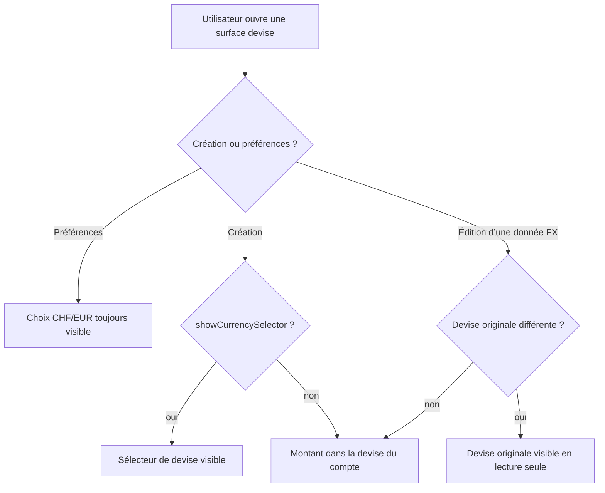

# Instruction: Retirer le gate du frontend et du contrat partagé

## Architecture projection

> Tree of the final files. ✅ create · ✏️ modify · ❌ delete

```txt
.
├── shared/
│   ├── index.ts                                                                 ✏️ ne réexporte plus le flag retiré
│   └── src/feature-flags.ts                                                     ✏️ conserve analytics/events, retire la clé et la propriété d’exposition
├── frontend/e2e/tests/features/live-conversion-preview.spec.ts                  ✏️ retire l’activation du flag devenu permanent
└── frontend/projects/webapp/src/app/
    ├── core/
    │   ├── analytics/
    │   │   ├── analytics.ts                                                     ✏️ synchronise seulement devise + préférence
    │   │   ├── analytics.spec.ts                                                ✏️ retire le mock et les assertions du flag
    │   │   ├── posthog.ts                                                       ✏️ remplace l’exemple multi-devise par un exemple générique
    │   │   └── posthog.spec.ts                                                  ✏️ teste les overrides avec une clé générique
    │   ├── currency/form/
    │   │   ├── picker-visibility.ts                                             ✏️ décide selon les devises uniquement
    │   │   └── picker-visibility.spec.ts                                        ✏️ couvre absence, même devise et devise différente
    │   └── feature-flags/
    │       ├── feature-flags.service.ts                                         ❌ adaptateur mono-flag devenu inutile
    │       └── index.ts                                                         ❌ barrel devenu vide
    ├── pattern/amount-input/
    │   ├── amount-input.ts                                                      ✏️ utilise la préférence utilisateur sans gate
    │   └── amount-input.spec.ts                                                 ✏️ prouve le comportement sans mock de flag
    └── feature/
        ├── settings/
        │   ├── settings-page.ts                                                 ✏️ rend la section devise sans condition PostHog
        │   └── settings-page.spec.ts                                            ✏️ attend la section même sans flag
        ├── complete-profile/
        │   ├── complete-profile-page.ts                                         ✏️ rend le choix de devise et respecte la préférence
        │   └── complete-profile-page.spec.ts                                    ✏️ retire le scénario flag OFF
        ├── current-month/components/
        │   ├── add-transaction-form.spec.ts                                     ✏️ retire le provider de flag
        │   └── add-transaction-bottom-sheet.spec.ts                             ✏️ retire le provider de flag
        ├── budget-templates/details/components/
        │   ├── edit-template-line-dialog.ts                                     ✏️ initialise l’édition selon les devises
        │   └── edit-template-line-dialog.spec.ts                                ✏️ retire les variantes de flag
        └── budget/budget-details/
            ├── allocated-transactions/
            │   ├── create-dialog/form.spec.ts                                  ✏️ retire le mock de flag
            │   └── details-dialog/
            │       ├── dialog.ts                                                ✏️ rend les métadonnées FX lorsqu’elles existent
            │       ├── bottom-sheet.ts                                          ✏️ rend les métadonnées FX lorsqu’elles existent
            │       └── bottom-sheet.spec.ts                                     ✏️ retire le provider de flag
            ├── budget-line/
            │   ├── create/dialog.spec.ts                                        ✏️ retire le mock de flag
            │   └── edit/
            │       ├── dialog.ts                                                ✏️ décide l’affichage selon les devises
            │       └── dialog.spec.ts                                           ✏️ retire les scénarios de flag
            └── components/
                ├── budget-grid/
                │   ├── budget-grid.ts                                           ✏️ ne propage plus le flag
                │   ├── budget-grid-card.ts                                      ✏️ retire l’input de flag
                │   ├── budget-grid-mobile-card.ts                               ✏️ retire l’input de flag
                │   ├── budget-detail-panel.ts                                   ✏️ affiche les conversions selon les données
                │   └── budget-detail-panel.spec.ts                              ✏️ retire le provider de flag
                └── edit-transaction-form/
                    ├── edit-transaction-form.ts                                 ✏️ décide l’affichage selon les devises
                    ├── edit-transaction-form.spec.ts                            ✏️ retire les scénarios de flag
                    └── edit-transaction-form-locale.spec.ts                     ✏️ retire le provider de flag
```

## User Journey



## Tasks to do

### `1)` Retirer le contrat du flag arrivé à terme

> Aucun symbole multi-devise spécifique ne subsiste dans le registre partagé ou l’adaptateur Angular.

1. Retirer `FEATURE_FLAGS.MULTI_CURRENCY`, `FeatureFlagKey` et leur réexport partagé.
2. Retirer `ANALYTICS_PROPERTIES.MULTI_CURRENCY_ENABLED`.
3. Supprimer `FeatureFlagsService` et son barrel, seuls consommateurs du flag.
4. Garder `PostHogService.flagsVersion()` et `isFeatureEnabled()` génériques ; remplacer seulement l’exemple et la constante de test liés à la devise.

### `2)` Rendre les sélecteurs indépendants de PostHog

> Les règles existantes de préférence et d’édition suffisent.

1. Retirer `isMultiCurrencyEnabled` de `PickerVisibilityArgs` ; conserver `originalCurrency != null && originalCurrency != userCurrency`.
2. En création, faire dépendre `AmountInput.showSelector` uniquement de `UserSettingsStore.showCurrencySelector`.
3. En édition, utiliser le helper simplifié dans les formulaires de transaction, prévision et modèle.
4. Rendre sans condition la section devise des paramètres et du profil initial ; conserver `showCurrencySelector` pour les champs optionnels.

### `3)` Afficher les métadonnées FX selon les données

> Une conversion historique reste visible dès que ses champs sont présents.

1. Retirer les `@if` du flag autour des lignes/badges de conversion.
2. Retirer la propagation `isMultiCurrencyEnabled` du grid vers ses cartes desktop/mobile.
3. Laisser les composants de conversion gérer leurs états absents comme aujourd’hui.

### `4)` Nettoyer analytics et tests

> Les tests couvrent les règles métier restantes, pas un rollout supprimé.

1. Synchroniser uniquement `currency` et `show_currency_selector` dans `AnalyticsService`.
2. Retirer les providers, mocks et cas `flagEnabled` devenus inutiles.
3. Remplacer les tests « flag OFF/ON » par le happy path toujours disponible et les cas de préférence/devise existants.
4. Retirer l’import `FEATURE_FLAGS` et les cinq appels `enableFeatureFlags` du scénario E2E de conversion ; ses cas restent pilotés par `showCurrencySelector`.
5. Vérifier qu’aucune référence à `multi-currency-enabled`, `MULTI_CURRENCY` ou `isMultiCurrencyEnabled` ne subsiste dans le code web/shared/E2E.

## Test acceptance criteria

| Task | Acceptance criteria |
| ---- | ------------------- |
| 1 | Le bundle partagé et le frontend ne contiennent plus la clé `multi-currency-enabled`, tandis que les primitives génériques `PostHogService.isFeatureEnabled` restent testées. |
| 2 | Les paramètres et le choix initial de devise affichent CHF/EUR sans PostHog ; un formulaire de création affiche le sélecteur exactement lorsque `showCurrencySelector` vaut `true`. |
| 3 | Une ligne ou transaction portant des métadonnées FX affiche son origine et sa conversion sur desktop, mobile, dialog et bottom sheet. |
| 4 | Les suites frontend/shared passent sans provider `FeatureFlagsService` ni scénario de rollout multi-devise ; le test E2E de conversion conserve ses cinq comportements sans injection du flag. |
