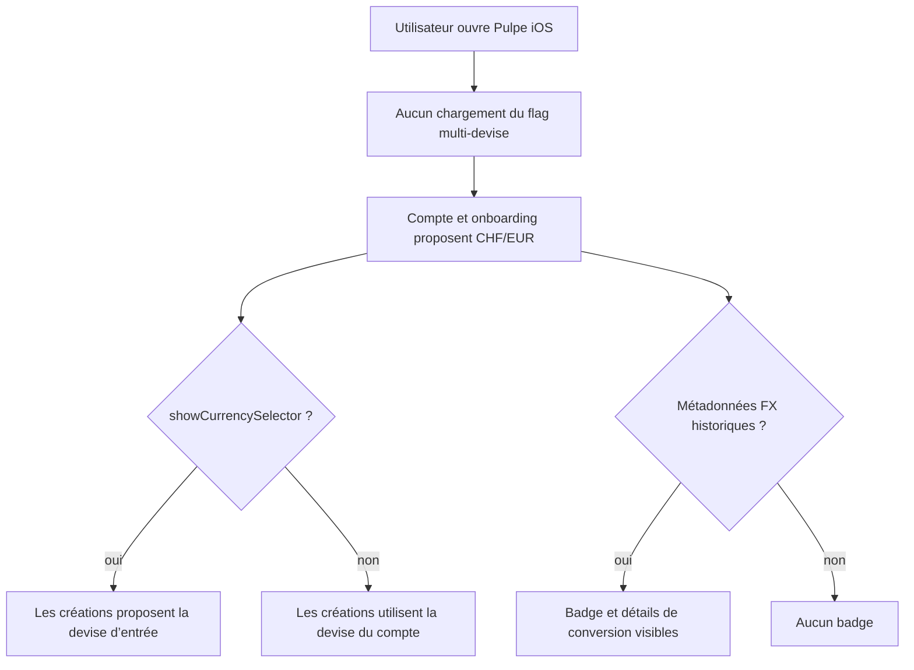

# Instruction: Retirer le gate et son store dédié d’iOS

## Architecture projection

> Tree of the final files. ✅ create · ✏️ modify · ❌ delete

```txt
.
└── ios/
    ├── Pulpe.xcodeproj/project.pbxproj                                          ✏️ retire le fichier supprimé des groupes et sources compilées
    ├── Pulpe/
    │   ├── App/PulpeApp.swift                                                   ✏️ retire le cycle de vie et l’injection du store
    │   ├── Core/Analytics/
    │   │   ├── AnalyticsService.swift                                           ✏️ retire la propriété d’exposition dédiée, garde les primitives génériques
    │   │   └── CurrencyAnalyticsSyncModifier.swift                              ✏️ synchronise devise + préférence uniquement
    │   ├── Domain/Store/
    │   │   ├── FeatureFlagsStore.swift                                          ❌ store mono-flag devenu inutile
    │   │   └── UserSettingsStore.swift                                          ✏️ retire la dépendance et le computed gated
    │   ├── Shared/Components/
    │   │   ├── CurrencyConversionBadge.swift                                    ✏️ dépend seulement des métadonnées FX
    │   │   └── EditBudgetLineSheet.swift                                        ✏️ lit la préférence brute, nettoie la preview
    │   └── Features/
    │       ├── Account/
    │       │   ├── AccountView.swift                                            ✏️ affiche toujours « Jour de paie et devise »
    │       │   ├── CurrencySettingView.swift                                    ✏️ affiche toujours la section devise
    │       │   └── PreferencesView.swift                                        ✏️ nettoie la preview
    │       ├── Onboarding/
    │       │   ├── OnboardingStepView.swift                                     ✏️ propose toujours le changement de devise aux étapes prévues
    │       │   └── Steps/
    │       │       ├── IncomeStep.swift                                         ✏️ affiche toujours le choix CHF/EUR
    │       │       └── BudgetPreviewStep.swift                                  ✏️ nettoie les previews
    │       ├── CurrentMonth/Components/AddTransactionSheet.swift                ✏️ lit `showCurrencySelector`
    │       ├── Templates/TemplateDetails/EditTemplateLineSheet.swift            ✏️ lit la préférence brute, nettoie la preview
    │       └── Budgets/BudgetDetails/
    │           ├── AddAllocatedTransactionPage.swift                            ✏️ lit `showCurrencySelector`
    │           ├── AddBudgetLineSheet.swift                                     ✏️ lit `showCurrencySelector`
    │           ├── EditTransactionPage.swift                                    ✏️ lit la préférence brute
    │           └── SavingsWithdrawal/SavingsWithdrawalSheet.swift               ✏️ lit `showCurrencySelector`
    └── PulpeTests/
        ├── Domain/Store/UserSettingsStoreTests.swift                             ✏️ retire le scénario de gate
        └── Shared/Components/EditBudgetLineSheetTests.swift                      ✏️ aligne le contrat documenté sur la préférence
```

## User Journey



## Tasks to do

### `1)` Retirer le store mono-flag du cycle de vie

> L’app ne charge, ne persiste et ne rafraîchit plus `multi-currency-enabled`.

1. Supprimer `FeatureFlagsStore.swift` et ses références dans le projet Xcode.
2. Retirer sa création, son `@State`, son injection d’environnement et ses refresh au lancement/foreground dans `PulpeApp`.
3. Retirer les injections `FeatureFlagsStore()` devenues inutiles dans les previews.
4. Conserver dans `AnalyticsService` les méthodes génériques de feature flags ; retirer seulement `multiCurrencyEnabledProperty`.

### `2)` Faire de la préférence utilisateur la seule règle de saisie

> `UserSettingsStore.showCurrencySelector` reprend son sens direct.

1. Retirer la dépendance optionnelle `FeatureFlagsStore` et `showCurrencySelectorEffective` de `UserSettingsStore`.
2. Construire `UserSettingsStore()` directement dans l’app.
3. Remplacer les lectures de `showCurrencySelectorEffective` par `showCurrencySelector` dans les créations.
4. Pour les éditions FX, conserver la conjonction avec `isAlternateCurrency`.

### `3)` Rendre la devise et les conversions toujours disponibles

> Les surfaces visibles ne dépendent plus de l’analytics.

1. Rendre `CurrencySettingView` et le choix de devise de `IncomeStep` sans condition.
2. Faire dépendre la chip devise d’onboarding uniquement des étapes prévues.
3. Fixer le sous-titre Compte à « Jour de paie et devise ».
4. Faire dépendre `CurrencyConversionBadge` uniquement de `originalAmount` et `originalCurrency`.

### `4)` Nettoyer analytics et tests

> Les propriétés et tests liés au rollout disparaissent avec lui.

1. Retirer l’observation du store et `multi_currency_enabled` de `CurrencyAnalyticsSyncModifier`.
2. Retirer le test de préférence neutralisée par un flag OFF ; conserver la preuve que la préférence chargée pilote les formulaires.
3. Aligner le test/commentaire `EditBudgetLineSheet` sur `showCurrencySelector && isAlternateCurrency`.
4. Vérifier qu’aucune référence à `FeatureFlagsStore`, `isMultiCurrencyEnabled`, `showCurrencySelectorEffective` ou `multi_currency_enabled` ne subsiste dans le code iOS.

## Test acceptance criteria

| Task | Acceptance criteria |
| ---- | ------------------- |
| 1 | Le projet Xcode compile sans référencer `FeatureFlagsStore.swift` ; l’app démarre et revient au premier plan sans créer ni rafraîchir de store multi-devise, tandis que les méthodes génériques de flags restent disponibles dans `AnalyticsService`. |
| 2 | Avec `showCurrencySelector = true`, toutes les créations concernées proposent CHF/EUR ; avec `false`, elles utilisent directement la devise du compte. |
| 3 | Compte, Préférences et onboarding exposent toujours la devise ; un objet portant des métadonnées FX affiche son badge de conversion. |
| 4 | Les tests iOS passent sans environnement `FeatureFlagsStore` ni assertion de gate multi-devise. |
