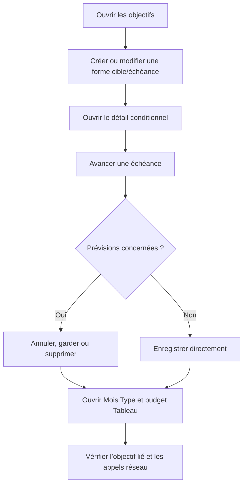

# Instruction: Prouver les parcours critiques sur le web

## Architecture projection

> Tree of the final files. ✅ create · ✏️ modify · ❌ delete

```txt
frontend/e2e/tests/features/
├── ✏️ savings-goals-progress.spec.ts
├── ✏️ template-details-view.spec.ts
└── ✏️ budget-table-mobile-menu.spec.ts
```

- `savings-goals-progress.spec.ts` : étendre le parcours existant aux quatre formes d’objectif et à la réconciliation d’échéance.
- `template-details-view.spec.ts` : prouver l’affordance d’objectif lié dans le Mois Type sans nouvelle requête par ligne.
- `budget-table-mobile-menu.spec.ts` : prouver la même information dans la cellule nom du mode Tableau.
- Création : aucune. Suppression : aucune.

## User Journey



## Tasks to do

### `1)` Couvrir la matrice cible et échéance

> Prouver le parcours utilisateur complet au-dessus des specs de composants déjà présentes.

1. Réutiliser `authenticatedPage`, les routes mockées et les helpers existants ; ne créer ni fixture ni configuration Playwright.
2. Conserver le scénario nom-seul existant puis couvrir cible-seule, échéance-seule et cible+échéance avec début futur.
3. Vérifier création, ouverture du détail, édition, retrait explicite et payloads omission/`null`/valeur.
4. Vérifier que début après échéance bloque l’enregistrement sans requête d’écriture.
5. Vérifier que chaque détail affiche uniquement les métriques, la barre, la trajectoire et les actions applicables.

### `2)` Couvrir la réconciliation d’une échéance avancée

> Prouver l’ordre preview puis mutation atomique depuis l’interface réelle.

1. Mocker la preview des prévisions futures et observer les requêtes d’écriture.
2. Couvrir annulation, freeze et remove avec candidats, ainsi que zéro candidat.
3. Couvrir une échéance reculée, retirée et ajoutée depuis `null`.
4. Vérifier qu’une confirmation envoie un seul PATCH complet avec le mode et les IDs affichés, et aucun POST generation-stop.
5. Vérifier qu’une annulation ou un conflit ne produit ni succès ni mutation partielle.

### `3)` Couvrir l’objectif lié dans les budgets

> Prouver PUL-317 sur les deux surfaces Angular concernées.

1. Étendre les mocks existants avec une prévision liée, une libre et une liste d’objectifs.
2. Vérifier le nom et l’icône de l’objectif dans la carte du Mois Type.
3. Vérifier la même information sous la prévision dans la cellule nom du mode Tableau, sans colonne supplémentaire.
4. Vérifier qu’une ligne libre reste inchangée et qu’aucun GET par ligne ou par ID n’est émis.

### `4)` Exécuter la preuve web ciblée

> Obtenir une trace verte reproductible avant l’inspection visuelle.

1. Exécuter les trois specs Playwright ciblées sur le projet Feature mocked.
2. Exécuter les specs Angular déjà liées aux surfaces uniquement si un sélecteur ou un contrat de rendu a dû changer.
3. Conserver le rapport Playwright et le trace zip de tout échec ; ne pas déclarer la phase complète avec un retry rouge.

## Test acceptance criteria

| Task | Acceptance criteria |
| ---- | ------------------- |
| 1 | Nom-seul, cible-seule, échéance-seule et cible+échéance peuvent être créés, ouverts, modifiés et nettoyés sans valeur fictive. |
| 1 | Un champ inchangé est omis, un champ retiré vaut `null`, un champ ajouté porte sa valeur ; début après échéance n’émet aucune écriture. |
| 1 | Chaque détail expose uniquement les métriques et actions définies pour sa combinaison. |
| 2 | Une échéance avancée avec candidats affiche la preview avant toute mutation ; zéro candidat ou date non avancée n’affiche pas le dialogue. |
| 2 | Annuler produit zéro écriture ; freeze et remove produisent chacun un PATCH atomique complet et zéro POST séparé. |
| 2 | Un conflit laisse l’objectif et les prévisions inchangés et n’affiche aucun faux succès. |
| 3 | Le Mois Type et le mode Tableau affichent le nom courant d’un objectif lié ; une ligne libre reste inchangée. |
| 3 | Une liste froide provoque au plus un GET d’objectifs et aucune requête par ligne ou par ID. |
| 4 | Les trois specs ciblées passent sans retry masquant un premier échec. |
