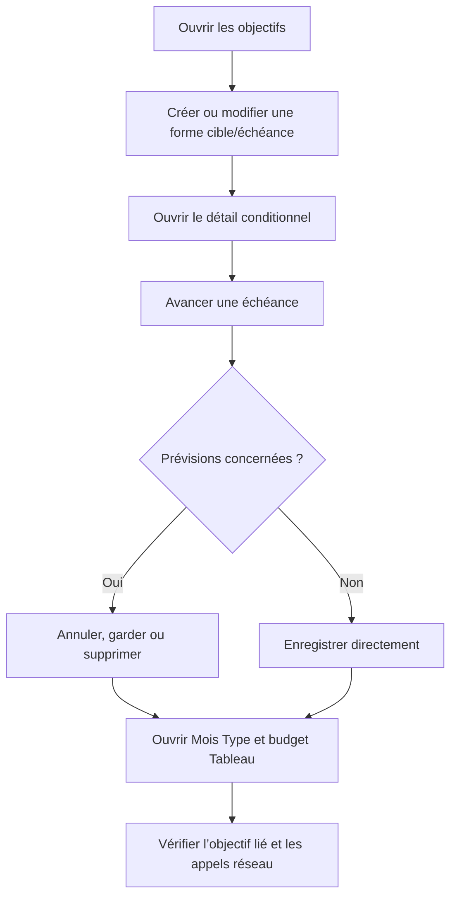

# Instruction: Réparer les preuves web et les mocks contractuels

## Architecture projection

> Tree of the final files. ✅ create · ✏️ modify · ❌ delete

```txt
frontend/e2e/tests/features/
├── ✏️ savings-goals-progress.spec.ts
├── ✏️ template-details-view.spec.ts
└── ✏️ budget-table-mobile-menu.spec.ts
```

- `savings-goals-progress.spec.ts` : corriger la matrice de progression mockée et compléter édition, tri-state, réconciliation et conflit.
- `template-details-view.spec.ts` : borner la requête liste et interdire tout GET d’objectif par ID dans le Mois Type.
- `budget-table-mobile-menu.spec.ts` : appliquer la même preuve réseau dans le mode Tableau.
- Création : aucune. Suppression : aucune.

## User Journey



## Tasks to do

### `1)` Aligner les réponses mockées sur le contrat canonique

> Ne faire traverser à l’interface que des états réellement émis par le backend.

1. Réutiliser `progressFor` au lieu d’ajouter une seconde fabrique E2E.
2. Aligner ses valeurs sur les calculateurs shared : sans échéance, aucune projection ni verdict d’échéance ; sans cible, aucune suggestion de complétion ni métrique cible.
3. Conserver une estimation de complétion uniquement pour une cible sans échéance quand le rythme confirmé la rend calculable.
4. Asserter explicitement la présence et l’absence de chaque région conditionnelle : barre cible, projection, rythme, requis, estimation, trajectoire et actions.

### `2)` Terminer la matrice création, édition et retrait

> Parcourir les quatre formes d’objectif jusqu’à leur nettoyage, pas seulement jusqu’au détail.

1. Réutiliser `authenticatedPage`, les routes mockées et les helpers existants ; ne créer ni fixture ni configuration Playwright.
2. Couvrir nom-seul, cible-seule, échéance-seule et cible+échéance avec début futur.
3. Pour la matrice complète, vérifier création, ouverture, édition puis suppression finale depuis l’interface.
4. Répartir les transitions pour observer les trois états du PATCH : champ intact omis, champ vidé envoyé à `null`, champ ajouté envoyé avec sa valeur.
5. Soumettre un début après échéance et compter zéro POST/PATCH, puis corriger l’intervalle et vérifier que la sauvegarde redevient possible.

### `3)` Compléter la réconciliation d’une échéance avancée

> Prouver la preview, chaque décision et les transitions qui ne doivent pas demander de décision.

1. Conserver le scénario avec candidats et vérifier que le GET preview précède toute mutation.
2. Ajouter annulation, `freeze` et `remove` ; compter zéro écriture pour l’annulation et exactement un PATCH atomique pour chaque décision.
3. Interdire tout POST séparé vers `generation-stop`.
4. Ajouter zéro candidat, échéance repoussée, échéance retirée et échéance ajoutée depuis `null` ; aucun dialogue ne doit apparaître.
5. Mocker un conflit/drift, vérifier le rechargement des candidats, l’état inchangé et l’absence de message de succès.

### `4)` Fermer la preuve réseau PUL-317

> Chaque surface doit prouver seule l’absence de N+1.

1. Conserver dans les deux specs une ligne liée, une ligne libre et la liste d’objectifs.
2. Compter les GET liste et imposer un maximum de un par navigation froide.
3. Intercepter toute URL `/savings-goals/:id` et faire échouer le test si elle est appelée.
4. Vérifier le nom courant dans la carte du Mois Type et dans la cellule nom du Tableau ; la ligne libre reste inchangée.

### `5)` Exécuter la preuve web ciblée

> Obtenir une trace verte reproductible avant l’inspection visuelle.

1. Exécuter `pnpm --filter pulpe-frontend exec playwright test e2e/tests/features/savings-goals-progress.spec.ts e2e/tests/features/template-details-view.spec.ts e2e/tests/features/budget-table-mobile-menu.spec.ts --project="Feature Tests (Mocked)" --retries=0`.
2. Exécuter les specs Angular déjà liées aux surfaces uniquement si un sélecteur ou un contrat de rendu a dû changer.
3. Conserver le rapport Playwright et le trace zip de tout échec ; ne pas déclarer la phase complète avec un retry rouge.

## Test acceptance criteria

| Task | Acceptance criteria |
| ---- | ------------------- |
| 1 | Cible-seule n’expose ni projection d’échéance ni verdict de rythme ; les états sans cible n’exposent ni cible fictive ni suggestion booléenne fictive. |
| 1 | Chaque combinaison affiche uniquement les métriques, trajectoires et actions autorisées par le contrat shared. |
| 2 | Nom-seul, cible-seule, échéance-seule et cible+échéance sont créés, ouverts, modifiés puis supprimés depuis l’UI. |
| 2 | Un champ intact est omis, un champ retiré vaut `null`, un champ ajouté porte sa valeur ; début après échéance n’émet aucune écriture. |
| 3 | Une échéance avancée avec candidats affiche la preview avant toute mutation ; zéro candidat, échéance repoussée/retirée ou ajout depuis `null` n’affiche pas le dialogue. |
| 3 | Annuler produit zéro écriture ; `freeze` et `remove` produisent chacun un PATCH atomique complet et zéro POST séparé. |
| 3 | Un conflit recharge la preview, laisse objectif et prévisions inchangés et n’affiche aucun faux succès. |
| 4 | Chaque surface produit au plus un GET liste et échoue sur tout GET d’objectif par ID ; le nom lié reste affiché et la ligne libre inchangée. |
| 5 | Les trois specs ciblées passent avec `--retries=0`; aucun premier échec n’est masqué. |
