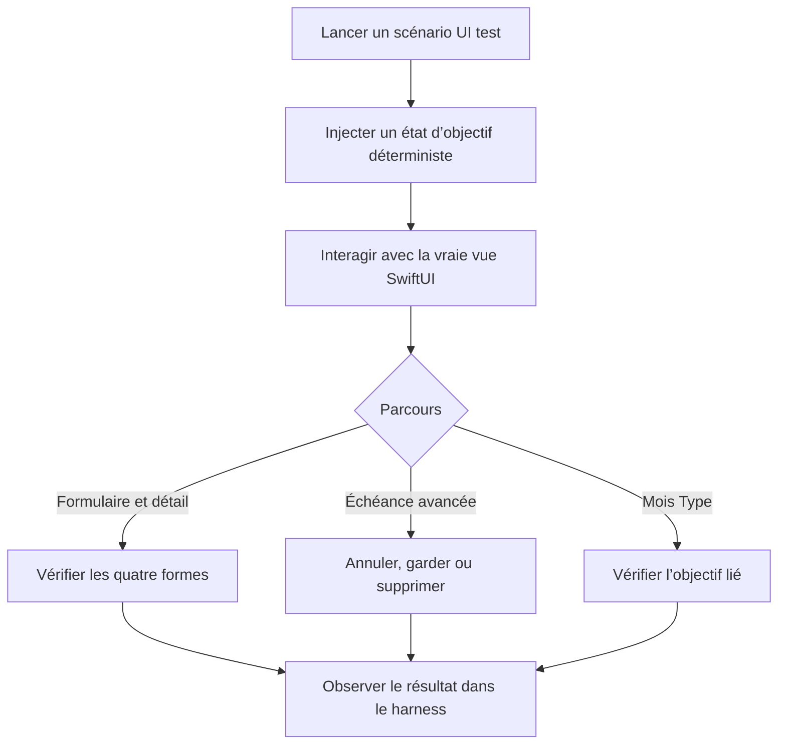

# Instruction: Ajouter la preuve UI iOS déterministe et réparer la preview

## Architecture projection

> Tree of the final files. ✅ create · ✏️ modify · ❌ delete

```txt
ios/
├── Pulpe/App/
│   ├── ✏️ PulpeApp.swift
│   ├── ✏️ BudgetLongPressUITestHarness.swift
│   └── ✅ SavingsGoalIntervalUITestHarness.swift
├── Pulpe/Features/
│   ├── SavingsGoals/
│   │   └── ✏️ SavingsGoalDetailView.swift
│   └── Templates/TemplateDetails/
│       └── ✏️ TemplateDetailsView.swift
└── PulpeUITests/
    ├── ✏️ BudgetLineLongPressTests.swift
    └── ✅ SavingsGoalIntervalUITests.swift
```

- `PulpeApp.swift` : router les nouveaux scénarios UI test sans toucher au lancement normal.
- `BudgetLongPressUITestHarness.swift` : étendre l’enum de scénarios déjà utilisée par l’application et les UI tests.
- `SavingsGoalIntervalUITestHarness.swift` : héberger les vues de production avec un service mémoire local et exposer les mutations observées.
- `SavingsGoalDetailView.swift` : injecter `SavingsGoalServicing` dans le view model via un paramètre par défaut, sans changer les appels de production.
- `TemplateDetailsView.swift` : injecter `SavingsGoalStore()` dans la preview existante ; le harness réutilise `TemplateLineRow` tel quel.
- `BudgetLineLongPressTests.swift` : cibler la première occurrence du bouton quand SwiftUI propage l’identifiant aux sous-éléments.
- `SavingsGoalIntervalUITests.swift` : exercer la matrice, la décision d’échéance et l’objectif lié depuis XCUITest.
- Suppression : aucune.

## User Journey



## Tasks to do

### `1)` Ouvrir les seams déjà prévus

> Rendre les vues existantes pilotables hors ligne sans ajouter de nouvelle couche d’abstraction.

1. Ajouter à `SavingsGoalDetailView.init` un paramètre `SavingsGoalServicing` par défaut et le transmettre au view model ; tous les appels de production gardent leur signature actuelle.
2. Ajouter `.environment(SavingsGoalStore())` à la preview de `TemplateDetailsView`.
3. Ouvrir cette preview et vérifier qu’elle ne lève plus d’erreur d’environnement à l’exécution.
4. Ne modifier ni `project.yml`, ni les services réseau, ni les modèles ; les dossiers sources sont déjà inclus par XcodeGen.

### `2)` Ajouter un harness déterministe minimal

> Réutiliser `UITEST_SCENARIO` pour afficher les vraies vues de la feature.

1. Étendre `UITestLaunchScenario` avec formulaire, quatre états de détail, réconciliation d’échéance et ligne de Mois Type liée/libre.
2. Router ces cas dans `PulpeApp` avant le flux authentifié, comme le harness long-press existant.
3. Implémenter dans le nouveau fichier un seul service mémoire conforme à `SavingsGoalServicing`, avec données fixes et compteurs de création, update et décision.
4. Instancier `SavingsGoalFormSheet`, `SavingsGoalDetailView`, `GoalGenerationStopSheet` via le détail réel, et `TemplateLineRow` avec leurs environnements de production.
5. Afficher les compteurs et payloads utiles sous des identifiants d’accessibilité réservés au harness ; n’ajouter ni serveur local, ni dépendance, ni framework de test générique.
6. Vérifier qu’un lancement sans `UITEST_SCENARIO` suit encore le flux normal et que les deux scénarios long-press restent routés comme avant.

### `3)` Ajouter les tests de comportement XCUITest

> Vérifier les interactions que les tests Swift de modèle ne traversent pas.

1. Créer un objectif nom-seul depuis le formulaire et vérifier le résultat affiché par le harness.
2. Ouvrir les quatre états de détail et vérifier présence ou absence des régions conditionnelles.
3. Vérifier que l’intervalle invalide ne permet aucune sauvegarde.
4. Depuis le détail daté, avancer l’échéance jusqu’à la confirmation ; vérifier annulation sans update puis `freeze` et `remove` avec exactement un update réconcilié.
5. Vérifier le chip d’objectif sur une ligne liée et son absence sur une ligne libre.
6. Attacher aux tests les captures des états retenus via `XCTAttachment`, sans créer de helper ou de stockage parallèle.
7. Utiliser les identifiants existants, les libellés stables et les probes du harness ; ne pas instrumenter les vues de production tant qu’un élément reste adressable de façon univoque.

### `4)` Exécuter la preuve iOS ciblée

> Prouver le comportement sur un simulateur réellement disponible.

1. Résoudre l’UDID d’un iPhone Simulator disponible puis le réutiliser pour toute la phase.
2. Exécuter `xcodegen generate --use-cache` dans `ios/`.
3. Exécuter `SavingsGoalIntervalUITests`, `PulpeUITests/testAppLaunches` et `BudgetLineLongPressTests` via le scheme `PulpeUITests`, avec `CODE_SIGNING_ALLOWED=NO` et un `.xcresult` dédié.
4. Construire `PulpeLocal` sur le même simulateur.
5. Conserver le `.xcresult` de tout échec ; un crash de preview ou une erreur CoreSimulator ne compte jamais comme validation.

## Test acceptance criteria

| Task | Acceptance criteria |
| ---- | ------------------- |
| 1 | Le détail accepte un service mémoire mais conserve `SavingsGoalService.shared` par défaut ; la preview `TemplateDetailsView` s’ouvre avec ses deux stores requis. |
| 2 | Chaque scénario ouvre une vraie vue de production avec des données déterministes, sans réseau, authentification ni base locale. |
| 2 | Sans scénario, l’application suit son lancement normal ; les scénarios long-press existants restent routés. |
| 3 | Le formulaire nom-seul se sauvegarde ; un début après échéance ne transmet aucune sauvegarde. |
| 3 | Les quatre combinaisons cible/échéance rendent uniquement leurs régions applicables sans crash ni contenu fictif. |
| 3 | Annuler la confirmation ne transmet aucun update ; `freeze` et `remove` transmettent chacun un unique update avec la décision choisie. |
| 3 | Une ligne liée affiche le chip et le nom de l’objectif ; une ligne libre n’affiche aucun emplacement vide. |
| 4 | Les UI tests ciblés, le test de lancement, les tests long-press et la build `PulpeLocal` réussissent sur le même simulateur. |
