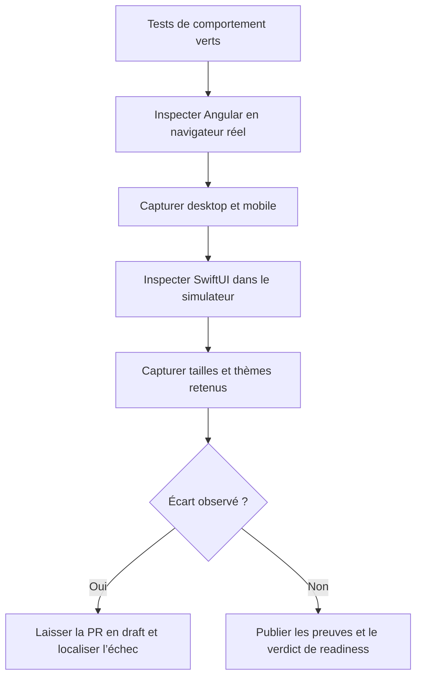

# Instruction: Inspecter le rendu cross-platform et publier les preuves

## Architecture projection

> Tree of the final files. ✅ create · ✏️ modify · ❌ delete

```txt
.
└── Aucun fichier du dépôt
```

- Les captures navigateur, captures simulateur et journaux d’exécution restent des artefacts attachés à la PR #553.
- Création : aucune. Modification : aucune. Suppression : aucune.

## User Journey



## Wireframe

```txt
┌──────────────────────────────────┐
│ (1) En-tête de formulaire        │
├──────────────────────────────────┤
│ (2) Champ principal              │
│ (3) Montants optionnels          │
│ (4) Bornes de période            │
│ (5) Plan mensuel conditionnel    │
├──────────────────────────────────┤
│ (6) Actions                      │
└──────────────────────────────────┘

┌──────────────────────────────────┐
│ (7) En-tête du détail            │
├──────────────────────────────────┤
│ (8) Résumé et progression        │
│ (9) Métriques conditionnelles    │
│ (10) Trajectoire et plan         │
│ (11) Contributions               │
└──────────────────────────────────┘

┌──────────────────────────────────┐
│ (12) En-tête de confirmation     │
├──────────────────────────────────┤
│ (13) Liste et total              │
├──────────────────────────────────┤
│ (14) Décisions et annulation     │
└──────────────────────────────────┘

┌──────────────────────────────────┐
│ (15) Ligne · information         │
│      Objectif lié                │
│      Montant · récurrence        │
└──────────────────────────────────┘
```

1. Contient le contexte et la fermeture de la surface.
2. Porte l’unique information obligatoire.
3. Regroupe le stock et la cible facultatifs.
4. Présente le début et l’échéance indépendamment.
5. Occupe un emplacement uniquement quand le contrat le rend applicable.
6. Garde une seule action principale et les sorties secondaires.
7. Situe l’objectif et les actions de page.
8. Résume l’état sans métrique inventée.
9. N’affiche que les indicateurs définis par la combinaison.
10. Regroupe les projections et ajustements disponibles.
11. Conserve la liste des éléments liés.
12. Distingue la confirmation du formulaire.
13. Montre l’ensemble serveur et son total.
14. Sépare clairement conservation, suppression et sortie.
15. Intègre l’objectif dans la hiérarchie secondaire de la ligne existante.

## Tasks to do

### `1)` Inspecter le rendu Angular réel

> Comparer les surfaces réelles au wireframe et aux règles `DESIGN.md`.

1. Lancer les scénarios Playwright de la phase 1 dans Chromium headed à 1440×900 puis 390×844, sur le SHA qui sera publié.
2. Inspecter formulaire complet, détails nom-seul et cible+échéance, confirmation d’échéance, Mois Type lié et mode Tableau lié.
3. Vérifier débordements, chevauchements, scroll, focus visible, hiérarchie des actions, contenu conditionnel et absence d’emplacement vide.
4. Vérifier les surfaces chaudes, la sémantique Épargne, le rouge limité à la suppression et les montants tabulaires.
5. Capturer chaque surface retenue aux deux largeurs ; le mode Tableau n’exige qu’une capture desktop.

### `2)` Inspecter le rendu SwiftUI réel

> Valider les mêmes intentions dans un iPhone Simulator, pas dans une preview statique.

1. Ouvrir via les scénarios XCUITest le formulaire, les deux détails représentatifs, la confirmation et la ligne liée sur le même simulateur que la phase 2.
2. Inspecter en portrait, thème clair et taille de texte par défaut.
3. Rejouer formulaire et détail avec une taille Dynamic Type d’accessibilité, puis la confirmation en thème sombre.
4. Vérifier absence de coupe, scroll accessible, cibles tactiles, action principale unique, surfaces de sheet, couleurs sémantiques et montants stables.
5. Attacher les captures comme `XCTAttachment` au `.xcresult`, puis exporter le jeu retenu pour la PR.

### `3)` Publier une preuve reproductible

> Transformer les exécutions et captures en verdict vérifiable sur la PR #553.

1. Vérifier que `plan.md`, `phase-1.md`, `phase-2.md` et `phase-3.md` apparaissent dans `git ls-files`; les ajouter explicitement malgré `.gitignore` lors du prochain commit autorisé.
2. Associer les preuves au SHA exact testé et nommer viewport, simulateur, OS, thème et taille de texte.
3. Joindre les commandes ciblées, leur résultat final, les captures web et les captures iOS dans un commentaire de validation.
4. Signaler chaque écart avec la surface, le scénario et la preuve ; garder le verdict `not ready` tant qu’un écart ou un test rouge subsiste.
5. Publier `ready for review` uniquement si tous les critères des trois phases sont satisfaits ; commit, push, commentaire et changement réel de statut de la PR restent des actions explicites séparées.

## Test acceptance criteria

| Task | Acceptance criteria |
| ---- | ------------------- |
| 1 | Les surfaces web retenues sont visibles et utilisables à 1440×900 et 390×844, sans coupe, chevauchement, scroll bloqué ni contenu conditionnel fantôme. |
| 1 | Le formulaire, les détails, la confirmation et les lignes liées respectent la hiérarchie et les règles sémantiques Pulpe ; le mode Tableau reste lisible en desktop. |
| 2 | Les mêmes surfaces sont validées dans un iPhone Simulator en thème clair, et les cas ciblés restent utilisables en Dynamic Type d’accessibilité et thème sombre. |
| 2 | Aucun contrôle essentiel ni montant n’est tronqué ; la sheet de confirmation et le chip lié conservent leur hiérarchie. |
| 3 | Les quatre documents du plan sont suivis par Git et la PR contient le SHA, les résultats des tests et un jeu de captures rattaché à chaque surface et environnement. |
| 3 | Tout échec donne un verdict `not ready` et maintient la PR en draft ; aucun succès n’est déduit d’une build seule ou d’une capture non inspectée. |
