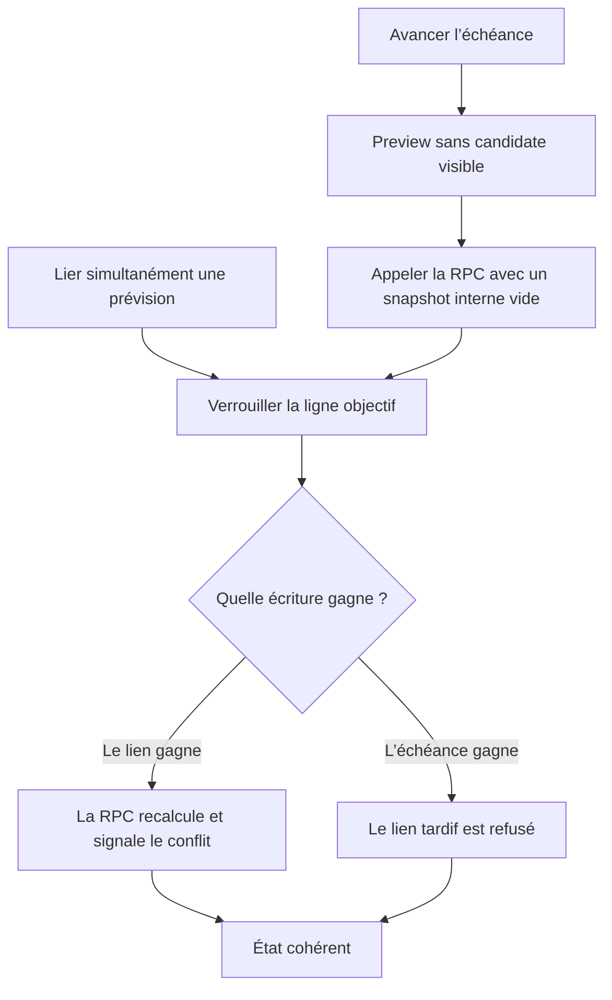

# Instruction: Sérialiser les changements d’échéance

## Architecture projection

> Tree of the final files. ✅ create · ✏️ modify · ❌ delete

```txt
backend-nest
├── src/modules/savings-goal
│   ├── application
│   │   ├── ✏️ update-savings-goal.use-case.ts
│   │   └── ✏️ update-savings-goal.use-case.spec.ts
│   ├── domain
│   │   └── ✏️ savings-goal.entity.ts
│   └── ✏️ savings-goal-generation-stop.integration.spec.ts
└── supabase/migrations
    └── ✅ 20260727121000_serialize_savings_goal_horizon_changes.sql
```

- Suppression : aucune.

## User Journey



## Tasks to do

### `1)` Reproduire le contournement de la RPC

> Verrouiller le parcours qui utilise aujourd’hui un PATCH ordinaire lorsque la preview est vide.

1. Ajouter le test use-case qui avance l’échéance sans candidate liée.
2. Prouver d’abord que `repo.update` est appelé à la place de `reconcileTargetDate`.
3. Garder les cas échéance identique, repoussée ou supprimée sur le PATCH ordinaire.

### `2)` Réutiliser la réconciliation atomique avec un snapshot vide

> Faire passer tout avancement réel par le recalcul sous verrou déjà existant.

1. Autoriser `budgetLineIds: []` uniquement dans la commande interne du repository.
2. Conserver `savingsGoalReconciliationSchema.min(1)` pour toute décision fournie par un client.
3. Quand aucune candidate n’est visible, appeler `reconcileTargetDate` avec le patch, l’échéance attendue et le mode `freeze`, inerte sur une liste vide.
4. N’exécuter aucun recalcul de budget lorsque la RPC ne retourne aucun budget touché.

### `3)` Sérialiser aussi le PATCH ordinaire avec les nouveaux liens

> Donner un ordre transactionnel aux changements d’échéance qui ne passent légitimement pas par la RPC.

1. Ajouter une migration qui remplace le trigger de lien sans modifier `20260727120000_enforce_savings_goal_link_horizon.sql`.
2. Verrouiller l’objectif avec `FOR SHARE` lors d’un insert ou changement de lien, de kind ou de budget.
3. Conserver les gardes propriétaire, kind, période payDay-aware et l’exception pour une occurrence dont le lien ne change pas.
4. Régénérer les types Supabase ; aucun diff n’est attendu puisque les signatures restent identiques.

### `4)` Prouver les deux ordres de concurrence

> Tester le parcours applicatif réel contre Supabase local.

1. Lancer `UpdateSavingsGoalUseCase` avec son repository réel pendant l’insertion d’une ligne hors nouvel horizon.
2. Accepter seulement deux issues : lien committé puis conflit de snapshot, ou échéance committée puis lien refusé.
3. Couvrir aussi le passage d’un objectif ouvert à une échéance datée face à un nouveau lien.

## Test acceptance criteria

| Task | Acceptance criteria |
| --- | --- |
| 1–2 | Un avancement d’échéance sans candidate n’appelle jamais `repo.update` et transmet un snapshot vide à la RPC existante. |
| 2 | Un payload client contenant une réconciliation vide reste invalide ; seuls les appels internes peuvent porter ce snapshot. |
| 3–4 | Aucun ordre de commit ne produit un lien créé après une échéance déjà avancée et situé hors de son horizon. |
| 3–4 | Une ligne dans l’horizon, une modification sans changement de lien et une échéance repoussée ou supprimée gardent leur comportement actuel. |
| 4 | Les deux issues concurrentes autorisées sont observables via le use case réel, sans état final partiellement appliqué. |
