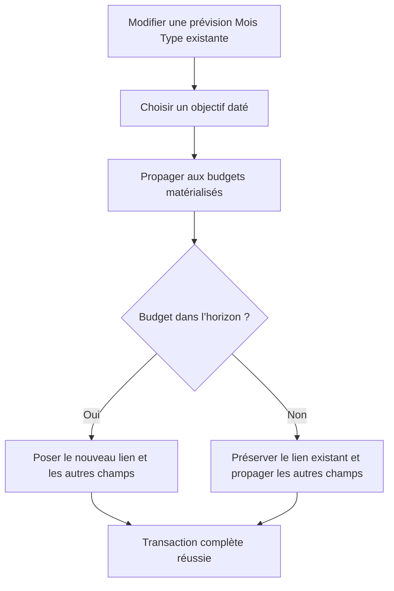

# Instruction: Borner le nouveau lien propagé depuis le Mois Type

## Architecture projection

> Tree of the final files. ✅ create · ✏️ modify · ❌ delete

```txt
backend-nest
├── src/modules/budget-template
│   └── ✏️ savings-goal-propagation.integration.spec.ts
└── supabase/migrations
    └── ✅ 20260727122000_bound_updated_template_goal_links.sql
```

- Suppression : aucune.

## User Journey



## Tasks to do

### `1)` Reproduire le parcours principal cassé

> Couvrir l’ajout d’un lien, pas seulement la modification d’une ligne déjà liée au même objectif.

1. Seeder une ligne Mois Type non liée et des budgets avant, à et après l’échéance.
2. Exécuter le bulk de propagation avec le même `excluded_budget_ids` que le use case produit déjà.
3. Constater que la RPC actuelle tente le lien hors horizon et rollback toute l’opération.

### `2)` Consommer les exclusions déjà calculées

> Corriger uniquement l’affectation SQL qui ignore aujourd’hui son entrée.

1. Ajouter une migration qui remplace `apply_template_line_operations` sans modifier `20260726121000_bound_template_goal_propagation.sql`.
2. Dans la boucle UPDATE, appliquer le nouveau `savings_goal_id` seulement aux budgets absents de `excluded_budget_ids`.
3. Dans les budgets exclus, conserver le lien stocké tout en propageant nom, montant, kind, récurrence et métadonnées de devise.
4. Ne changer ni la création de ligne, ni la protection `is_manually_adjusted`, ni le wrapper avec tags qui appelle déjà cette fonction.
5. Régénérer les types Supabase ; aucun diff n’est attendu.

### `3)` Vérifier l’état final atomique

> Prouver que le trigger d’horizon n’annule plus le parcours utilisateur.

1. Vérifier que la ligne Mois Type et les occurrences dans l’horizon portent le nouvel objectif.
2. Vérifier qu’une occurrence après échéance conserve son ancien lien, y compris `null`.
3. Vérifier que ses autres champs non protégés sont néanmoins propagés.
4. Conserver verts les tests existants de création bornée et de modification d’une ligne déjà liée.

## Test acceptance criteria

| Task | Acceptance criteria |
| --- | --- |
| 1–3 | Relier une ligne Mois Type existante à un objectif daté réussit même si un budget matérialisé se trouve après l’échéance. |
| 2–3 | La ligne Mois Type et les budgets dans l’horizon portent le nouveau lien ; chaque budget exclu conserve exactement son lien précédent. |
| 2–3 | Les autres champs continuent de se propager dans un budget exclu et les lignes ajustées manuellement restent intactes. |
| 2–3 | La création bornée, le wrapper avec tags et l’édition d’une ligne déjà liée conservent leur comportement. |
