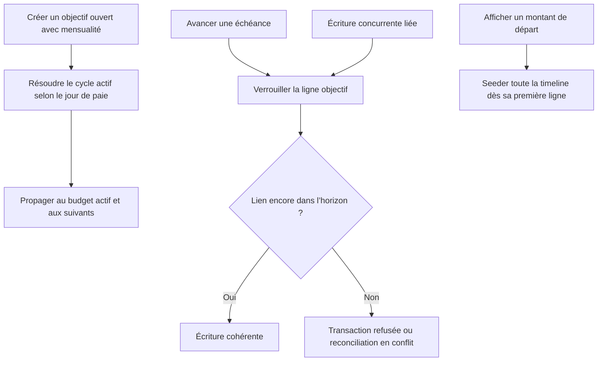

# Instruction: Sécuriser les invariants shared et backend

## Architecture projection

> Tree of the final files. ✅ create · ✏️ modify · ❌ delete

```txt
.
├── backend-nest
│   ├── src/modules/budget-template
│   │   ├── application
│   │   │   ├── ✏️ bulk-template-line-operations.use-case.ts
│   │   │   └── ✏️ bulk-template-line-operations.use-case.spec.ts
│   │   ├── domain/ports
│   │   │   └── ✏️ template-line-propagation.port.ts
│   │   └── infrastructure/adapters
│   │       ├── ✏️ template-line-propagation.adapter.ts
│   │       └── ✏️ template-line-propagation.adapter.spec.ts
│   ├── src/modules/savings-goal
│   │   ├── application
│   │   │   ├── ✏️ create-savings-goal.use-case.ts
│   │   │   └── ✏️ create-savings-goal.use-case.spec.ts
│   │   ├── infrastructure/persistence
│   │   │   └── ✏️ supabase-savings-goal.repository.ts
│   │   └── ✏️ savings-goal-generation-stop.integration.spec.ts
│   └── supabase/migrations
│       └── ✅ 20260727120000_enforce_savings_goal_link_horizon.sql
├── shared
│   ├── ✏️ schemas.ts
│   ├── src
│   │   ├── ✏️ savings-goal-schema.spec.ts
│   │   └── calculators
│   │       ├── ✏️ savings-goal-plan.ts
│   │       └── ✏️ savings-goal-plan.spec.ts
└── docs
    └── ✏️ SAVINGS.md
```

- Suppression : aucune.

## User Journey



## Tasks to do

### `1)` Utiliser le cycle payDay-aware dans la propagation ouverte

> Inclure le budget réellement actif même lorsque son mois civil précède la date courante.

1. Ajouter `payDayOfMonth` à l’entrée du port de propagation déjà utilisé par la création d’objectif.
2. Le transmettre depuis `AuthenticatedUser` jusqu’au bulk sans créer de second chemin de propagation.
3. Dans `fetchPropagationBudgets`, dériver la borne basse avec `getBudgetPeriodForDate(now, payDayOfMonth)` au lieu du mois UTC.
4. Écrire d’abord la régression : avant le jour de paie, un budget du cycle précédent doit recevoir la ligne récurrente.
5. Conserver inchangés les parcours ordinaires du Mois Type qui ne portent qu’un `user.id`.

### `2)` Fermer la course d’échéance au point d’écriture commun

> Garantir qu’une échéance avancée ne peut jamais committer avec une nouvelle prévision liée hors horizon.

1. Retirer seulement `.max(120)` de `reconciliation.budgetLineIds`; garder UUID, unicité logique côté RPC et borne de 120 périodes sur l’échéance.
2. Créer une migration additive qui remplace `enforce_savings_goal_line_link` sans modifier les migrations existantes.
3. Pour un `budget_line` lié, verrouiller la ligne `savings_goal` avec `FOR KEY SHARE`, vérifier propriétaire et type, calculer la période payDay-aware du budget et refuser un nouveau lien strictement après l’échéance.
4. Ne déclencher cette garde que sur insert ou changement de lien, kind ou budget ; une occurrence historique déjà liée doit rester modifiable sur ses autres colonnes.
5. Conserver le contrôle actuel des `template_line` : propriétaire commun, kind Épargne et objectif existant.
6. Ajouter une intégration concurrente à deux issues valides : soit l’insertion gagne et la réconciliation signale un drift sans changer l’échéance, soit la réconciliation gagne et le lien tardif est refusé ; l’état final `échéance avancée + ligne hors horizon` est toujours impossible.
7. Ajouter les cas après échéance refusé, dans l’horizon accepté, update de montant historique accepté et snapshot de plus de 120 IDs accepté.
8. Régénérer les types Supabase après application locale de la migration ; aucun diff de type n’est attendu si la signature publique reste identique.

### `3)` Corriger le stock initial et le contexte d’erreur

> Rendre la timeline cohérente dès sa première ligne et respecter la chaîne de cause backend.

1. Écrire une régression avec début futur et `initialAmount`, avec puis sans ligne future liée.
2. Initialiser `confirmedCumulative` avec le stock dès le début de la timeline et supprimer son ajout différé à l’ancrage historique.
3. Vérifier que `plannedCumulative`, le rythme et l’éligibilité pré-début restent inchangés.
4. Retirer `supabaseError` du `loggingContext` de la réconciliation et conserver l’erreur uniquement dans `{ cause }`.
5. Aligner `docs/SAVINGS.md` sur le seed immédiat et la garde DB des nouveaux liens hors horizon.

## Test acceptance criteria

| Task | Acceptance criteria |
| --- | --- |
| 1 | Avant le jour de paie, la création d’un objectif ouvert propage sa mensualité au budget du cycle actif même si celui-ci appartient au mois civil précédent. |
| 1 | Après le jour de paie et sans jour de paie personnalisé, la borne de propagation reste identique au comportement actuel. |
| 1 | Les opérations ordinaires du Mois Type et les lignes non liées conservent leur contrat. |
| 2 | Une réconciliation accepte un snapshot exact contenant plus de 120 IDs sans relâcher la limite de 120 périodes sur l’échéance. |
| 2 | Aucun ordre de commit concurrent ne peut produire une échéance avancée avec une nouvelle `budget_line` liée strictement après son horizon. |
| 2 | Une nouvelle ligne liée dans l’horizon passe ; une ligne hors horizon est refusée ; une occurrence historique existante reste modifiable sans toucher à son lien. |
| 2 | Le contrôle propriétaire/kind continue de protéger `budget_line` et `template_line`, y compris via les RPC `SECURITY DEFINER`. |
| 3 | Le premier mois rendu porte déjà `initialAmount` dans `confirmedCumulative`, même lorsque `startDate` est future ou qu’aucune ligne future n’existe. |
| 3 | `plannedCumulative`, les rythmes et les contributions pré-début restent inchangés. |
| 3 | L’erreur Supabase n’est présente qu’en `cause`, jamais dans `loggingContext`. |
| 3 | Les suites shared/backend ciblées, les intégrations Supabase et la génération de types passent sans nouveau warning. |
